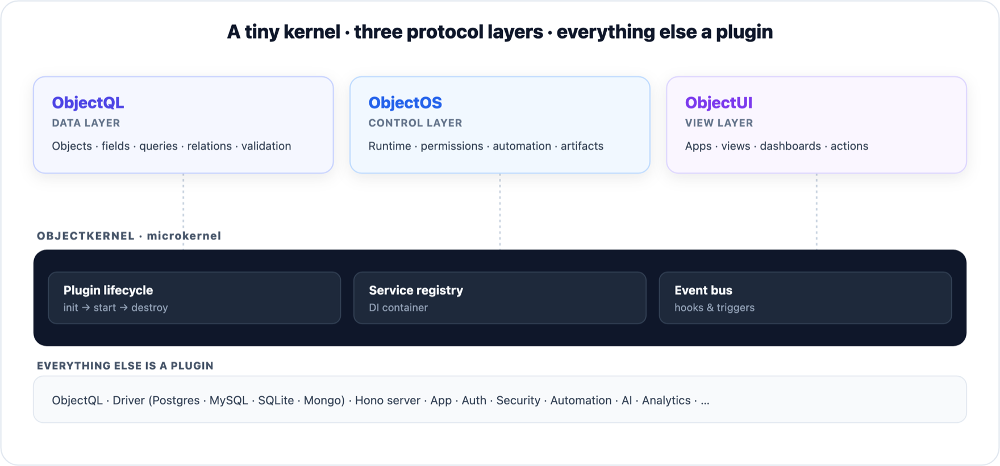

# ObjectStack

[](./LICENSE)


> ## AI writes the app. ObjectStack is what it writes.
>
> The open target format and runtime for AI-written business apps. Your coding
> agent writes models, UI, workflows, and permissions as compact typed metadata —
> [a complete CRM is under 2,000 lines](#why-the-mistakes-dont-ship), so the whole
> app fits in the agent's context — and strict TypeScript, Zod schemas, and a
> validation gate catch its mistakes at authoring time. The runtime derives the
> database, REST API, UI, and MCP server, and enforces permissions and audit on
> every call.

`Fits in an agent's context` · `Typed, validated, governed` · `Self-host anywhere` · Apache-2.0

**Everything in this repo is the open stack** — protocol, microkernel, SDK,
CLI, and the production runtime, Apache-2.0 with no open-core asterisks. You
can build, ship, and self-host real apps from here alone. Rather have the
platform run for you, AI Builder and governance included? That's
**[ObjectOS](https://github.com/objectstack-ai/objectos)**, the commercial
runtime environment built on this stack.

<p align="center">
  
  <br><sub>One typed definition → database · REST API · client SDK · UI · MCP tools.</sub>
</p>

## The loop

**1 · Create a project.** The scaffolder installs the AI skills bundle and writes
an `AGENTS.md`, so your agent starts with the protocol's rules already loaded —
not with generic "write me some TypeScript" priors.

```bash
npm create objectstack@latest my-app && cd my-app
```

**2 · Describe the requirement.** Open the project in Claude Code (or Cursor,
Copilot, …) and say what the business needs:

> Build a support desk. Add a `ticket` object with subject, description, a
> priority select and a status select. Add a **Resolve** action that only shows
> on tickets that aren't already resolved. Add an "Open tickets" list view and a
> Support nav group. Run `npm run validate` when you're done.

The agent writes typed metadata — not a codebase. The gate rejects what would
fail silently at runtime, and the agent fixes it before you ever see it.

**3 · Preview in the browser.**

```bash
npx os dev --ui   # → http://localhost:3000/_console/
```

The Console renders the real app — records, boards, dashboards. Something wrong?
Say what to change. **Requirement changes run the same loop**, on a diff you can
actually read.

<p align="center">
  
  
</p>
<p align="center"><sub>Prefer clicking? Studio authors the same metadata visually — same artifacts, same gate.</sub></p>

## What can it actually build?

Point an agent at an empty repo and you get a one-off codebase: every screen
hand-invented, every mistake yours to find at runtime. ObjectStack gives the
agent a **vocabulary** instead — typed, validated primitives for what enterprise
software is actually made of. The agent composes the definition; the runtime
already knows how to run it.

| | Capability |
| :--- | :--- |
| **Objects & fields** | Typed schemas with relations, validation, formulas, files |
| **Permissions** | RBAC plus row- and field-level security, enforced by the runtime |
| **Automation** | DAG flows, record triggers, scheduled jobs, webhooks |
| **Approvals** | Multi-step chains with queues and a full audit trail |
| **Views** | Lists, kanban, calendars, gantt, galleries — declared, not coded |
| **Dashboards & reports** | Charts, aggregations, KPIs bound to live data |
| **Actions** | Permission-checked buttons and server operations |
| **APIs & SDK** | Generated REST + realtime endpoints, typed client SDK |
| **AI tools** | Every object and exposed action doubles as a governed MCP tool |
| **Translations** | Labels and UI text as metadata, per locale |
| **Seed data** | Fixtures and demo datasets that ship with the app |
| **Datasources** | PostgreSQL, MySQL, SQLite, MongoDB, or in-memory |

Here's the shape of it — one object, and the database table, REST API, UI views,
and MCP tools all follow:

```ts
import { ObjectSchema, Field } from '@objectstack/spec/data';

export const Ticket = ObjectSchema.create({
  name: 'support_desk_ticket',
  label: 'Ticket',
  sharingModel: 'private',            // org-wide default — the security gate requires it
  fields: {
    subject: Field.text({ label: 'Subject', required: true, searchable: true }),
    status: Field.select({
      label: 'Status',
      required: true,
      options: [
        { label: 'Open', value: 'open', color: '#3B82F6', default: true },
        { label: 'Resolved', value: 'resolved', color: '#10B981' },
      ],
    }),
    due_date: Field.date({ label: 'Due Date' }),
  },
});
```

## Why the mistakes don't ship

"AI writes it" is only useful if AI's mistakes don't reach production. Four gates
stand between the agent and your users:

| Gate | Catches |
| :--- | :--- |
| **Typed** | Strict TypeScript + Zod — shape errors die in the editor, seconds after the agent writes them |
| **Validated** | `os validate` rejects metadata that type-checks but would fail silently at runtime: dangling bindings, bad CEL predicates, missing security posture |
| **Reviewed** | You approve a small readable diff in the Console — not fifty thousand lines of glue |
| **Governed** | The runtime enforces permissions and audit on every call, so even a wrong app stays inside the fence |

The reason this works is the same reason TypeScript was the right host language:
**an agent's errors become located, corrective text it can read and fix itself**,
in seconds — instead of a silent runtime failure nobody traces back.

The other half is size. The CRM in this repo — [`examples/app-crm`](./examples/app-crm):
six objects, views, a dashboard, a lead-conversion flow, permission sets, actions,
translations — is **31 files, 1,792 lines, roughly 16k tokens**. That's the whole
business system, in about 8% of a 200k-token context window. Count it yourself:

```bash
find examples/app-crm/src -name '*.ts' -not -name '*.test.ts' | xargs cat | wc -l
```

Because it **fits in an agent's context window**, the agent can load it
end-to-end, reason about every dependency, and refactor across data, API, UI, and
permissions in one change — it can answer *"what breaks if I change this?"*
instead of grepping and hoping. That's the difference between AI as autocomplete
and AI as a co-maintainer.

> Your objects, permissions, and flows are your business ontology — and the
> definition layer of the AI era should be an open protocol you own.
> [Read why](https://www.objectos.ai/en/blog/ai-ontology-open-protocol/).

## Your app is AI-operable, for free

Because the app is typed metadata, the runtime serves it as an **MCP server** at
`/api/v1/mcp` — on by default. Point any MCP client at it and an agent can
inspect and *operate* the app you just built, under the same permissions and RLS
as a human:

```bash
claude mcp add --transport http my-app http://localhost:3000/api/v1/mcp
```

Objects are exposed automatically; actions opt in with `ai: { exposed: true }`.
See [Connect an MCP Client](https://objectstack.ai/docs/ai/connect-mcp).

## This repo

The **framework**: the protocol (`@objectstack/spec`), kernel, SDK, CLI, and the
production runtime. `os start` or the official Docker image
[`ghcr.io/objectstack-ai/objectstack`](./docker) ships your compiled app —
Console and governance included — entirely on open source. Try a live app in
~30s on [StackBlitz](https://stackblitz.com/github/objectstack-ai/hotcrm) (no
install).

Three layers sit on a microkernel: **ObjectQL** (data), **Kernel** (control),
**ObjectUI** (view). Everything starts as a Zod schema — 1,600+ of them — and
TypeScript types, JSON Schemas, REST routes, UI metadata, and agent tools are all
derived from that one source. See [ARCHITECTURE.md](./ARCHITECTURE.md).

**Want it governed and hosted, with Build & Ask AI built in?**
[ObjectOS](https://www.objectos.ai) is the commercial runtime for these
definitions — [objectstack-ai/objectos](https://github.com/objectstack-ai/objectos)
is its public home (docs, issue tracker, trademark policy).

## Ship it

The scaffolded project is container-ready:

```bash
docker build -t my-app . && docker compose up -d   # app + Postgres on the official runtime image
```

See [Self-Hosted Deployment](https://objectstack.ai/docs/deployment/self-hosting) for bare Node, Kubernetes, and the secrets you must pin — and [Build with Claude Code](https://objectstack.ai/docs/getting-started/build-with-claude-code) to run the whole loop end-to-end.

## Working on the framework itself

```bash
git clone https://github.com/objectstack-ai/objectstack.git
cd objectstack
pnpm install     # Node 18+, pnpm 8+ (corepack enable)
pnpm build       # build all packages
pnpm dev         # run the showcase example (REST + Console on :3000)
```

## Monorepo Scripts

| Script | Description |
| :--- | :--- |
| `pnpm build` | Build all packages (excludes docs) |
| `pnpm dev` | Run the showcase kitchen-sink example (`@objectstack/example-showcase`) — REST + Studio; exercises every metadata type, view, automation, AI & security chain |
| `pnpm dev:showcase` | Same as `pnpm dev` (explicit alias) |
| `pnpm dev:crm` | Run the minimal CRM example (`@objectstack/example-crm`) |
| `pnpm dev:todo` | Run the Todo example (`@objectstack/example-todo`) |
| `pnpm objectui:refresh` | Pull the sibling `../objectui` build into `packages/console/` |
| `pnpm test` | Run all tests (Turborepo) |
| `pnpm setup` | Install dependencies and build the spec package |
| `pnpm docs:dev` | Start the documentation site locally |
| `pnpm docs:build` | Build documentation for production |

## CLI Commands

The CLI binary ships as both `os` and `objectstack`.

```bash
os init [name]    # Scaffold a new project
os create         # Interactive project / object scaffolder
os dev            # Start dev server with hot-reload (REST + console)
os start          # Start the production server
os serve          # Serve a compiled artifact
os compile        # Build a deployable JSON Environment Artifact
os validate       # Validate metadata against the protocol
os lint           # Lint metadata for best-practice violations
os info           # Display project metadata summary
os generate       # Scaffold objects, views, flows, agents, migrations
os doctor         # Check environment health
os explain        # Explain protocol concepts on the command line
```

Cloud, package registry, and environment management subcommands (`os package publish`, `os package install`, `os login`, `os whoami`, `os environments`, `os cloud …`) are available when targeting an ObjectStack Cloud control plane.

## Use the generated API

Every object ships a REST API automatically — no controllers to write:

```bash
# CRUD endpoints for the `todo_task` object you defined above
curl http://localhost:3000/api/v1/data/todo_task
```

For the browser, the typed client SDK and React hooks (`useQuery` / `useMutation` / `usePagination`) live in [`@objectstack/client-react`](packages/client-react). Need a new capability? Write a plugin, driver, or service against the same kernel APIs — every built-in is one (see below).

## Package Directory

<details>
<summary><b>72 published packages</b> across core, engine, drivers, client, plugins, services, adapters, tools, and examples — click to expand.</summary>

### Core

| Package | Description |
| :--- | :--- |
| [`@objectstack/spec`](packages/spec) | Protocol definitions — Zod schemas, TypeScript types, JSON Schemas, constants |
| [`@objectstack/core`](packages/core) | Microkernel runtime — Plugin system, DI container, EventBus, Logger |
| [`@objectstack/types`](packages/types) | Shared TypeScript type utilities |
| [`@objectstack/formula`](packages/formula) | Canonical expression engine — CEL (cel-js) + ObjectStack stdlib for formula fields, predicates, conditions, dynamic defaults |
| [`@objectstack/platform-objects`](packages/platform-objects) | Built-in platform object schemas — identity, security, audit, notification, package, and environment |

### Engine

| Package | Description |
| :--- | :--- |
| [`@objectstack/objectql`](packages/objectql) | ObjectQL query engine and schema registry |
| [`@objectstack/runtime`](packages/runtime) | Runtime bootstrap — DriverPlugin, AppPlugin |
| [`@objectstack/metadata`](packages/metadata) | Metadata loading and persistence |
| [`@objectstack/rest`](packages/rest) | Auto-generated REST API layer |

### Drivers

| Package | Description |
| :--- | :--- |
| [`@objectstack/driver-memory`](packages/plugins/driver-memory) | In-memory driver (development and testing) |
| [`@objectstack/driver-sql`](packages/plugins/driver-sql) | SQL driver — PostgreSQL, MySQL, SQLite (production) |
| [`@objectstack/driver-mongodb`](packages/plugins/driver-mongodb) | MongoDB driver (native document database) |

> Turso / libSQL driver (`@objectstack/driver-turso`) and the libSQL-backed vector knowledge plugin (`@objectstack/knowledge-turso`) live in the [ObjectStack Cloud](https://github.com/objectstack-ai/cloud) monorepo as of this release.

### Client

| Package | Description |
| :--- | :--- |
| [`@objectstack/client`](packages/client) | Client SDK — CRUD, batch API, error handling |
| [`@objectstack/client-react`](packages/client-react) | React hooks — `useQuery`, `useMutation`, `usePagination` |

### Plugins

| Package | Description |
| :--- | :--- |
| [`@objectstack/plugin-hono-server`](packages/plugins/plugin-hono-server) | Hono-based HTTP server plugin |
| [`@objectstack/mcp`](packages/mcp) | Model Context Protocol server — exposes ObjectStack to AI agents |
| [`@objectstack/plugin-auth`](packages/plugins/plugin-auth) | Authentication plugin (better-auth) |
| [`@objectstack/plugin-security`](packages/plugins/plugin-security) | RBAC, Row-Level Security, Field-Level Security |
| [`@objectstack/plugin-sharing`](packages/plugins/plugin-sharing) | Record-level sharing — `sys_record_share` + enforcement middleware |
| [`@objectstack/plugin-approvals`](packages/plugins/plugin-approvals) | Approval as a flow node — approver resolution, record lock & status mirror over `sys_approval_request` + `sys_approval_action` |
| [`@objectstack/plugin-audit`](packages/plugins/plugin-audit) | Audit logging plugin |
| [`@objectstack/plugin-email`](packages/plugins/plugin-email) | Pluggable outbound email transport |
| [`@objectstack/plugin-webhooks`](packages/plugins/plugin-webhooks) | Outbound webhook delivery — fan-out `data.record.*` events |
| [`@objectstack/plugin-reports`](packages/plugins/plugin-reports) | Saved reports + scheduled email digests |
| [`@objectstack/plugin-dev`](packages/plugins/plugin-dev) | Developer mode — in-memory stubs for all services |

### Services

| Package | Description |
| :--- | :--- |
| [`@objectstack/service-analytics`](packages/services/service-analytics) | Analytics — aggregations, time series, funnels, dashboards |
| [`@objectstack/service-automation`](packages/services/service-automation) | Automation engine — flows, triggers, and workflow state machines |
| [`@objectstack/service-cache`](packages/services/service-cache) | Cache — in-memory, Redis, multi-tier |
| [`@objectstack/service-feed`](packages/services/service-feed) | Activity feed / chatter |
| [`@objectstack/service-i18n`](packages/services/service-i18n) | Internationalization service |
| [`@objectstack/service-job`](packages/services/service-job) | Cron & interval job scheduler |
| [`@objectstack/service-package`](packages/services/service-package) | Package registry — publish, version, retrieve metadata packages |
| [`@objectstack/service-queue`](packages/services/service-queue) | Background job queue (in-memory, BullMQ) |
| [`@objectstack/service-realtime`](packages/services/service-realtime) | Real-time events and subscriptions |
| [`@objectstack/service-settings`](packages/services/service-settings) | Settings — manifest registry + K/V resolver (Env > Tenant > User) |
| [`@objectstack/service-storage`](packages/services/service-storage) | File storage (local, S3, R2, GCS) |

### Framework Adapters

| Package | Description |
| :--- | :--- |
| [`@objectstack/hono`](packages/adapters/hono) | Hono adapter (Node.js, Bun, Deno, Cloudflare Workers) — the supported HTTP adapter |

### Tools & Apps

| Package / App | Description |
| :--- | :--- |
| [`@objectstack/cli`](packages/cli) | CLI binary (`os` / `objectstack`) — `init`, `dev`, `start`, `serve`, `compile`, `publish`, `validate`, `generate`, `lint`, `doctor` |
| [`create-objectstack`](packages/create-objectstack) | Project scaffolder (`npx create-objectstack`) |
| [`objectstack-vscode`](packages/vscode-objectstack) | VS Code extension — autocomplete, validation, diagnostics |
| [`@object-ui/console`](https://github.com/objectstack-ai/objectui/tree/main/apps/console) | Fork-ready runtime console SPA (lives in objectstack-ai/objectui, served via `@object-ui/console` on npm) |
| [`@objectstack/account`](apps/account) | Account & identity portal — sign in, organizations, connected apps |
| [`@objectstack/docs`](apps/docs) | Documentation site (Fumadocs + Next.js) |

### Examples

| Example | Description | Level |
| :--- | :--- | :--- |
| [`@objectstack/example-todo`](examples/app-todo) | Task management app — objects, views, dashboards, flows | Beginner |
| [`@objectstack/example-crm`](examples/app-crm) | Minimal CRM smoke-test workspace — validates the metadata loading pipeline | Intermediate |
| [HotCRM](https://github.com/objectstack-ai/hotcrm) | Full-featured enterprise CRM reference app (separate repo) | Advanced |

</details>

## Architecture

ObjectStack uses a **microkernel architecture** where the kernel provides only the essential infrastructure (DI, EventBus, lifecycle), and all capabilities are delivered as plugins. The three layers sit above the microkernel:

<p align="center">
  
</p>

See [ARCHITECTURE.md](./ARCHITECTURE.md) for the complete design documentation including the plugin lifecycle state machine, dependency graph, and design decisions.

## Roadmap

See [ROADMAP.md](./ROADMAP.md) for the current documentation and architecture cleanup priorities.

## Contributing

We welcome contributions. Please read [CONTRIBUTING.md](./CONTRIBUTING.md) for the development workflow, coding standards, testing requirements, and documentation guidelines.

Key standards:
- **Zod-first** — all schemas start with Zod; TypeScript types are derived via `z.infer<>`
- **camelCase** for configuration keys (e.g., `maxLength`, `defaultValue`)
- **snake_case** for machine names / data values (e.g., `project_task`, `first_name`)

## Documentation

Full documentation: **[https://objectstack.ai/docs](https://objectstack.ai/docs)**

**Upgrading from 10.x?** See [Upgrading to ObjectStack 11](./docs/upgrading-to-11.md).

Run locally: `pnpm docs:dev`

## Community

- ⭐ **Star this repo** if ObjectStack is useful — it helps others find it.
- 🐛 Questions, bugs, or feature requests → [open an issue](https://github.com/objectstack-ai/objectstack/issues).
- 🤝 Want to contribute? See [CONTRIBUTING.md](./CONTRIBUTING.md).

## License

Apache-2.0. 