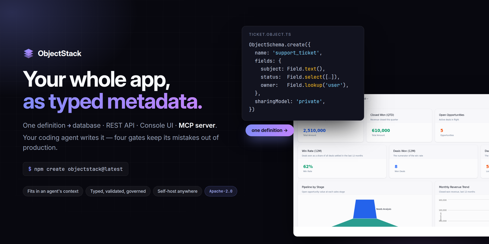
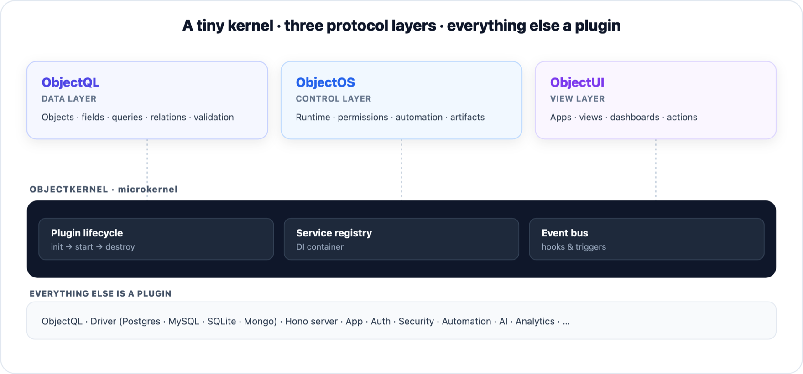

# ObjectStack

[](./LICENSE)

[](https://objectstack.ai/docs)

> ## Apps small enough for AI to hold whole.
>
> ObjectStack turns the whole app — data model, UI, workflows, permissions —
> into typed metadata that fits in a single context window. Agents read it
> whole, reason it whole, refactor it whole.
>
> That metadata is your **business ontology** — an open, versioned definition of
> your objects, permissions, and flows that you own, not code scattered across a
> framework. Strict TypeScript, Zod schemas, and a validation gate catch the
> agent's mistakes at authoring time; the runtime derives the database, REST API,
> UI, and MCP server, and enforces permissions and audit on every call.

`Fits in an agent's context` · `Typed, validated, governed` · `Self-host anywhere` · Apache-2.0

<p align="center">
  <a href="https://youtu.be/CX_FlOoOtr0">
    
  </a>
  <br>
  <a href="https://youtu.be/CX_FlOoOtr0"><b>▶&nbsp; Watch: ObjectStack in 90 Seconds</b></a>
</p>

**Everything in this repo is the open stack** — protocol, microkernel, SDK,
CLI, and the production runtime, Apache-2.0 with no open-core asterisks
([LICENSING.md](./LICENSING.md)). You build & ask with Claude Code or any coding
agent: the agent writes the metadata in your repo and operates the running app
over MCP. Want the same loop hosted, in the browser, nothing to install? That's
[ObjectOS](https://www.objectos.ai), the commercial runtime environment built on
this stack.

<p align="center">
  
  <br><sub>One typed definition → database · REST API · client SDK · UI · MCP tools.</sub>
</p>

## Try it in five minutes

**1 · Create a project.** The scaffolder installs the AI skills bundle and writes
an `AGENTS.md`, so your agent starts with the protocol's rules already loaded —
not with generic "write me some TypeScript" priors.

```bash
npm create objectstack@latest my-app && cd my-app
```

**2 · Describe the requirement.** Open the project in Claude Code (or Cursor,
Copilot, …) and say what the business needs:

> Build a support desk. Add a `ticket` object with subject, description, a
> priority select and a status select. Add a **Resolve** action that only shows
> on tickets that aren't already resolved. Add an "Open tickets" list view and a
> Support nav group. Run `npm run validate` when you're done.

The agent writes typed metadata — not a codebase. The gate rejects what would
fail silently at runtime, and the agent fixes it before you ever see it.

**3 · Preview in the browser.**

```bash
npx os dev --ui   # → http://localhost:3000/_console/
```

The Console renders the real app — records, boards, dashboards. Something wrong?
Say what to change. **Requirement changes run the same loop**, on a diff you can
actually read.

No install at all? Open a live app on
[StackBlitz](https://stackblitz.com/github/objectstack-ai/hotcrm).

<p align="center">
  
  
</p>
<p align="center"><sub>Prefer clicking? Studio authors the same metadata visually — same artifacts, same gate.</sub></p>

## What one definition gives you

Point an agent at an empty repo and you get a one-off codebase: every screen
hand-invented, every mistake yours to find at runtime. ObjectStack gives the
agent a **vocabulary** instead — typed, validated primitives for what enterprise
software is actually made of. The agent composes the definition; the runtime
already knows how to run it.

| | Capability |
| :--- | :--- |
| **Objects & fields** | Typed schemas with relations, validation, formulas, files |
| **Permissions** | RBAC plus row- and field-level security, enforced by the runtime |
| **Automation** | DAG flows, record triggers, scheduled jobs, webhooks |
| **Approvals** | Multi-step chains with queues and a full audit trail |
| **Views** | Lists, kanban, calendars, gantt, galleries — declared, not coded |
| **Dashboards & reports** | Charts, aggregations, KPIs bound to live data |
| **Actions** | Permission-checked buttons and server operations |
| **APIs & SDK** | Generated REST + realtime endpoints, typed client SDK |
| **AI tools** | Every object and exposed action doubles as a governed MCP tool |
| **Translations** | Labels and UI text as metadata, per locale |
| **Seed data** | Fixtures and demo datasets that ship with the app |
| **Datasources** | PostgreSQL, MySQL, SQLite, MongoDB, or in-memory |

Here's the shape of it — one object, and the database table, REST API, UI views,
and MCP tools all follow:

```ts
import { ObjectSchema, Field } from '@objectstack/spec/data';

export const Ticket = ObjectSchema.create({
  name: 'support_desk_ticket',
  label: 'Ticket',
  sharingModel: 'private',            // org-wide default — the security gate requires it
  fields: {
    subject: Field.text({ label: 'Subject', required: true, searchable: true }),
    status: Field.select({
      label: 'Status',
      required: true,
      options: [
        { label: 'Open', value: 'open', color: '#3B82F6', default: true },
        { label: 'Resolved', value: 'resolved', color: '#10B981' },
      ],
    }),
    due_date: Field.date({ label: 'Due Date' }),
  },
});
```

The REST API exists the moment the object does — no controllers to write:

```bash
curl http://localhost:3000/api/v1/data/support_desk_ticket
```

In the browser, the typed client SDK and React hooks (`useQuery`, `useMutation`,
`usePagination`) live in [`@objectstack/client-react`](packages/client-react).

## Why the mistakes don't ship

"AI writes it" is only useful if AI's mistakes don't reach production. Four gates
stand between the agent and your users:

| Gate | Catches |
| :--- | :--- |
| **Typed** | Strict TypeScript + Zod — shape errors die in the editor, seconds after the agent writes them |
| **Validated** | `os validate` rejects metadata that type-checks but would fail silently at runtime: dangling bindings, bad CEL predicates, missing security posture |
| **Reviewed** | You approve a small readable diff in the Console — not a pile of generated glue |
| **Governed** | The runtime enforces permissions and audit on every call, so even a wrong app stays inside the fence |

The reason this works is the same reason TypeScript was the right host language:
**an agent's errors become located, corrective text it can read and fix itself**,
in seconds — instead of a silent runtime failure nobody traces back.

The other half is size. The bundled example CRM — [`examples/app-crm`](./examples/app-crm):
objects, views, a dashboard, a lead-conversion flow, permission sets, actions,
translations — is small enough for an agent to load end-to-end, reason about
every dependency, and refactor across data, API, UI, and permissions in one
change. It can answer *"what breaks if I change this?"* instead of grepping and
hoping. Measure it yourself:

```bash
find examples/app-crm/src -name '*.ts' -not -name '*.test.ts' | xargs cat | wc -l
```

> Your objects, permissions, and flows are your business ontology — and the
> definition layer of the AI era should be an open protocol you own.
> [Read why](https://www.objectos.ai/en/blog/ai-ontology-open-protocol/).

## Your app is AI-operable, for free

Because the app is typed metadata, the runtime serves it as an **MCP server** at
`/api/v1/mcp` — on by default. Point any MCP client at it and an agent can
inspect and *operate* the app you just built, under the same permissions and RLS
as a human:

```bash
claude mcp add --transport http my-app http://localhost:3000/api/v1/mcp
```

The first tool call opens a browser to sign you in — each deployment is its own
OAuth server, so there's no token to copy-paste. Headless setups (CI,
containers) use an API key instead. Objects are exposed automatically; actions
opt in with `ai: { exposed: true }`. See
[Connect an MCP Client](https://objectstack.ai/docs/ai/connect-mcp) for both flows.

## Ship it

The scaffolded project is container-ready, on the official runtime image
[`ghcr.io/objectstack-ai/objectstack`](./docker):

```bash
docker build -t my-app . && docker compose up -d   # app + Postgres
```

See [Self-Hosted Deployment](https://objectstack.ai/docs/deployment/self-hosting)
for bare Node, Kubernetes, and the secrets you must pin — and
[Build with Claude Code](https://objectstack.ai/docs/getting-started/build-with-claude-code)
to run the whole loop end-to-end.

## Hack on the framework

```bash
git clone https://github.com/objectstack-ai/objectstack.git
cd objectstack
pnpm install     # Node 22+, pnpm 10 (corepack enable)
pnpm build       # build all packages
pnpm dev         # showcase example: REST + Console on :3000
pnpm test        # run the test suite
```

Other examples: `pnpm dev:crm`, `pnpm dev:todo`. Docs site: `pnpm docs:dev`.
[AGENTS.md](./AGENTS.md) is the working rulebook for both humans and agents;
[CONTRIBUTING.md](./CONTRIBUTING.md) covers the workflow.

Three layers sit on a microkernel — **ObjectQL** (data), **Kernel** (control),
**ObjectUI** (view). Everything starts as a Zod schema; TypeScript types, JSON
Schemas, REST routes, UI metadata, and agent tools are all derived from that one
source. The kernel provides only DI, the event bus, and lifecycle; every
capability — drivers, server, auth, security, automation, AI — is a plugin.

<p align="center">
  
</p>

Design details, the plugin lifecycle state machine, and the dependency graph are
in [ARCHITECTURE.md](./ARCHITECTURE.md).

### CLI

The CLI binary ships as both `os` and `objectstack`; `os --help` lists everything.

```bash
os init [name]    # Scaffold a new project
os create         # Interactive project / object scaffolder
os dev            # Dev server with hot-reload (REST + console)
os start          # Production server
os compile        # Build a deployable JSON environment artifact
os serve          # Serve a compiled artifact
os validate       # Validate metadata against the protocol
os lint           # Lint metadata for best-practice violations
os verify         # Boot the app in-process and verify it over real HTTP
os generate       # Scaffold objects, views, flows, agents, migrations
os diff           # Diff two metadata artifacts
os doctor         # Check environment health
os explain        # Explain protocol concepts on the command line
```

Cloud, package registry, secrets, and environment subcommands (`os package …`,
`os environments …`, `os login`, `os cloud …`) target an ObjectStack Cloud
control plane.

### Package directory

<details>
<summary><b>Everything in <code>packages/</code></b>, grouped by layer — click to expand.</summary>

#### Protocol & core

| Package | Description |
| :--- | :--- |
| [`@objectstack/spec`](packages/spec) | The protocol — Zod schemas, TypeScript types, JSON Schemas, constants |
| [`@objectstack/core`](packages/core) | Microkernel — plugin system, DI container, EventBus, Logger |
| [`@objectstack/types`](packages/types) | Shared interfaces describing the runtime environment |
| [`@objectstack/formula`](packages/formula) | Expression engine — CEL plus the ObjectStack stdlib, for formulas, predicates, defaults |
| [`@objectstack/platform-objects`](packages/platform-objects) | Built-in platform objects — identity, security, audit, tenant, metadata |
| [`@objectstack/lint`](packages/lint) | Static validation of a metadata graph, shared by `os validate` and AI authoring |
| [`@objectstack/sdui-parser`](packages/sdui-parser) | Constrained JSX source → SDUI schema tree compiler (parse, never execute) |

#### Engine

| Package | Description |
| :--- | :--- |
| [`@objectstack/objectql`](packages/objectql) | Isomorphic ObjectQL query engine and schema registry |
| [`@objectstack/runtime`](packages/runtime) | Runtime bootstrap — DriverPlugin, AppPlugin, environment artifacts |
| [`@objectstack/rest`](packages/rest) | Auto-generated REST API layer |
| [`@objectstack/metadata`](packages/metadata) | Metadata loading, saving, and persistence |
| [`@objectstack/metadata-core`](packages/metadata-core) | Metadata repository contracts — types, canonicalization, errors |
| [`@objectstack/metadata-fs`](packages/metadata-fs) | File-system metadata repository (JSON files + JSONL change log) |
| [`@objectstack/metadata-protocol`](packages/metadata-protocol) | Metadata management protocol — CRUD, draft/publish, locks, diagnostics |
| [`@objectstack/observability`](packages/observability) | Metrics, error reporting, and logging contracts with noop / console / OTLP exporters |
| [`@objectstack/verify`](packages/verify) | Boot an app in-process and verify it through the real HTTP stack |

#### Drivers

| Package | Description |
| :--- | :--- |
| [`@objectstack/driver-memory`](packages/drivers/driver-memory) | In-memory driver (development, testing, reference implementation) |
| [`@objectstack/driver-sql`](packages/drivers/driver-sql) | SQL driver — PostgreSQL, MySQL, SQLite via Knex |
| [`@objectstack/driver-mongodb`](packages/drivers/driver-mongodb) | MongoDB driver over the official client |
| [`@objectstack/driver-turso`](packages/drivers/driver-turso) | Turso / libSQL driver — edge-first SQLite with embedded replicas |
| [`@objectstack/driver-sqlite-wasm`](packages/drivers/driver-sqlite-wasm) | WASM SQLite driver for browsers and WebContainers (StackBlitz) |

#### Client

| Package | Description |
| :--- | :--- |
| [`@objectstack/client`](packages/client) | Client SDK — CRUD, batch API, error handling |
| [`@objectstack/client-react`](packages/client-react) | React hooks — `useQuery`, `useMutation`, `usePagination` |

#### Plugins

| Package | Description |
| :--- | :--- |
| [`@objectstack/plugin-hono-server`](packages/plugins/plugin-hono-server) | Hono-based HTTP server plugin |
| [`@objectstack/hono`](packages/adapters/hono) | Hono adapter — Node.js, Bun, Deno, Cloudflare Workers |
| [`@objectstack/mcp`](packages/mcp) | MCP server — exposes objects and AI tools over stdio and Streamable HTTP |
| [`@objectstack/plugin-auth`](packages/plugins/plugin-auth) | Authentication and identity (better-auth) |
| [`@objectstack/plugin-security`](packages/plugins/plugin-security) | RBAC, row-level and field-level security |
| [`@objectstack/plugin-sharing`](packages/plugins/plugin-sharing) | Record-level sharing and `sharingModel` enforcement |
| [`@objectstack/organizations`](packages/plugins/organizations) | Multi-organization row-level isolation |
| [`@objectstack/plugin-approvals`](packages/plugins/plugin-approvals) | Multi-step approval engine |
| [`@objectstack/plugin-audit`](packages/plugins/plugin-audit) | Audit log object and audit trail |
| [`@objectstack/plugin-email`](packages/plugins/plugin-email) | Pluggable outbound email transport |
| [`@objectstack/plugin-webhooks`](packages/plugins/plugin-webhooks) | Durable, cluster-aware outbound webhook delivery |
| [`@objectstack/plugin-reports`](packages/plugins/plugin-reports) | Saved reports and scheduled email digests |
| [`@objectstack/plugin-pinyin-search`](packages/plugins/plugin-pinyin-search) | Pinyin recall for CJK search |
| [`@objectstack/plugin-dev`](packages/plugins/plugin-dev) | Zero-config local development assembly |
| [`@objectstack/knowledge-memory`](packages/plugins/knowledge-memory) | In-memory knowledge adapter (dev / test) |
| [`@objectstack/knowledge-ragflow`](packages/plugins/knowledge-ragflow) | RAGFlow knowledge adapter |
| [`@objectstack/embedder-openai`](packages/plugins/embedder-openai) | OpenAI-compatible embedder (OpenAI, DashScope, Ollama, and any drop-in endpoint) |

#### Connectors & triggers

| Package | Description |
| :--- | :--- |
| [`@objectstack/connector-rest`](packages/connectors/connector-rest) | Generic REST connector for the automation engine |
| [`@objectstack/connector-openapi`](packages/connectors/connector-openapi) | Connector actions generated from an OpenAPI document |
| [`@objectstack/connector-mcp`](packages/connectors/connector-mcp) | Any MCP server's tools as connector actions |
| [`@objectstack/connector-slack`](packages/connectors/connector-slack) | Slack Web API connector |
| [`@objectstack/trigger-record-change`](packages/triggers/trigger-record-change) | Launch flows on insert / update / delete |
| [`@objectstack/trigger-schedule`](packages/triggers/trigger-schedule) | Launch flows on a cron, interval, or one-off schedule |
| [`@objectstack/trigger-api`](packages/triggers/trigger-api) | Inbound HTTP / webhook flow trigger with HMAC verification |

#### Services

| Package | Description |
| :--- | :--- |
| [`@objectstack/service-automation`](packages/services/service-automation) | Automation engine — DAG flows, triggers, workflow state machines |
| [`@objectstack/service-analytics`](packages/services/service-analytics) | Aggregations, time series, funnels, dashboards |
| [`@objectstack/service-realtime`](packages/services/service-realtime) | Real-time events and subscriptions |
| [`@objectstack/service-job`](packages/services/service-job) | Cron and interval job scheduler |
| [`@objectstack/service-queue`](packages/services/service-queue) | Background job queue — in-memory or durable DB-backed |
| [`@objectstack/service-cache`](packages/services/service-cache) | Cache — in-memory and Redis |
| [`@objectstack/service-cluster`](packages/services/service-cluster) | Cluster primitives — PubSub, Lock, KV, Counter |
| [`@objectstack/service-cluster-redis`](packages/services/service-cluster-redis) | Redis driver for the cluster service |
| [`@objectstack/service-storage`](packages/services/service-storage) | File storage — local filesystem and S3 |
| [`@objectstack/service-datasource`](packages/services/service-datasource) | External-table federation and datasource lifecycle |
| [`@objectstack/service-settings`](packages/services/service-settings) | Settings — manifest registry and K/V resolver (env > tenant > user) |
| [`@objectstack/service-i18n`](packages/services/service-i18n) | Internationalization |
| [`@objectstack/service-messaging`](packages/services/service-messaging) | Outbound notification dispatch across channels |
| [`@objectstack/service-sms`](packages/services/service-sms) | SMS delivery (Aliyun, Twilio, log) |
| [`@objectstack/service-knowledge`](packages/services/service-knowledge) | Knowledge / RAG orchestration over pluggable adapters |
| [`@objectstack/service-package`](packages/services/service-package) | Package registry — publish, install, manage metadata packages |
| [`@objectstack/cloud-connection`](packages/cloud-connection) | Runtime-side client for an ObjectStack cloud control plane |

#### Tools & apps

| Package | Description |
| :--- | :--- |
| [`@objectstack/cli`](packages/cli) | The `os` / `objectstack` CLI |
| [`create-objectstack`](packages/create-objectstack) | Project scaffolder (`npm create objectstack`) |
| [`@objectstack/console`](packages/console) | Prebuilt Console SPA pinned to this release; source lives in [objectui](https://github.com/objectstack-ai/objectui) |
| [`@objectstack/studio`](packages/apps/studio) | Studio — the visual metadata builder app |
| [`@objectstack/setup`](packages/apps/setup) | Setup — the platform administration app |
| [`@objectstack/account`](packages/apps/account) | Account — sign in, organizations, connected apps |
| [`@objectstack/docs`](apps/docs) | Documentation site (Fumadocs + Next.js) |

#### Examples

| Example | What it shows |
| :--- | :--- |
| [`examples/app-todo`](examples/app-todo) | The smallest app — objects, views, dashboards, flows |
| [`examples/app-crm`](examples/app-crm) | A minimal CRM exercising the full metadata pipeline: objects → views → app → dashboard → hooks → flows → seed |
| [`examples/app-showcase`](examples/app-showcase) | Kitchen sink — every metadata type, view type, chart type, and capability chain; what `pnpm dev` runs |
| [`examples/app-multi-package`](examples/app-multi-package) | One release artifact carrying two packages that share a namespace |
| [`examples/embed-objectql`](examples/embed-objectql) | ObjectQL as a plain library — no kernel, no plugins |
| [HotCRM](https://github.com/objectstack-ai/hotcrm) | Full-featured enterprise CRM reference app (separate repo) |

</details>

## Community

- ⭐ **Star this repo** if ObjectStack is useful — it helps others find it.
- 🐛 Questions, bugs, or feature requests → [open an issue](https://github.com/objectstack-ai/objectstack/issues).
- 🤝 Want to contribute? Start with [CONTRIBUTING.md](./CONTRIBUTING.md) and [ROADMAP.md](./ROADMAP.md).
- 📖 Full documentation at [objectstack.ai/docs](https://objectstack.ai/docs); upgrading between majors is covered in the [upgrade guide](https://objectstack.ai/docs/upgrading).
- ☁️ Want it governed and hosted, with Build & Ask AI built in? [ObjectOS](https://www.objectos.ai) is the commercial runtime for these definitions — [objectstack-ai/objectos](https://github.com/objectstack-ai/objectos) is its public home.

## License

Apache-2.0. See [LICENSE](./LICENSE) and [LICENSING.md](./LICENSING.md).
