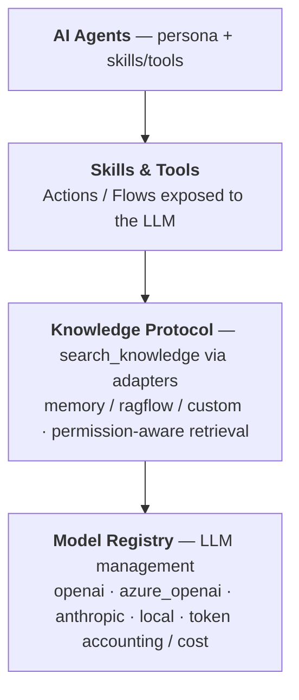

# AI Overview

AI in ObjectStack is a **cross-protocol capability layer**: agents, tools, and knowledge retrieval sit on top of the same objects, actions, permissions, and automation that power the rest of the platform. This module covers the architecture and each of its moving parts.

<Callout type="info">
**Two different "AI" stories — don't confuse them:**
- **AI *builds* your app** (authoring) — Claude Code writes the typed metadata; you verify in the Console. That's the [Build with Claude Code](/docs/getting-started/build-with-claude-code) workflow, in *Get Started* — a different thing from this section.
- **Your app *exposes/uses* AI** (runtime) — agents, tools, RAG, natural-language queries, and an MCP server that let an AI operate the app you built, under the same permissions. **This section covers that.**
</Callout>

<Callout type="info">
**The open framework does AI bring-your-own-AI** — your keys, your models, zero platform AI cost. Everything on this page is part of the open edition unless a section is explicitly marked **cloud / Enterprise**:

- **Data & actions → `@objectstack/mcp`** (BYO-AI). Point your own AI — Claude, Cursor, any MCP client, or a local model — at the app's objects, queries, and business **actions**, governed by the same RLS. With a local model, data *and* inference stay inside your boundary.
- **Knowledge & RAG → the Knowledge Protocol + adapter plugins** (`knowledge-memory`, `knowledge-ragflow`, `embedder-openai`) — permission-aware retrieval over your own objects.
- **Agents, tools, skills → typed metadata** (`defineAgent` / `defineTool` / `defineSkill`) plus the Model Registry. Author them as source (`*.agent.ts`, `*.tool.ts`, …) with your own AI coding agent (Claude Code, Cursor), aided by the ObjectStack [skills](/docs/ai/skills-reference) and MCP introspection.

The **cloud / Enterprise** tier adds an in-product chat *runtime* on top of these same primitives — the `ask` data-query assistant, the `build` Studio authoring assistant, and the `/api/v1/ai/*` chat endpoints (`@objectstack/service-ai`, cloud [ADR-0025](https://github.com/objectstack-ai/cloud/blob/main/docs/adr/0025-service-ai-to-cloud-open-mcp-only.md)). The open edition has no built-in in-product chat.
</Callout>

## What's in this module

- [AI Agents](/docs/ai/agents) — the two platform agents (`ask` / `build`), skills as the extension primitive, and agent anatomy
- [Actions as Tools](/docs/ai/actions-as-tools) — explicit opt-in exposure of Actions to the LLM, HITL approval, permission-aware execution
- [Knowledge & RAG](/docs/ai/knowledge-rag) — the Knowledge Protocol and its adapter plugins
- [Natural Language Queries](/docs/ai/natural-language-queries) — the built-in data tools that turn questions into ObjectQL
- [AI Skills System](/docs/ai/skills) — structured knowledge modules for AI coding assistants
- [AI Skills Reference](/docs/ai/skills-reference) — the per-skill catalog
- Spec: [Knowledge Protocol](/docs/protocol/knowledge)
- Schema reference: [AI](/docs/references/ai)

---

## AI Architecture

ObjectStack provides a comprehensive AI platform:



---

## Best Practices

### 1. AI Agent Design

✅ **DO:**
- Define clear agent roles and responsibilities
- Provide detailed instructions
- Use appropriate temperature settings
- Test with real-world scenarios
- Monitor agent performance

❌ **DON'T:**
- Give agents conflicting instructions
- Use high temperatures for factual tasks
- Deploy without testing
- Ignore cost implications

### 2. Knowledge & Data Access

✅ **DO:**
- Declare knowledge sources via the Knowledge Protocol and pick the adapter (`memory`, `ragflow`, custom) that fits your data
- Rely on the built-in data tools (`query_records` / `get_record` / `aggregate_data`) for live record access
- Let permission-aware retrieval and RLS scope what each user's agent can see
- Keep indexed objects in sync via the protocol's event sync

❌ **DON'T:**
- Reinvent a vector DB — let the adapter engine handle chunking/embedding/rerank
- Bypass `ExecutionContext`, which would leak rows past row-level security
- Expose objects to agents that the calling user can't read

### 3. Prompt Engineering

✅ **DO:**
- Be specific and clear
- Provide examples
- Use role-playing ("You are a...")
- Include constraints
- Test variations

❌ **DON'T:**
- Be vague or ambiguous
- Assume context
- Use complex jargon
- Write overly long prompts

### 4. Cost Management

✅ **DO:**
- Choose appropriate models (GPT-3.5 vs GPT-4)
- Implement caching
- Set token limits
- Monitor usage
- Use cheaper models for simple tasks

❌ **DON'T:**
- Always use the most expensive model
- Skip caching
- Allow unlimited tokens
- Ignore cost metrics

### 5. Security & Privacy

✅ **DO:**
- Implement access controls
- Mask sensitive data
- Log AI interactions
- Review outputs
- Follow data privacy regulations

❌ **DON'T:**
- Expose PII to external APIs
- Skip output validation
- Ignore audit trails
- Trust AI blindly

---

## Real-World Integration

### Complete Sales AI Workflow

Agents are metadata, not classes — there are no `.enrich()` / `.predict()` /
`.query()` methods to call. Enrichment, scoring, and email drafting are
implemented as **Actions/Flows exposed as tools**, and the LLM calls them while
reasoning over the conversation. In the **open edition**, your own AI reaches
those same tools over MCP (`@objectstack/mcp`), and you drive them on a trigger
or schedule from a [Flow or Workflow](/docs/automation).

<Callout type="info">
**Cloud / Enterprise runtime.** The in-product chat invocation shown below — the
REST chat endpoint (`/api/v1/ai/agents/:agentName/chat`) and the server-side
`aiService.chatWithTools(...)` — is the `@objectstack/service-ai` chat runtime,
which ships in the **cloud / Enterprise** tier. The agent, tool, and skill
*metadata* it consumes is open; only this in-product chat runtime is not.
</Callout>

```typescript
// Invoke an agent over the REST chat endpoint.
// POST /api/v1/ai/agents/:agentName/chat
const res = await fetch('/api/v1/ai/agents/sales_assistant/chat', {
  method: 'POST',
  headers: { 'Content-Type': 'application/json', Authorization: `Bearer ${token}` },
  body: JSON.stringify({
    message: `A hot lead just came in (id ${lead.id}). Qualify it, suggest the
              next best action, and draft a professional intro email.`,
  }),
});
const { reply } = await res.json();
// The agent calls its `analyze_lead` / `suggest_next_action` / `generate_email`
// tools (the Actions/Flows you wired) and returns its summary in `reply`.
```

Server-side, the same flow runs through `chatWithTools`, threading the
end-user's `ExecutionContext` so tool calls respect row-level security:

```typescript
const reply = await aiService.chatWithTools(messages, tools, {
  toolExecutionContext: {
    actor: { id: currentUser.id, name: currentUser.displayName, positions: currentUser.positions, permissions: currentUser.permissions },
    conversationId,
    environmentId,
  },
});
```

To run any of this on lead creation or on a schedule, drive the agent from a
[Flow or Workflow](/docs/automation) rather than expecting trigger/schedule fields
on the agent itself.

---

**Next:** [AI Agents →](/docs/ai/agents)
