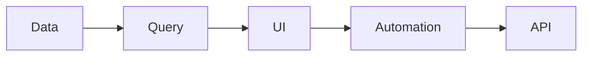

ObjectStack ships a set of **domain-specific skills** that teach AI assistants (Claude Code, GitHub Copilot, Cursor, …) the protocol's schemas, patterns, and constraints — plus **process** skills that teach how work moves through a project rather than what to author. This guide is the complete catalog.

<Callout type="info">
**New to skills?** Read [AI Skills System](/docs/ai/skills) first for the conceptual overview, then return here for the per-skill reference.
</Callout>

---

## Installing skills

Skills install into a project from the [skills.sh](https://skills.sh) registry, reading the `skills/` directory of the [`objectstack-ai/objectstack`](https://github.com/objectstack-ai/objectstack) repository.

**New projects — installed automatically.** `create-objectstack` runs the install step for you during scaffolding:

```bash
npm create objectstack@latest my-app
```

**Existing projects — install the whole bundle:**

```bash
npx skills add objectstack-ai/objectstack/skills --all
```

Run the same command again at any time to pull the latest versions — `--all` is idempotent, so updating is one command regardless of how many skills the bundle contains. To choose which skills to add instead of the full set, run `npx skills add objectstack-ai/objectstack/skills` without `--all`. (The `/skills` subpath scopes discovery to the published catalog — always keep it in the command.)

<Callout type="info">
Skills are versioned as **one bundle**. You do not track or update each skill individually — `--all` always installs the matching set for the `@objectstack/spec` version in your project.
</Callout>

---

{/* BEGIN GENERATED: skills (packages/spec/scripts/build-skill-docs.ts) — DO NOT EDIT */}

ObjectStack ships **11 skills** — one per authoring domain, plus process skills for how a project is delivered. Each is self-contained: an AI assistant loads only the ones a task needs.

## Quick Reference

| # | Skill | Domain | Path | What it covers |
| :--- | :--- | :--- | :--- | :--- |
| 1 | [Platform](#platform) | `platform` | `skills/objectstack-platform/` | Bootstrap, configure, extend, and operate ObjectStack runtimes. Covers project setup (`defineStack`, drivers, adapters, scaffolding), plugin and service development (PluginContext, DI, kernel hooks like `kernel:ready`), and operations (CLI commands, migrations, deployment, test harnesses via LiteKernel). |
| 2 | [Data](#data) | `data` | `skills/objectstack-data/` | Design ObjectStack data schemas — objects, fields, field conditional rules, relationships, validations, indexes, lifecycle hooks, permissions, row-level security — and the seeds (`defineSeed()`) that load fixtures and reference data alongside them. |
| 3 | [Query](#query) | `query` | `skills/objectstack-query/` | Construct ObjectQL queries — filters, sorting, pagination, aggregation, relation expansion, and full-text search. |
| 4 | [UI](#ui) | `ui` | `skills/objectstack-ui/` | Author ObjectStack UI metadata — Views (list/form/kanban/calendar/gantt), Apps (navigation), Pages (structured plus the HTML and React source-authoring tiers, ADR-0080/0081), Dashboards, Reports, Charts, Actions, and package Docs (`src/docs/*.md`). |
| 5 | [Automation](#automation) | `automation` | `skills/objectstack-automation/` | Design ObjectStack automation — Flows (visual logic), Triggers, Approvals, state machines, scheduled jobs, and webhooks. |
| 6 | [AI](#ai) | `ai` | `skills/objectstack-ai/` | Design ObjectStack AI skills, tools, knowledge sources, conversations, model registry entries, and MCP integrations. |
| 7 | [API](#api) | `api` | `skills/objectstack-api/` | Design the server-side API surface that an ObjectStack runtime exposes — REST endpoints, auth providers, realtime channels, error envelopes, batch/versioning contracts. |
| 8 | [i18n](#i18n) | `i18n` | `skills/objectstack-i18n/` | Author ObjectStack translation bundles — object/field labels, view text, app navigation strings, automation messages — and configure locale fallback, coverage reporting, and the per-locale source layout. |
| 9 | [Formula](#formula) | `expression` | `skills/objectstack-formula/` | Author CEL expressions used across ObjectStack — formula fields, field conditional rules (`visibleWhen`, `readonlyWhen`, `requiredWhen`), validation / sharing / visibility predicates, flow conditions, and dynamic seed values. |
| 10 | [PM Dispatch](#pm-dispatch) | `process` | `skills/objectstack-pm-dispatch/` | Run a project-manager dispatch loop over a GitHub backlog: triage and queue ready issues, claim each one, dispatch it to a parallel developer agent that returns a structured JSON report, review the results against GitHub, and drive accepted pull requests to landing — escalating to the maintainer only what genuinely needs a human decision. Ships the developer-agent operating template the loop injects into every dispatch (no custom agent types required) and the upstream-reporting procedure for platform defects an app project finds. |
| 11 | [Upgrade](#upgrade) | `process` | `skills/objectstack-upgrade/` | Upgrade an ObjectStack metadata project across a protocol major — run the deterministic conversion chain, then work the semantic residue the chain cannot express (intent choices, custom code on retired APIs, stale prose) to a decision with the project's owner, and finish with a green `validate` plus a human-readable upgrade report. |

---

### Platform

**Domain** `platform` · **Path** `skills/objectstack-platform/`

Bootstrap, configure, extend, and operate ObjectStack runtimes. Covers project setup (`defineStack`, drivers, adapters, scaffolding), plugin and service development (PluginContext, DI, kernel hooks like `kernel:ready`), and operations (CLI commands, migrations, deployment, test harnesses via LiteKernel).

Use when the user is writing `objectstack.config.ts`, building a plugin or driver, wiring a framework adapter, running `os` CLI commands, or planning deployment.

Do not use for data schema design (see objectstack-data) or query patterns (see objectstack-query); data lifecycle hooks (beforeInsert / afterUpdate) belong in objectstack-data — only kernel / service-level events live here.

**Tags:** `project`, `defineStack`, `driver`, `adapter`, `plugin`, `kernel`, `service`, `DI`, `lifecycle`, `cli`, `deploy`, `ops`

---

### Data

**Domain** `data` · **Path** `skills/objectstack-data/`

Design ObjectStack data schemas — objects, fields, field conditional rules, relationships, validations, indexes, lifecycle hooks, permissions, row-level security — and the seeds (`defineSeed()`) that load fixtures and reference data alongside them.

Use when the user is creating or modifying `*.object.ts` / `*.seed.ts` files, picking field types, modelling relationships, writing `beforeInsert`/`afterUpdate` hooks, configuring per-object access control, or authoring bootstrap / demo data. Use for `visibleWhen` / `readonlyWhen` / `requiredWhen` rules that belong on fields.

Do not use for querying data (see objectstack-query) or for plugin / kernel hooks (see objectstack-platform). CEL expressions in formulas / validations / sharing rules / dynamic seed values: load objectstack-formula alongside.

**Tags:** `object`, `field`, `validation`, `index`, `relationship`, `hook`, `schema`, `permission`, `rls`, `security`, `seed`, `fixture`

---

### Query

**Domain** `query` · **Path** `skills/objectstack-query/`

Construct ObjectQL queries — filters, sorting, pagination, aggregation, relation expansion, and full-text search.

Use when the user is writing a query DSL expression, picking pagination strategy, or designing a list view's filter spec.

Do not use for defining objects / fields / relationships (see objectstack-data) or for designing the API endpoint that exposes a query (see objectstack-api).

**Tags:** `query`, `filter`, `sort`, `paginate`, `aggregate`, `ObjectQL`, `full-text`

---

### UI

**Domain** `ui` · **Path** `skills/objectstack-ui/`

Author ObjectStack UI metadata — Views (list/form/kanban/calendar/gantt), Apps (navigation), Pages (structured plus the HTML and React source-authoring tiers, ADR-0080/0081), Dashboards, Reports, Charts, Actions, and package Docs (`src/docs/*.md`).

Use when the user is adding `*.view.ts` / `*.app.ts` / `*.dashboard.ts` / `*.action.ts` / `src/docs/*.md` files or designing a Studio-rendered UI surface, including dataset-bound dashboard/report widgets.

Do not use for: data schema (see objectstack-data), interactive screen flows / wizards (those are `*.flow.ts` with `type: 'screen'` — see objectstack-automation), the React renderer implementation (lives in `packages/client-react`, not metadata), or Studio's own admin UI (that ships with the platform). CEL expressions in visibility/conditional rules: load objectstack-formula alongside.

**Tags:** `view`, `app`, `page`, `dashboard`, `report`, `chart`, `action`, `widget`, `doc`

---

### Automation

**Domain** `automation` · **Path** `skills/objectstack-automation/`

Design ObjectStack automation — Flows (visual logic), Triggers, Approvals, state machines, scheduled jobs, and webhooks.

Use when the user is adding `*.flow.ts`, wiring an event-driven rule, or modelling an approval chain.

Do not use for data lifecycle hooks at the object layer (see objectstack-data) or for kernel / plugin events (see objectstack-platform). CEL expressions in flow conditions / edge guards: load objectstack-formula alongside.

**Tags:** `flow`, `workflow`, `trigger`, `approval`, `state-machine`, `scheduled`, `webhook`

---

### AI

**Domain** `ai` · **Path** `skills/objectstack-ai/`

Design ObjectStack AI skills, tools, knowledge sources, conversations, model registry entries, and MCP integrations.

Use when the user is adding `*.skill.ts` / `*.tool.ts`, configuring an LLM provider, wiring agent tools, or indexing ObjectStack data as a knowledge source for RAG. Agents themselves are platform-internal (`ask` / `build`) — third parties extend them via skills and tools, not by authoring `*.agent.ts`.

Do not use for general LLM prompting questions unrelated to ObjectStack metadata.

**Tags:** `agent`, `tool`, `skill`, `conversation`, `llm`, `embedding`, `mcp`

---

### API

**Domain** `api` · **Path** `skills/objectstack-api/`

Design the server-side API surface that an ObjectStack runtime exposes — REST endpoints, auth providers, realtime channels, error envelopes, batch/versioning contracts.

Use when the user is adding `*.endpoint.ts`, configuring auth providers, defining custom routes, or extending the REST generator.

Do not use for: consuming an ObjectStack API from a client (that is just standard HTTP — no skill needed); the auto-generated CRUD endpoints (those follow from objectstack-data); request-side query syntax (see objectstack-query). CEL expressions in route guards or auth predicates: load objectstack-formula alongside.

**Tags:** `rest`, `endpoint`, `auth`, `realtime`, `server`

---

### i18n

**Domain** `i18n` · **Path** `skills/objectstack-i18n/`

Author ObjectStack translation bundles — object/field labels, view text, app navigation strings, automation messages — and configure locale fallback, coverage reporting, and the per-locale source layout.

Use when the user is adding `*.translation.ts` files, wiring a new locale, or resolving missing-translation warnings.

Do not use for general i18n library questions unrelated to ObjectStack bundles.

**Tags:** `i18n`, `translation`, `locale`, `l10n`, `bundle`, `coverage`

---

### Formula

**Domain** `expression` · **Path** `skills/objectstack-formula/`

Author CEL expressions used across ObjectStack — formula fields, field conditional rules (`visibleWhen`, `readonlyWhen`, `requiredWhen`), validation / sharing / visibility predicates, flow conditions, and dynamic seed values.

Use when the user is writing an `F`, `P`, or `cel` tagged-template literal, or asks "how do I express X as a formula / predicate".

Do not use for SQL fragments (driver-native), cron schedules (cron dialect), or L2 hook bodies (those belong in objectstack-data).

**Tags:** `cel`, `formula`, `predicate`, `condition`, `validation`, `visibility`, `seed-dynamic`

---

### PM Dispatch

**Domain** `process` · **Path** `skills/objectstack-pm-dispatch/`

Run a project-manager dispatch loop over a GitHub backlog: triage and queue ready issues, claim each one, dispatch it to a parallel developer agent that returns a structured JSON report, review the results against GitHub, and drive accepted pull requests to landing — escalating to the maintainer only what genuinely needs a human decision. Ships the developer-agent operating template the loop injects into every dispatch (no custom agent types required) and the upstream-reporting procedure for platform defects an app project finds.

Use when asked to "work through the backlog", "batch-dispatch issues", "派发 issue 给开发 agent", to stand up a multi-agent delivery loop in an ObjectStack app project, or to report a platform bug found while building an app.

Do not use for authoring ObjectStack metadata (the domain skills cover that), for a single already-scoped change you can just make, or as a replacement for the project's own conventions file — that file always wins.

**Tags:** `pm`, `dispatch`, `backlog`, `triage`, `multi-agent`, `delivery`, `github`, `escalation`, `upstream`

---

### Upgrade

**Domain** `process` · **Path** `skills/objectstack-upgrade/`

Upgrade an ObjectStack metadata project across a protocol major — run the deterministic conversion chain, then work the semantic residue the chain cannot express (intent choices, custom code on retired APIs, stale prose) to a decision with the project's owner, and finish with a green `validate` plus a human-readable upgrade report.

Use when a project is on an older protocol major and must move to the current one, when `@objectstack/spec` was bumped across a major and metadata or code stopped parsing, when a parse or `tsc` error quotes a `[REMOVED]` prescription, or when asked to "upgrade to v17" / "升级到 v17" / "一键升级元数据项目".

Do not use to author new metadata (the domain skills cover that), to design a retirement in the ObjectStack platform repo itself (that is the platform's own internal playbook), or to hand-write a rewrite the conversion chain already applies — running the chain is always the first step, never a fallback.

**Tags:** `upgrade`, `migration`, `protocol`, `major`, `retired-keys`, `tombstone`, `conversions`, `validate`, `report`

---

{/* END GENERATED: skills */}

## Skill anatomy

Every skill is a directory under `skills/`:

```
skills/objectstack-{domain}/
├── SKILL.md              # required — frontmatter (name, description, domain, tags) + prose guide
├── references/           # generated & optional — present only when the skill maps to Zod sources
│   └── _index.md         # pointers into @objectstack/spec Zod sources
├── rules/                # optional — detailed implementation rules
└── evals/                # optional — AI comprehension test cases
```

`SKILL.md` is the only required file. The `references/_index.md` index is generated by `packages/spec/scripts/build-skill-references.ts` and points into the published `@objectstack/spec` schemas in `node_modules` — skills never bundle copies of the schemas, so they stay version-aligned automatically. Skills with no mapped Zod sources (such as Formula) ship without a `references/` directory at all.

<Callout type="warn">
The catalog above (names, domains, descriptions) is **generated from each `SKILL.md` frontmatter** by `build-skill-docs.ts`. Edit the frontmatter, not this page — then run `pnpm --filter @objectstack/spec gen:skill-docs`.
</Callout>

---

## Best practices

### 1. Start with the right skill

Use the [Quick Reference](#quick-reference) table to find the skill that matches your task rather than guessing. When a task spans domains, the per-skill "Do not use for …" notes point you to the right neighbour.

### 2. Chain skills for complex tasks

Most real-world work spans multiple domains. A typical CRM feature chains:



### 3. Load Formula alongside its host

Any CEL expression — a validation predicate, a flow condition, a field visibility rule — is covered by **Formula**. Load it *in addition to* the host skill (Data, Automation, UI), not instead of it.

### 4. Respect skill boundaries

If a skill says "delegate to X for Y", follow it. Skills are deliberately focused and composable — keeping them narrow is what lets an assistant load only the context a task needs.

---

## Next steps

- [AI Skills System](/docs/ai/skills) — conceptual overview of the skills architecture
- [AI Capabilities](/docs/ai) — AI agents, RAG pipelines, and intelligent automation
- [Plugin Development](/docs/plugins/development) — build custom plugins
- [Development Standards](/docs/concepts/design-principles) — naming conventions and project structure
