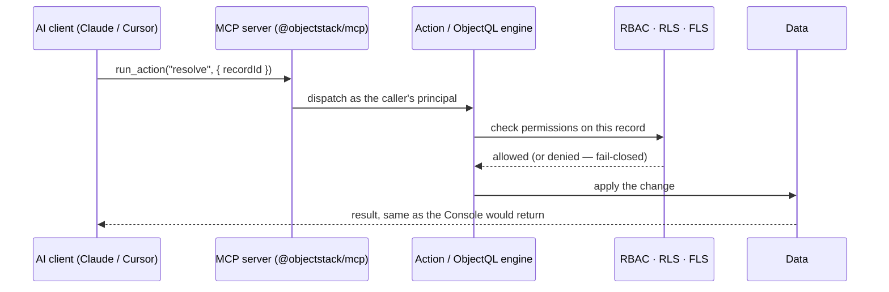

# API Overview

ObjectStack generates its entire API surface — REST endpoints, realtime protocols, and the client SDK — from your metadata: define an object once and its endpoints exist. This module documents those surfaces and how to consume them.

ObjectStack exposes a fully typed REST API. All endpoints use JSON request/response bodies. The API is **service-driven** — routes are only available when the corresponding plugin is installed. Use the [Discovery endpoint](#discovery) to determine what services are available at runtime.

### Surfaces at a glance

| Surface | Status in this repo |
| :--- | :--- |
| **REST** | ✅ Auto-generated from the protocol (`@objectstack/rest`) — CRUD, query, batch, metadata, packages |
| **Realtime** | ⚠️ In-process pub/sub service (`@objectstack/service-realtime`, single-instance); the `/realtime/*` REST routes and WebSocket/SSE transport are plugin-provided — none ships in the open framework |
| **MCP** | ✅ Non-system objects exposed automatically as Model Context Protocol tools; actions additionally require the author's `ai.exposed` opt-in — every call is gated by the caller's permissions/RLS ([AI module](/docs/ai)) |
| **GraphQL** | ⚠️ Route is wired but **bring-your-own service**: `/graphql` returns 501 unless an implementation of the `IGraphQLService` contract is registered — none ships in the open framework |
| **OData** | ⚠️ Vocabulary only: REST list endpoints accept OData-style operators (e.g. `$top`), but there is no standalone OData endpoint |

<Callout type="info">
**Base URL**: Configurable, defaults to `/api/v1`. All paths below are relative to the base URL.
</Callout>

## Your app as an MCP server

REST and GraphQL are how *code* consumes your app. **MCP is how *AI* consumes it.**
Because every object and action is typed metadata, ObjectStack can expose the whole app
as a [Model Context Protocol](https://modelcontextprotocol.io) server — so an AI client
(Claude Code, Claude Desktop, Cursor, a local model) can inspect and *operate* the app
you built, under the same permissions and RLS as the UI. It is served at `/api/v1/mcp`
by default — set `OS_MCP_SERVER_ENABLED=false` to opt out
(see [environment variables](/docs/deployment/environment-variables#mcp-server)).

The generated tools mirror the surfaces you already defined:
`list_objects` / `describe_object` (discover the schema), `query_records` / `get_record`
(read), `create_record` / `update_record` / `delete_record` (write), and
`list_actions` / `run_action` (invoke your business actions by name). Every call runs as
the caller — RBAC, RLS, and field-level security all apply.



See [Actions as Tools](/docs/ai/actions-as-tools) for the `run_action` bridge and the
[MCP reference](/docs/references/ai/mcp) for binding external MCP servers into your agents.

## Authentication

Every REST call runs as a principal — anonymous requests only see what your
permission model grants anonymous users. Two ways to authenticate:

- **Session cookie** (browsers, quick local tests): `POST /api/v1/auth/sign-in/email`
  with `{ "email": "…", "password": "…" }` sets the session cookie — reuse it with
  `curl -c cookies.txt` / `-b cookies.txt`. On a fresh dev database the seeded
  admin is `admin@objectos.ai` / `admin123`.
- **API key** (scripts, CI, headless agents): mint one with `POST /api/v1/keys`
  (the key is shown once), or from **Setup → Connect an Agent** in the Console.
  Send it as `x-api-key: osk_…` or `Authorization: Bearer osk_…`.

See [Authentication](/docs/permissions/authentication) for the full identity
surface (OAuth flows, sessions, providers) and
[Plugin Endpoints](/docs/api/plugin-endpoints) for the auth route catalog.

## What's in this module

- [Data API](/docs/api/data-api) — CRUD, batch operations, record cloning, and analytics queries
- [Metadata & Package API](/docs/api/metadata-api) — object schemas, metadata types, UI views, and package management
- [Plugin Endpoints](/docs/api/plugin-endpoints) — auth, workflow, realtime, and other plugin-provided routes
- [Declarative Endpoints](/docs/api/declarative-endpoints) — publish an HTTP endpoint of your own as metadata (`apis:`)
- [Client SDK](/docs/api/client-sdk) — the official TypeScript client
- [Environment Routing](/docs/api/environment-routing) — routing requests across environments
- [Data Flow](/docs/api/data-flow) — how a request travels through the stack
- [Error Handling (Client)](/docs/api/error-handling-client) — handling API errors in client code
- [Error Handling (Server)](/docs/api/error-handling-server) — raising and shaping errors on the server
- [Error Catalog](/docs/api/error-catalog) — the full list of error codes
- [Wire Format](/docs/api/wire-format) — request/response envelopes on the wire

The two endpoint pages are easy to confuse: **Plugin Endpoints** is a catalog of routes the
platform serves for you once a plugin is installed, while **Declarative Endpoints** is how you
declare a route of your own, under your app's namespace, for callers outside the platform.

Spec: [HTTP API](/docs/protocol/kernel/http-protocol), [Real-Time Protocols](/docs/protocol/kernel/realtime-protocol)

Schema reference: [API](/docs/references/api)

---

## Discovery

The discovery endpoint is the entry point for all clients. It returns the API version, available routes, service capabilities, and per-service status.

### `GET /api/v1` (and `GET /api/v1/discovery`)

Returns the full discovery manifest. `@objectstack/rest` registers **one handler at both
paths** — the API base path and `<basePath>/discovery` — so the two are the same document,
not a redirect and not two shapes. In a REST-less composition the runtime dispatcher
registers `<basePath>/discovery` as the fallback owner instead, and then serves its own
`/.well-known/objectstack` payload there (see below); when `@objectstack/rest` is mounted
the dispatcher cedes the route to it, so a single owner answers it (ADR-0076 D11).

**Response**:
```json
{
  "version": "v1",
  "apiName": "ObjectStack API",
  "routes": {
    "data": "/api/v1/data",
    "metadata": "/api/v1/meta"
  },
  "services": {
    "metadata": {
      "enabled": true,
      "status": "available",
      "route": "/api/v1/meta",
      "provider": "objectql"
    },
    "data": { "enabled": true, "status": "available", "route": "/api/v1/data", "provider": "objectql" },
    "analytics": { "enabled": false, "status": "unavailable", "message": "Install service-analytics to enable" },
    "auth": { "enabled": false, "status": "unavailable", "message": "Install plugin-auth to enable" }
  },
  "capabilities": {
    "cron": { "enabled": false },
    "automation": { "enabled": false },
    "search": { "enabled": false },
    "transactionalBatch": { "enabled": true, "description": "Atomic cross-object batch endpoint (POST {basePath}/batch)…" }
  }
}
```

Disabled/uninstalled route keys (e.g. `auth`, `analytics`, `workflow`) are omitted from `routes` entirely rather than set to `null`; check `services` to tell "not installed" apart from "installed but not yet mounted here." The sample above shows a minimal install: `analytics` reports `unavailable` and advertises no route until `@objectstack/service-analytics` registers the engine — the dispatcher then also mounts `/api/v1/analytics/*` (the routes are capability-conditional; an uninstalled capability answers 404 for every method).

`metadata` is reported from whatever implementation fills its slot, so the sample's `available` is the `MetadataPlugin` case (a persisted `sys_metadata` registry). A stack running the kernel's in-memory fallback instead reports `status: "degraded"` with a `message` naming what is missing and what to install. `handlerReady` is `true` either way: `/api/v1/meta` is served by the protocol, so the route is mounted whichever registry sits behind it.

`capabilities` is a flat map of platform feature flags, one entry per well-known
capability (`comments`, `automation`, `cron`, `search`, `export`, `chunkedUpload`,
`transactionalBatch`), each derived from what is actually registered — never hardcoded.
`transactionalBatch` (#3298, ADR-0034) is the one worth negotiating at connect time: it is
`true` **iff** the atomic cross-object batch route (`POST {basePath}/batch`) is mounted
*and* the runtime engine can honour a transaction, so a client can decide once whether to
send an atomic batch or fall back to client-side sequencing, instead of probing for
`404`/`405`/`501`. See [Data API → batch](/docs/api/data-api).

### `GET /.well-known/objectstack`

Served by the runtime dispatcher (`@objectstack/runtime`), not `@objectstack/rest` — its body is wrapped in the response envelope as `{ "success": true, "data": { ... } }` and includes fields (`name`, `environment`, `features`, `locale`) that the `@objectstack/rest`-served `/api/v1` response above does not. The client SDK's `connect()` tries `/api/v1/discovery` first and falls back to this endpoint, unwrapping either `body.data` or the bare `body`.

<Callout type="info">
**Service Status Values**: `available` (fully operational), `registered` (route declared but handler unverified — may return 501), `degraded` (partial functionality), `unavailable` (not installed), `stub` (placeholder that throws errors)
</Callout>

### What an absent capability answers

Discovery never advertises a route for a service it reports `unavailable`. If you call one anyway, the status tells you **which kind of absence** you hit:

| You get | Meaning | Example |
| :--- | :--- | :--- |
| **404** | The route is not mounted. The server does not expose this path at all. | `/analytics/*` without an analytics service — the mount itself is gated; `/mcp` when the MCP server is disabled for the environment |
| **501** | The route is mounted; nothing implements it. The request reached a handler that had nothing to delegate to. | `/automation`, `/notifications`, `/ui/*`, `/ai/*`, `/auth/*`, `/i18n/*`, `/graphql` without their backing service |

A 501 body names the package that would provide the capability — the same sentence `services.<slot>.message` carries in discovery, so the wall and the discovery entry always agree. A 404 here means what 404 always means: check the path.

Neither is retryable. Nothing answers **503** for a missing capability; that status is reserved for genuinely transient states (the kernel still booting, on `GET /ready`).

---

## Error Handling

Error responses depend on which HTTP server is in front of the kernel. There are two wire formats in use today.

**Kernel REST server** (`@objectstack/rest`) emits a string `error` message plus a SCREAMING_SNAKE `code`:

```json
{
  "error": "Record not found: account/123",
  "code": "RECORD_NOT_FOUND"
}
```

Validation failures additionally include a `fields` array (one entry per invalid field). Common codes emitted by the kernel REST server:

| Code | HTTP | Description |
|:-----|:-----|:------------|
| `VALIDATION_FAILED` | 400 | Input validation failed (includes `fields`) |
| `PERMISSION_DENIED` | 403 | Insufficient permissions |
| `RECORD_NOT_FOUND` | 404 | Resource does not exist |
| `CONCURRENT_UPDATE` | 409 | Record was modified by another user |

**Runtime dispatcher** (`@objectstack/runtime`) wraps errors in the `{ success: false, ... }` envelope declared by `ApiErrorSchema`. `code` is the semantic string; the numeric HTTP status is on `httpStatus`, and `details` carries structured context only:

```json
{
  "success": false,
  "error": {
    "code": "RECORD_NOT_FOUND",
    "message": "Record not found: account/123",
    "httpStatus": 404
  }
}
```

Branch on `error.code`, never on `error.httpStatus` — the status answers "what
class of failure" and the code answers "which failure". A branch that has no
code of its own is served a `StandardErrorCode` derived from the status
(`403` → `PERMISSION_DENIED`, `503` → `SERVICE_UNAVAILABLE`, …).

<Callout type="info">
The richer `ErrorResponseSchema` in `@objectstack/spec/api` (with `category`, `retryable`, etc.) is the aspirational spec envelope, not the current wire format. Its `category` values are drawn from the `ErrorCategory` enum: `validation`, `authentication`, `authorization`, `not_found`, `conflict`, `rate_limit`, `server`, `external`, `maintenance`.
</Callout>

---

## Protocol Types (Zod)

All request/response schemas are defined as Zod schemas in `@objectstack/spec/api` and can be used for both runtime validation and TypeScript type inference.

```typescript
import { 
  FindDataRequestSchema, 
  FindDataResponseSchema,
  type FindDataRequest,
  type FindDataResponse,
} from '@objectstack/spec/api';

// Runtime validation
const request = FindDataRequestSchema.parse({ object: 'account', query: { ... } });

// TypeScript type
const response: FindDataResponse = await protocol.findData(request);
```

See the [Protocol Reference](/docs/references/api/protocol) for the full list of protocol methods and their Zod schemas.

---

## Next Steps

<Cards>
  <Card 
    href="/docs/api/data-api" 
    title="Data API"
    description="CRUD, batch operations, and analytics endpoints"
  />
  <Card 
    href="/docs/api/declarative-endpoints" 
    title="Declarative Endpoints"
    description="Expose your app to outside callers by declaring an endpoint as metadata"
  />
  <Card 
    href="/docs/api/client-sdk" 
    title="Client SDK"
    description="TypeScript client that wraps this API"
  />
  <Card 
    href="/docs/kernel/services-checklist" 
    title="Kernel Services"
    description="Service implementation checklist for plugin authors"
  />
  <Card 
    href="/docs/releases/implementation-status" 
    title="Implementation Status"
    description="What is implemented today"
  />
</Cards>
