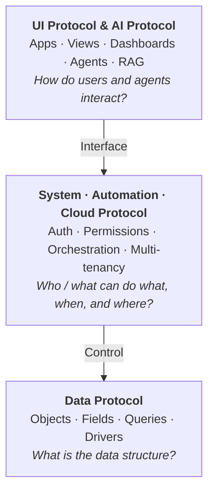
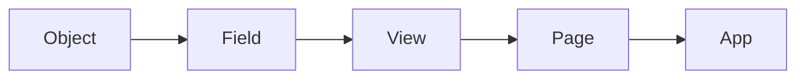
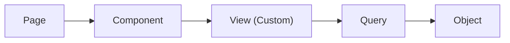
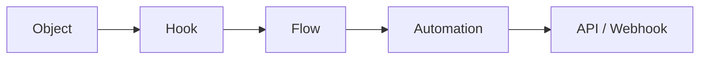
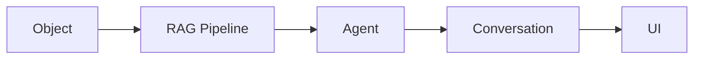

import { Database, Layout, Cpu, ArrowRight, CheckCircle, Workflow, Bot, Cloud } from 'lucide-react';

# The Protocol Stack

The architecture is built on foundational protocols that work together as a unified system:

<Callout type="info">
**This is the engine-level view.** When you *build*, you work by area — data,
automation, interface, access, AI (see [What you build](/docs/getting-started/quick-start#what-you-build)).
This page zooms one level down, into the runtime engines that implement those areas:
**ObjectQL** (data), **ObjectOS** (control — automation, access, governance), and
**ObjectUI** (interface). You rarely think in these three while building; they're the
machinery underneath.
</Callout>

<Cards>
  <Card
    icon={<Database />}
    title="Data Protocol"
    description="ObjectQL: Structure, queries, and constraints."
  />
  <Card
    icon={<Layout />}
    title="UI Protocol"
    description="ObjectUI: Presentation, interaction, and routing."
  />
  <Card
    icon={<Cpu />}
    title="System Protocol"
    description="ObjectOS: Control, runtime, and governance."
  />
  <Card
    icon={<Workflow />}
    title="Automation Protocol"
    description="Business Logic: Flow, Workflow, Triggers."
  />
  <Card
    icon={<Bot />}
    title="AI Protocol"
    description="Intelligence: Agents, RAG, Models."
  />
  <Card
    icon={<Cloud />}
    title="Cloud Protocol"
    description="Management: Multi-tenancy, Marketplace, Licensing."
  />
</Cards>

## Why Separated Layers?

Traditional applications tightly couple data, business logic, and presentation. This creates **Implementation Coupling** — changing one layer forces changes across the entire stack.

ObjectStack enforces **Separation of Concerns** through protocol boundaries:



<Callout type="info">
**Who writes this?** In practice, Claude Code authors across every area from your
description — data (objects), automation (flows), access (permissions), and interface
(views, apps) — guided by the matching [skills](/docs/ai/skills). Each passes
`os validate` before you review it in the Console. See
[How AI Development Works](/docs/getting-started/how-ai-development-works).
</Callout>

## Layer 1: ObjectQL (Data Protocol)

**Role:** Define the **Structure** and **Intent** of data.

**Responsibilities:**
- Object schema definitions (what is a "Customer"?)
- Field types and validation rules
- Query language (filtering, sorting, aggregation)
- Database drivers (Postgres, MongoDB, SQLite)

**Key Principle:** ObjectQL knows **nothing** about users, permissions, or UI. It only cares about data structure and queries.

### Example: Defining a Customer Object

```typescript
// src/objects/customer.object.ts
import { ObjectSchema, Field } from '@objectstack/spec/data';

export const Customer = ObjectSchema.create({
  name: 'customer',
  label: 'Customer',
  icon: 'building',
  
  fields: {
    name: Field.text({
      label: 'Company Name',
      required: true,
      maxLength: 120,
    }),
    
    industry: Field.select({
      label: 'Industry',
      options: [
        { label: 'Technology', value: 'technology' },
        { label: 'Finance', value: 'finance' },
        { label: 'Healthcare', value: 'healthcare' },
        { label: 'Retail', value: 'retail' },
      ],
    }),
    
    annual_revenue: Field.currency({
      label: 'Annual Revenue',
      scale: 2,
    }),
    
    primary_contact: Field.lookup('contact', {
      label: 'Primary Contact',
    }),
  },
});
```

This definition is **pure metadata**. It doesn't know:
- Who can see this data
- How to render a form
- When to trigger workflows

That's the job of the other layers.

## Layer 2: ObjectOS (Control Protocol)

**Role:** Manage the **Lifecycle** and **Governance** of requests.

**Responsibilities:**
- Authentication (who is this user?)
- Authorization (can they access this field?)
- Workflows and automations (what happens after save?)
- Event processing (audit logs, notifications)
- Multi-tenancy and data isolation

**Key Principle:** ObjectOS acts as the **Gateway**. No layer can directly access the database; all requests must pass through the OS Kernel.

### Example: Permission Rules

```typescript
// src/permissions/sales_rep.permission.ts
import { definePermissionSet } from '@objectstack/spec';

// A permission set keyed by object and field — the only capability
// container (ADR-0090: capability is the union of held sets; the old
// profile concept was removed).
export const SalesRepPermission = definePermissionSet({
  name: 'sales_rep',
  label: 'Sales Rep',
  objects: {
    customer: {
      allowCreate: true,
      allowRead: true,
      allowEdit: true,
      allowDelete: false, // Only managers can delete
    },
  },
  fields: {
    // <object>.<field> -> field-level security
    'customer.annual_revenue': { readable: true, editable: false }, // Read-only
  },
});
```

### Example: Workflow Automation

```typescript
// src/flows/high_value_customer.flow.ts
import { defineFlow } from '@objectstack/spec';

// Automation is authored as a Flow: a graph of nodes connected by edges.
// A record_change flow runs when records of its target object change; branch
// edges carry CEL conditions evaluated against the changed record.
export const HighValueCustomerFlow = defineFlow({
  name: 'high_value_customer',
  label: 'High-Value Customer Alert',
  type: 'record_change',
  status: 'active',
  nodes: [
    { id: 'start', type: 'start', label: 'Customer created' },
    { id: 'assign', type: 'update_record', label: 'Assign owner' },
    { id: 'notify', type: 'notify', label: 'Alert leadership' },
    { id: 'end', type: 'end', label: 'End' },
  ],
  edges: [
    // Only continue when annual revenue exceeds $1M.
    { id: 'e1', source: 'start', target: 'assign', condition: 'record.annual_revenue > 1000000' },
    { id: 'e2', source: 'assign', target: 'notify' },
    { id: 'e3', source: 'notify', target: 'end' },
  ],
});
```

See the [Flow Metadata reference](/docs/automation/flows) for the full Flow node and edge reference.

ObjectOS **orchestrates** these rules at runtime, independent of the data structure or UI.

## Layer 3: ObjectUI (View Protocol)

**Role:** Render the **Presentation** and handle **User Interaction**.

**Responsibilities:**
- App navigation and branding
- List views (grid, kanban, calendar)
- Form layouts (simple, tabbed, wizard)
- Dashboards and reports
- Actions and buttons

**Key Principle:** ObjectUI is a **Rendering Engine**, not a hardcoded interface. It asks ObjectQL *"What is the schema?"* and dynamically generates the UI.

### Example: List View

```typescript
// src/views/customer.view.ts
import { defineView } from '@objectstack/spec';

// A view is authored with defineView({ list, form }); the list/form configs
// are nested, and the data source declares which object the view reads.
export const CustomerView = defineView({
  list: {
    type: 'grid',
    data: { provider: 'object', object: 'customer' },
    columns: [
      { field: 'name' },
      { field: 'industry' },
      { field: 'annual_revenue' },
      { field: 'primary_contact' },
    ],
    filterableFields: ['industry', 'annual_revenue'],
    sort: [{ field: 'name', order: 'asc' }],
  },
});
```

### Example: Form View

```typescript
// src/views/customer.view.ts
import { defineView } from '@objectstack/spec';

// The same defineView container also carries the form layout. A form is a
// list of sections, each holding fields.
export const CustomerView = defineView({
  form: {
    type: 'simple',
    data: { provider: 'object', object: 'customer' },
    sections: [
      {
        label: 'Company Information',
        fields: ['name', 'industry', 'annual_revenue'],
      },
      {
        label: 'Contact',
        fields: ['primary_contact'],
      },
    ],
  },
});
```

The UI doesn't "know" the field types. It asks ObjectQL for the schema and renders accordingly:
- `Field.text` → Text input
- `Field.select` → Dropdown
- `Field.lookup` → Autocomplete lookup
- `Field.currency` → Number input with currency formatting

## How They Work Together

Let's trace a **real-world scenario**: A sales rep creates a new high-value customer.

<Callout type="info">
The TypeScript in Steps 2–6 below is **conceptual pseudo-code** illustrating the
flow of control between layers. Calls like `Auth.getCurrentUser()`,
`Permission.check()`, `ObjectQL.getSchema()`, and `Workflow.getTriggersFor()` are
not real exported APIs — they stand in for the kernel's internal orchestration.
</Callout>

### Step 1: User Action (ObjectUI)

```
User fills out the "Create Customer" form:
- Name: "Acme Corp"
- Industry: "Technology"
- Annual Revenue: $5,000,000
- Primary Contact: "John Doe"

User clicks "Save"
```

### Step 2: UI Layer Sends Request

```typescript
// ObjectUI dispatches an action to ObjectOS
const request = {
  action: 'create',
  object: 'customer',
  data: {
    name: 'Acme Corp',
    industry: 'technology',
    annual_revenue: 5000000,
    primary_contact: 'contact_12345',
  },
};
```

### Step 3: ObjectOS Validates Permissions

```typescript
// Kernel checks: Does this user have permission?
const user = await Auth.getCurrentUser();
const canCreate = await Permission.check({
  user,
  object: 'customer',
  operation: 'create',
});

if (!canCreate) {
  throw new Error('Permission denied');
}
```

### Step 4: ObjectOS Validates Data

```typescript
// Kernel asks ObjectQL: Is this data valid?
const schema = ObjectQL.getSchema('customer');
const validation = schema.validate(request.data);

if (!validation.success) {
  throw new ValidationError(validation.errors);
}
```

### Step 5: ObjectQL Writes to Database

```typescript
// ObjectQL compiles the request into a database operation
const driver = ObjectQL.getDriver(); // Postgres, MongoDB, etc.
const result = await driver.insert('customer', {
  name: 'Acme Corp',
  industry: 'technology',
  annual_revenue: 5000000,
  primary_contact_id: 'contact_12345',
});
```

### Step 6: ObjectOS Triggers Workflows

```typescript
// Kernel checks: Are there any workflows for this event?
const workflows = Workflow.getTriggersFor('customer', 'after_create');

for (const workflow of workflows) {
  if (workflow.conditionsMet(result)) {
    await workflow.execute(result);
  }
}

// In this case:
// ✅ Annual revenue > $1M
// → Assign to enterprise sales team
// → Send alert email to leadership
```

### Step 7: ObjectUI Updates Display

```typescript
// Kernel returns success response
// UI optimistically updates the screen
// UI shows toast notification: "Customer created successfully"
// UI navigates to the new customer detail page
```

## The Full Stack in Action

Here's how all three protocols collaborate for a **Kanban Board** feature:

### 1. ObjectQL: Define the Data

```typescript
import { ObjectSchema, Field } from '@objectstack/spec/data';

export const Opportunity = ObjectSchema.create({
  name: 'opportunity',
  label: 'Opportunity',
  icon: 'target',
  
  fields: {
    title: Field.text({ 
      label: 'Title',
      required: true,
    }),
    
    stage: Field.select({
      label: 'Stage',
      options: [
        { label: 'Prospecting', value: 'prospecting', default: true },
        { label: 'Qualification', value: 'qualification' },
        { label: 'Proposal', value: 'proposal' },
        { label: 'Closed Won', value: 'closed_won' },
      ],
    }),
    
    amount: Field.currency({
      label: 'Amount',
      scale: 2,
    }),
    
    customer: Field.lookup('customer', {
      label: 'Customer',
    }),
  },
});
```

### 2. ObjectOS: Define Business Rules

```typescript
import { defineFlow } from '@objectstack/spec';

export const OpportunityWonFlow = defineFlow({
  name: 'opportunity_won',
  label: 'Opportunity Closed Won',
  type: 'record_change',
  status: 'active',
  nodes: [
    { id: 'start', type: 'start', label: 'Stage changed' },
    { id: 'invoice', type: 'create_record', label: 'Create invoice' },
    { id: 'notify', type: 'notify', label: 'Notify sales team' },
    { id: 'end', type: 'end', label: 'End' },
  ],
  edges: [
    { id: 'e1', source: 'start', target: 'invoice', condition: "record.stage == 'closed_won'" },
    { id: 'e2', source: 'invoice', target: 'notify' },
    { id: 'e3', source: 'notify', target: 'end' },
  ],
});
```

### 3. ObjectUI: Define the Kanban View

```typescript
import { defineView } from '@objectstack/spec';

export const OpportunityKanbanView = defineView({
  list: {
    type: 'kanban',
    data: { provider: 'object', object: 'opportunity' },
    columns: [
      { field: 'title' },
      { field: 'amount' },
      { field: 'customer' },
    ],
    // Kanban-specific config: group columns by the stage field.
    // `columns` here lists the fields shown on each card (required).
    kanban: {
      groupByField: 'stage',
      summarizeField: 'amount',
      columns: ['title', 'amount', 'customer'],
    },
  },
});
```

### The Result

When a user **drags an opportunity card** from "Proposal" to "Closed Won":

1. **ObjectUI** captures the drag-drop event
2. **ObjectOS** checks if the user has permission to update the `stage` field
3. **ObjectQL** validates that `"closed_won"` is a valid option
4. **ObjectQL** writes the update to the database
5. **ObjectOS** triggers the workflow (create invoice, send notification)
6. **ObjectUI** updates the kanban board to reflect the new state

**All from metadata. Zero hardcoded logic.**

## Benefits of the Three-Layer Architecture

### 1. Technology Independence

Swap implementations without breaking the system:

```
Same Metadata Definitions
          ↓
┌─────────┼─────────┐
ObjectQL: │         │
Postgres  │    MongoDB
          │
ObjectOS: │
Node.js   │    Python
          │
ObjectUI: │
React     │    Flutter
```

### 2. Parallel Development

Teams can work independently on each layer:

- **Data Team:** Define objects in ObjectQL
- **Backend Team:** Build workflows in ObjectOS
- **Frontend Team:** Create views in ObjectUI

All communicate through **protocol contracts**, not code dependencies.

### 3. Incremental Migration

Adopt ObjectStack gradually:

- **Phase 1:** Use ObjectQL as an ORM replacement
- **Phase 2:** Add ObjectOS for permissions and workflows
- **Phase 3:** Build ObjectUI views to replace custom forms

Each layer is independently useful.

### 4. Testability

Mock any layer for testing:

```typescript
// Test ObjectOS workflows without a real database
const mockObjectQL = {
  getSchema: () => CustomerSchema,
  insert: jest.fn(),
};

// Test ObjectUI rendering without a real backend
const mockObjectOS = {
  checkPermission: () => true,
  executeQuery: () => mockData,
};
```

## Summary

| Layer | Role | Knows About | Doesn't Know About |
| :--- | :--- | :--- | :--- |
| **ObjectQL** | Data structure & queries | Schema, fields, drivers | Users, permissions, UI |
| **ObjectOS** | Runtime & governance | Auth, workflows, events | Data structure, UI layout |
| **ObjectUI** | Presentation & interaction | Layout, navigation, actions | Business logic, data storage |

The three protocols are **loosely coupled** but **tightly integrated**:
- They communicate through **standard contracts** (Zod schemas)
- They can be **swapped or upgraded** independently
- They form a **complete system** when combined

## Next Steps

- [ObjectQL: Data Protocol](/docs/protocol/objectql) - Full data protocol specification
- [ObjectUI: UI Protocol](/docs/protocol/objectui) - Full view protocol specification
- [ObjectOS: System Protocol](/docs/protocol/objectos) - Full control protocol specification
- [Developer Guide](/docs/getting-started/quick-start) - Build your first ObjectStack application

---

## Appendix: Protocol Dependencies

Understanding the dependency chain helps you design applications correctly.

### Data Layer (ObjectQL)

```
Field Protocol (Core)
    ↓
    ├→ Object Protocol (uses Fields)
    ├→ Query Protocol (references Fields)
    ├→ Filter Protocol (filters on Fields)
    └→ Validation Protocol (validates Fields)
         ↓
         └→ Hook Protocol (extends validation with code)
```

### UI Layer (ObjectUI)

```
Theme Protocol (Foundation)
    ↓
View Protocol (uses Object, Query)
    ├→ ListView (uses Query, Filter)
    ├→ FormView (uses Object, Field)
    └→ Dashboard (uses View, Widget)
         ↓
         ├→ Page Protocol (composes Views)
         └→ App Protocol (organizes Pages)
              ↓
              └→ Action Protocol (UI interactions)
```

### System Layer (ObjectOS)

```
Data Driver Contracts (Database Abstraction)
    ↓
Datasource Protocol (Connection Config)
    ↓
    ├→ Context Protocol (Runtime State)
    ├→ Events Protocol (Event Bus)
    └→ Plugin Protocol (Extensibility)
         ↓
         ├→ Security Protocol (Access Control)
         ├→ API Protocol (External Access)
         └→ Automation Protocol (Workflows)
              ↓
              └→ AI Protocol (Intelligence)
```

## Appendix: Usage Patterns

### Pattern 1: Data-Driven UI

UI auto-generated from data definitions:



### Pattern 2: Custom UI with Data Binding

Custom UI connected to data:



### Pattern 3: Automation & Integration

Business logic automation:



### Pattern 4: AI-Enhanced Applications

AI capabilities on top of data:


