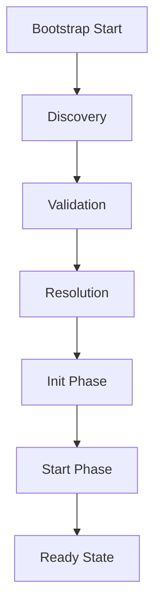

# Core Architecture

The ObjectKernel architecture follows a strict **Life-Cycle** process to ensure system stability.

## The Bootstrap Lifecycle

When you request `kernel.bootstrap()`, the following sequence occurs:



### 1. Discovery Phase
The kernel collects the plugins that have been explicitly registered via `kernel.use(plugin)`. The core kernel has no automatic plugin discovery; every plugin must be registered in code before `bootstrap()` is called.

### 2. Validation Phase
Each plugin's structure is validated locally by the plugin loader. There is no spec-driven schema check here — the kernel verifies a small set of required properties:
- **Name**: Must be present (and unique across registered plugins).
- **Init hook**: An `init` function is required.
- **Version**: Must be a valid SemVer string (defaults to `0.0.0` when omitted).

### 3. Resolution Phase
The kernel resolves the dependency graph. If Plugin A depends on Plugin B, the kernel ensures Plugin B is loaded first. Circular dependencies are detected and will throw an error.

### 4. Init Phase (`init`)
The required `init(ctx)` hook is called for all plugins in dependency order. This is where plugins should:
- Register Services involved in Dependency Injection.
- Register Event Listeners.
- **NOT** perform async IO (like database connections) if possible.

### 5. Start Phase (`start`)
After all plugins have successfully initialized, the optional `start(ctx)` hook is called in dependency order. This is where the application "comes alive":
- Database connections are established.
- HTTP servers start listening.
- Background jobs are scheduled.

Plugins may also implement an optional `destroy()` hook, which the kernel calls in reverse dependency order during `shutdown()` to release resources.

## ObjectKernel Public API

The `ObjectKernel` is the central orchestrator exposed to the host application. The methods you call from host code are:

```typescript
class ObjectKernel {
    /**
     * Register a plugin. Must be called before bootstrap().
     * Returns `this` so calls can be chained.
     */
    use(plugin: Plugin): Promise<this>;

    /**
     * Bootstrap the kernel.
     * Runs the validation -> resolution -> init -> start lifecycle for all
     * registered plugins, then moves the kernel into the ready state.
     */
    bootstrap(): Promise<void>;

    /**
     * Gracefully shut down the kernel, calling each plugin's destroy() hook
     * in reverse dependency order.
     */
    shutdown(): Promise<void>;

    /**
     * Register a service instance directly.
     * Returns `this` so calls can be chained.
     */
    registerService<T>(name: string, service: T): this;

    /**
     * Retrieve a registered service by name.
     */
    getService<T>(name: string): T;
}
```

<Callout type="info">
`bootstrap()` / `shutdown()` are the kernel lifecycle methods — there is no `start()` / `stop()` on `ObjectKernel`. (The `start`/`stop` naming applies to the per-plugin `start()` hook, not the kernel itself.)
</Callout>
