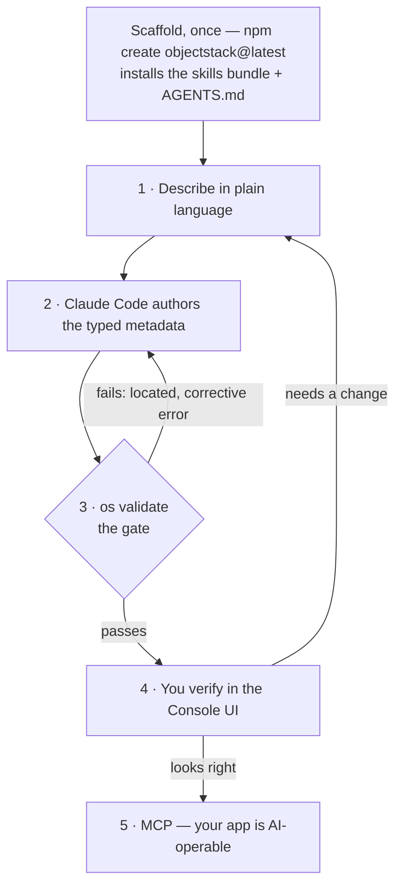
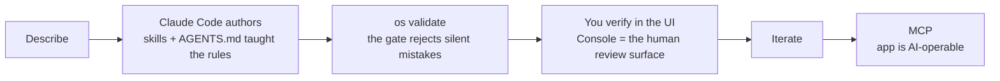

# Build with Claude Code

This is the **main way you build on ObjectStack**: you describe what you want in
plain language, **Claude Code (or Cursor, Copilot, …) writes the typed metadata**,
a validation gate catches the mistakes that fail silently at runtime, and **you
verify the result by clicking through the real app** in the Console. Then you say
what to change, and the loop repeats.

The thing you end up with isn't just an app — it's an app that AI can *operate*,
because the same metadata generates an MCP server.

<Callout type="info">
Want to understand the pieces the agent writes before you review them?
[Anatomy of an ObjectStack App](/docs/getting-started/quick-start) is a tour of
the metadata — objects, actions, views — and how to read it. This page is the
workflow; that one is the map.
</Callout>

## The build loop



Steps 3–5 are the heartbeat: **AI authors, the gate checks, you verify.** Nobody
hand-edits generated glue, and no metadata mistake reaches the browser unchecked.

## Before you start

| You need | Why |
|:---|:---|
| **Node.js 18+** and **pnpm** | Runs the scaffolder and the dev server (see [prerequisites](/docs/getting-started#prerequisites)). |
| **[Claude Code](https://claude.com/claude-code)** (or Cursor / Copilot) | Your agent reads `AGENTS.md` + the ObjectStack skills and authors the metadata. |

## 1. Scaffold the project

```bash
npm create objectstack@latest support-desk
cd support-desk
```

The scaffolder does more than copy files. It:

- derives a **namespace** from the name (`support-desk` → `support_desk`), so
  every object you create is named `support_desk_*`;
- installs dependencies;
- runs `npx skills add objectstack-ai/framework --all` to install the **AI skills
  bundle**;
- writes an **`AGENTS.md`** (and `.github/copilot-instructions.md`) that teach your
  coding agent the project layout, the naming rules, and — critically — *to run
  `npm run validate` after every metadata change*.

```
  ╔═══════════════════════════════════╗
  ║   ◆ Create ObjectStack v6.x       ║
  ╚═══════════════════════════════════╝

◆ New Environment
────────────────────────────────────────
  Environment: support-desk
  Namespace:   support_desk
  Template:    blank — Minimal starter — one object, REST API, ready to extend
  …
  → Installing AI skills for your coding agent...
  ✓ Environment created!
```

This is why AI authoring is reliable rather than a guessing game: **the agent
starts with the protocol's schemas and rules already loaded**, not with generic
"write me some TypeScript" priors. See [AI Skills](/docs/ai/skills) for how the
bundle works.

## 2. Open the project in Claude Code and describe the app

From the project directory, launch Claude Code and give it the goal in plain
language:

> Build a support-desk app. Add a `ticket` object with a subject, a long-text
> description, a `priority` select (low/normal/high/urgent) and a `status` select
> (open/pending/resolved/closed). Add a **Resolve** action that only shows on
> tickets that aren't already resolved or closed. Add a list view (subject,
> status, priority) with an "Open tickets" filter, and an app with a Support nav
> group. Run `npm run validate` when you're done.

You don't specify field types in TypeScript, wire barrel exports, or remember the
CEL scoping rules — the agent does, because the skills told it how.

## 3. What Claude Code writes

The agent authors ordinary project files. You review them — you don't type them.
A representative result:

```typescript title="src/objects/ticket.object.ts"
import { ObjectSchema, Field } from '@objectstack/spec/data';

export const Ticket = ObjectSchema.create({
  name: 'support_desk_ticket',
  label: 'Ticket',
  pluralLabel: 'Tickets',
  icon: 'life-buoy',
  description: 'A customer support request.',

  fields: {
    subject: Field.text({ label: 'Subject', required: true, searchable: true, maxLength: 200 }),
    description: Field.textarea({ label: 'Description' }),

    priority: Field.select({
      label: 'Priority',
      required: true,
      options: [
        { label: 'Low', value: 'low', default: true },
        { label: 'Normal', value: 'normal' },
        { label: 'High', value: 'high' },
        { label: 'Urgent', value: 'urgent' },
      ],
    }),

    status: Field.select({
      label: 'Status',
      required: true,
      options: [
        { label: 'Open', value: 'open', color: '#3B82F6', default: true },
        { label: 'Pending', value: 'pending', color: '#F59E0B' },
        { label: 'Resolved', value: 'resolved', color: '#10B981' },
        { label: 'Closed', value: 'closed', color: '#6B7280' },
      ],
    }),
  },

  sharingModel: 'private',      // org-wide default (OWD) — required by the security gate
  enable: { apiEnabled: true, searchable: true },
});
```

```typescript title="src/actions/ticket.actions.ts"
import { defineAction } from '@objectstack/spec/ui';

export const ResolveTicketAction = defineAction({
  name: 'resolve_ticket',
  label: 'Resolve',
  objectName: 'support_desk_ticket',
  icon: 'check-circle',
  type: 'script',
  target: 'resolveTicket',
  locations: ['record_header', 'list_item'],
  // Only offer "Resolve" on tickets that aren't already resolved or closed.
  // Predicates are CEL, record-scoped — `record.status`, never bare `status`.
  visible: 'record.status != "resolved" && record.status != "closed"',
  successMessage: 'Ticket resolved.',
  refreshAfter: true,
  ai: {
    exposed: true,
    description: 'Mark a support ticket as resolved. Use when the issue is fixed.',
  },
});
```

```typescript title="src/views/ticket.view.ts"
import { defineView } from '@objectstack/spec';

const data = { provider: 'object' as const, object: 'support_desk_ticket' };

export const TicketViews = defineView({
  list: {
    label: 'All Tickets',
    type: 'grid',
    data,
    columns: [{ field: 'subject' }, { field: 'status' }, { field: 'priority' }],
  },
  listViews: {
    open: {
      label: 'Open Tickets',
      type: 'grid',
      data,
      columns: [{ field: 'subject' }, { field: 'priority' }],
      filter: [{ field: 'status', operator: 'equals', value: 'open' }],
      sort: [{ field: 'priority', order: 'desc' }],
    },
  },
});
```

This is the same metadata that powers the REST API, the Console UI, **and the MCP
tools exposed to AI** — define it once, and ObjectStack derives the rest.

## 4. The gate: `os validate` catches AI mistakes

The most common way AI-authored metadata goes wrong is a mistake that **type-checks
cleanly and then fails silently at runtime** — there's no stack trace to feed back
to the agent. ObjectStack turns those into loud, located build errors.

Suppose the agent wrote the Resolve action's predicate as a **bare field
reference** — `status` instead of `record.status`:

```typescript
// ✗ Wrong — bare `status`. Type-checks (it's just a string), but at runtime
//   it resolves to null, so the action is hidden on EVERY ticket.
visible: 'status != "resolved"'
```

`npm run validate` (which `AGENTS.md` tells the agent to run) refuses it:

```
◆ Validate
────────────────────────────────────────
  → Validating against ObjectStack Protocol...
  → Validating expressions (ADR-0032)...

  ✗ Expression validation failed (1 issue)
  • stack · action 'resolve_ticket' visible: bare reference `status` — a
    formula/validation expression binds the record as the `record` namespace,
    not at top level, so `status` resolves to nothing and the expression
    silently evaluates to null. Write `record.status`.
      source: `status != "resolved"`

  ✗ EEXIT: 1
```

The message is **located** (which action, which predicate) and **corrective**
("Write `record.status`") — so the agent fixes it in one step instead of you
discovering a dead button three screens deep in the browser. This is the
["contract-first" guarantee](/docs/getting-started/how-ai-development-works#why-its-safe):
the error is rejected at the authoring gate, not tolerated by a lenient runtime.
For the full list of what the gate checks, see
[Validating Metadata](/docs/getting-started/validating-metadata).

Once it's clean:

```
  ✓ Validation passed (37ms)

  Support Desk v0.1.0
  Data: 1 Objects  6 Fields
  UI: 1 Apps  1 Views  1 Actions
```

<Callout type="tip">
**Never accept a metadata change as done until `os validate` passes.** It's the
same gate `os build` runs, so anything that validates will also compile.
</Callout>

## 5. Verify in the visual UI — your job in the loop

Validation proves the metadata is *well-formed*. It can't prove the app does what
*you* meant. That's the human half of the loop: **run it and look.**

```bash
os dev --ui
```

Open [http://localhost:3000/_console/](http://localhost:3000/_console/) and drive
the app like a user:

- Create a ticket. Confirm the fields, labels, and picklist colors match intent.
- Check the **Resolve** action shows on an open ticket — and **disappears** once
  the ticket is resolved (that's the `record.status` predicate doing its job).
- Open the **Support → Open** nav item; confirm the filter shows only open tickets.

{/* screenshot placeholder: /_console/ ticket list with the Support nav group */}
{/* screenshot placeholder: ticket record with the Resolve action in the header */}

This is where you catch the things static checks never will — a confusing label, a
missing field, the wrong default, an action that shows when it shouldn't. You're
the product reviewer; the Console is your cockpit.

## 6. Iterate

Found something? Don't hand-patch it — tell the agent, in the same plain language:

> The list is missing who a ticket is assigned to. Add an `assignee` lookup to
> `sys_user`, show it as a column in the list view, and re-run validate.

Claude Code edits the metadata, re-runs `os validate`, and you refresh the Console
to confirm. **That's the whole loop** — describe → author → gate → verify —
tightening on each pass until the app is right. See
[How AI development works](/docs/getting-started/how-ai-development-works) for why
this stays fast and safe as the app grows.

## 7. Your app is natively AI-operable (MCP)

Here's the payoff that a hand-built CRUD app doesn't give you for free: because
the whole app is typed metadata, ObjectStack can expose it as an **MCP server** —
so an AI client can inspect and *operate* the app you just built, under the exact
same permissions and row-level security as the UI.

Point your own AI (Claude Code, Claude Desktop, Cursor, any MCP client) at the
running app, and it gets a generated tool surface over your objects and actions:

| Tool | What the AI can do |
|:---|:---|
| `list_objects` / `describe_object` | Discover the `support_desk_ticket` schema. |
| `query_records` / `get_record` | "Show me all urgent open tickets." |
| `create_record` / `update_record` | File or edit a ticket. |
| `list_actions` / `run_action` | Run your **Resolve** action by name — "resolve ticket #42" — through the same business logic the toolbar button uses. |

Every call is bound to the caller's principal, so RBAC, RLS, and field-level
security apply to the agent exactly as they do to a person. The support desk you
built in six steps is now a backend an agent can *run* — not just a database it
can read.

Connecting is self-serve. The MCP surface is on by default — just add the
deployment to your client — and the deployment is
its own OAuth 2.1 authorization server, so interactive clients just open a
browser login (you connect as yourself, no admin-minted credentials):

```bash
claude mcp add --transport http support-desk https://your-deployment.example.com/api/v1/mcp
# first tool use opens a browser login — you're connected as yourself
```

Or install the [official plugin](https://github.com/objectstack-ai/claude-plugin) —
it bundles the portable ObjectStack agent skill and a guided `/objectstack:connect`
command (one plugin serves every deployment; the URL is the only input):

```bash
claude plugin marketplace add objectstack-ai/claude-plugin
```

Admins find every client's copy-paste-ready connect snippet — plus the SKILL.md
download and API-key minting — on the **Setup → Connect an Agent** page.

For headless callers (CI, scripts), mint an API key instead
(`POST /api/v1/keys`, shown once) and pass it as a header:

```bash
claude mcp add --transport http support-desk https://your-deployment.example.com/api/v1/mcp \
  --header "x-api-key: osk_..."
```

See [Connect your AI](/docs/ai/agents#connect-your-ai-byo-ai-over-mcp) for
per-client instructions (claude.ai / Claude Desktop / Claude Code and the
private-deployment reachability note), [Actions as Tools](/docs/ai/actions-as-tools)
for the `run_action` bridge, and [the MCP reference](/docs/references/ai/mcp) for
enabling the server.

## Recap — where each guardrail sat



- **Skills + `AGENTS.md`** meant the agent authored to the protocol, not from
  generic priors.
- **`os validate`** turned a silent-at-runtime bug into a located, corrective
  build error — the AI fixes it before you ever see it.
- **The Console** let you verify intent visually, which no schema check can.
- **MCP** made the finished app itself AI-operable, under the same guardrails.

## Next steps

<Cards>
  <Card
    title="How AI development works"
    href="/docs/getting-started/how-ai-development-works"
    description="Why the AI-build / human-verify loop stays fast and safe — the guardrails, in one place."
  />
  <Card
    title="Anatomy of an ObjectStack app"
    href="/docs/getting-started/quick-start"
    description="A tour of the metadata the agent writes — and how to read it to verify the result."
  />
  <Card
    title="Data Modeling"
    href="/docs/data-modeling"
    description="Objects, fields, relationships, validation, and row-level security in depth."
  />
  <Card
    title="AI Skills Reference"
    href="/docs/ai/skills-reference"
    description="The full catalog of skills your coding agent loads per task."
  />
</Cards>
