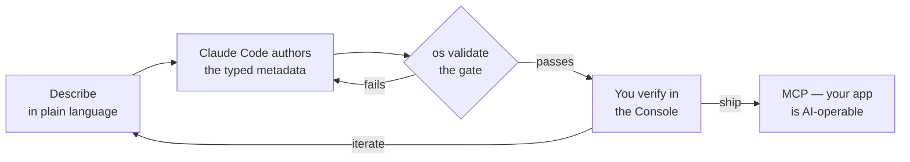

import { Database, Layout, Cog } from 'lucide-react';

**ObjectStack** is not just a framework; it is an **AI-native business backend protocol** for building enterprise software. It decouples the *Business Intent* (defined as typed metadata) from the *Technical Execution* (handled by the Kernel), so APIs, UI metadata, workflows, and agent tools can all derive from the same source of truth.

## How you'll build

ObjectStack is designed around one workflow: **an AI agent authors the app; you
verify it in a visual UI; guardrails keep the agent from shipping mistakes.**



You say what you want; Claude Code (or Cursor, Copilot, …) writes the typed
metadata, because the [skills bundle](/docs/ai/skills) and a scaffolded `AGENTS.md`
taught it the protocol. A validation gate rejects the mistakes that fail silently
at runtime, and you confirm the result by clicking through the real app. Then the
app you built is itself AI-operable, because the same metadata generates an MCP
server.

<Cards>
  <Card
    title="Build with Claude Code"
    href="/docs/getting-started/build-with-claude-code"
    description="The main path — run the whole loop end-to-end on an app you build live."
  />
  <Card
    title="How AI development works"
    href="/docs/getting-started/how-ai-development-works"
    description="Why AI-builds / human-verifies is fast and safe — the guardrails, in one place."
  />
</Cards>

The rest of this page explains *why* an agent can build an enterprise app
end-to-end safely: the protocol, and how everything derives from one source of
truth.

## The Problem

In traditional development, application logic is scattered:

1. **Database Schema** (`table.sql`)
2. **Backend Models** (`User.ts`)
3. **Frontend Validation** (`schema.zod.ts`)
4. **API Documentation** (`swagger.json`)
5. **Agent Tools** (MCP definitions, function calls, prompts)

When requirements change, you update code in multiple places. When AI agents need to act, they usually see only brittle glue code or manually curated tools. This is **Implementation Coupling**.

## The Solution

We centralize the "Intent" into a single TypeScript-authored, Zod-validated definition. You (and the agent) work in the same areas an app naturally divides into — data, automation, interface, access, AI — and the implementation layers (SQL, React, MCP tools) act as **Runtime Engines** that interpret that metadata.

<Cards>
  <Card
    icon={<Database />}
    title="Data"
    description="Business objects, fields, relationships, validation — the source of truth."
  />
  <Card
    icon={<Cog />}
    title="Automation"
    description="Flows, workflows, triggers, and approvals — the process logic."
  />
  <Card
    icon={<Layout />}
    title="Interface"
    description="Apps, views, dashboards, and actions — the server-driven UI."
  />
  <Card
    icon={<Cog />}
    title="Access"
    description="Roles, permissions, sharing, and row-level security."
  />
  <Card
    icon={<Database />}
    title="AI"
    description="Agents, tools, RAG, and the generated MCP surface."
  />
</Cards>

## The "Stack" Analogy

Think of ObjectStack as:

- **Kubernetes** for business applications - Declarative configuration over imperative code
- **Terraform** for data modeling - Infrastructure as code, but for data
- **GraphQL + React Server Components** - Schema-driven data + UI rendering combined (REST ships today; GraphQL is exposed via the `IGraphQLService` contract)
- **MCP for business systems** - Structured, permission-aware tools generated from metadata

## Key Features

### 1. Protocol-Driven Architecture

**The UI is a Projection. The API is a Consequence.**

- ObjectUI does not "build" a form; it *projects* the ObjectQL schema into a visual representation
- You do not write endpoints or hand-author every agent tool; ObjectOS *generates* the secure graph based on the access control protocol

### 2. Agent-Ready Boundaries

**Agents act through typed, permission-aware, auditable surfaces.**

- Tool schemas derive from business object metadata
- RBAC, RLS, and FLS apply to agent actions
- Executions are traceable to versioned artifacts, user/org context, inputs, and results

### 3. Database Agnostic

**ObjectQL treats the database as an Implementation Detail.**

- Start with SQLite for prototyping
- Migrate to PostgreSQL for production
- Archive to Snowflake for analytics
- **No code changes required**

## Real-World Benefits

| Traditional Approach | ObjectStack Approach |
| :--- | :--- |
| Write SQL migrations manually | Schema changes sync automatically |
| Build CRUD APIs by hand | REST generated from schema (GraphQL via the `IGraphQLService` contract) |
| Manually define agent tools | MCP/tool surfaces generated from metadata |
| Duplicate validation logic 3x | Define once, enforce everywhere |
| Lock into one database vendor | Swap databases without code changes |
| Agent tools drift from app logic | Tools derive from the same metadata and permissions |

## Who Should Use ObjectStack?

### Enterprise Developers
Building internal tools, CRMs, ERPs, or admin panels? ObjectStack eliminates boilerplate while making the business model explicit for AI agents.

### Platform Builders
Creating a SaaS product or multi-tenant application? ObjectStack provides enterprise-grade security and isolation.

### Integration Engineers
Connecting multiple systems? ObjectStack's protocol-driven approach makes it easy to map and transform data.

### AI Agent Builders
Need agents to operate real business data? ObjectStack gives them typed schemas, generated tools, permission boundaries, and audit trails instead of brittle query glue.

## Prerequisites

Before you start, make sure you have the following installed:

| Tool | Minimum Version | Check Command |
|:---|:---|:---|
| **Node.js** | 18.0.0+ | `node --version` |
| **pnpm** | 8.0.0+ (repo pins 10.x) | `pnpm --version` |
| **TypeScript** | 5.3.0+ (project targets 6.x) | `npx tsc --version` |

<Callout type="info">
**Why pnpm?** ObjectStack uses pnpm workspaces for monorepo management. Install it with `npm install -g pnpm` or `corepack enable` (corepack will pull the pinned pnpm 10.x from the repo's `packageManager` field).
</Callout>

## Common Setup Issues

### pnpm not found
```bash
# Install pnpm globally
npm install -g pnpm
# Or use corepack (recommended)
corepack enable
```

### TypeScript version mismatch
ObjectStack works with TypeScript 5.3+, but the project itself is built and tested against TypeScript 6.x. Update with:
```bash
pnpm add -D typescript@^6
```

### Port 3000 already in use
`objectstack dev` (what `pnpm dev` runs) automatically shifts to the next free port when 3000 is busy, so you usually don't need to do anything. To pin an explicit port instead:
```bash
# Find the process using port 3000
lsof -i :3000
# Use an explicit port (OS_PORT; PORT is the legacy alias)
OS_PORT=3001 pnpm dev
```

For more troubleshooting, see the [Troubleshooting & FAQ](/docs/deployment/troubleshooting) guide.

## Next Steps

- [Core Concepts](/docs/concepts) — Metadata-driven development & design principles
- [Architecture](/docs/concepts/architecture) — The three-layer protocol stack
- [Glossary](/docs/getting-started/glossary) — Key terminology
- [Build with Claude Code](/docs/getting-started/build-with-claude-code) — Build your first app end-to-end with an agent
- [Your First Project](/docs/getting-started/your-first-project) — The hands-on path: scaffold from npm, extend by hand, call the API
- [Anatomy of an ObjectStack App](/docs/getting-started/quick-start) — Read the metadata an agent writes, so you can verify it
