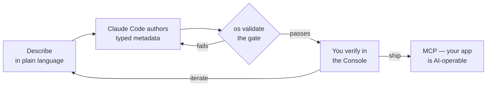

# ObjectStack Documentation

ObjectStack is an **AI-native business backend protocol** for structured, auditable
business applications. The way you build it: **an AI agent (Claude Code) authors your
application as typed metadata — data model, logic, permissions, UI — a validation gate
rejects mistakes that would fail silently at runtime, and you verify the result in a
visual Console.** From that one source of truth the runtime derives everything else — the
database schema on interchangeable drivers, a generated REST + realtime API,
permission-checked automation, server-driven UI, and an **MCP server**, so the app you
build is itself AI-operable. Agents act through the same typed, permission-aware surface —
never raw SQL or scraped UI.

## Start here

- [Build with Claude Code](/docs/getting-started/build-with-claude-code) — the main workflow: an agent builds the app, you verify it in the Console
- [How AI Development Works](/docs/getting-started/how-ai-development-works) — why AI-builds / human-verifies is fast and safe
- [What is ObjectStack?](/docs/getting-started) — the protocol model and runtime layers
- [Core Concepts](/docs/concepts) — the ideas behind metadata-driven development
- [Architecture](/docs/concepts/architecture) — how the runtime turns your metadata into a database, API, UI, and MCP surface

## Platform modules

Each module documents one capability in depth — overview first, then guides, with links to the matching protocol spec and schema reference.

<Cards>
  <Card href="/docs/data-modeling" title="Data Modeling" description="Objects, fields, relationships, validation, formulas, and queries (ObjectQL)" />
  <Card href="/docs/automation" title="Automation" description="Hooks, flows, workflows, approvals, and webhooks — the process engine" />
  <Card href="/docs/permissions" title="Permissions & Identity" description="Authentication, permission sets, positions, sharing rules, and field-level security" />
  <Card href="/docs/ui" title="UI Engine" description="Apps, views, dashboards, and forms as server-driven UI (ObjectUI)" />
  <Card href="/docs/api" title="API & SDK" description="Generated REST, realtime, and client SDK surfaces" />
  <Card href="/docs/ai" title="AI" description="Agents, actions as tools, RAG, and natural-language queries" />
  <Card href="/docs/plugins" title="Plugins & Packages" description="Extend the runtime and package your extensions" />
  <Card href="/docs/kernel" title="Kernel & Services" description="The ObjectOS runtime, service registry, and services.* APIs" />
  <Card href="/docs/deployment" title="Deployment & Operations" description="Deployment modes, environments, publishing, and troubleshooting" />
</Cards>

## Protocol & reference

- [Protocol Spec](/docs/protocol) — the normative ObjectQL / ObjectOS / ObjectUI specifications for implementers
- [Schema Reference](/docs/references) — generated Zod schema reference for every metadata type
- [Quick Reference](/docs/getting-started/quick-reference) — fast lookup tables across all protocols
- [Glossary](/docs/getting-started/glossary) — the shared vocabulary used across these docs
- [Releases](/docs/releases) — release notes and implementation status
