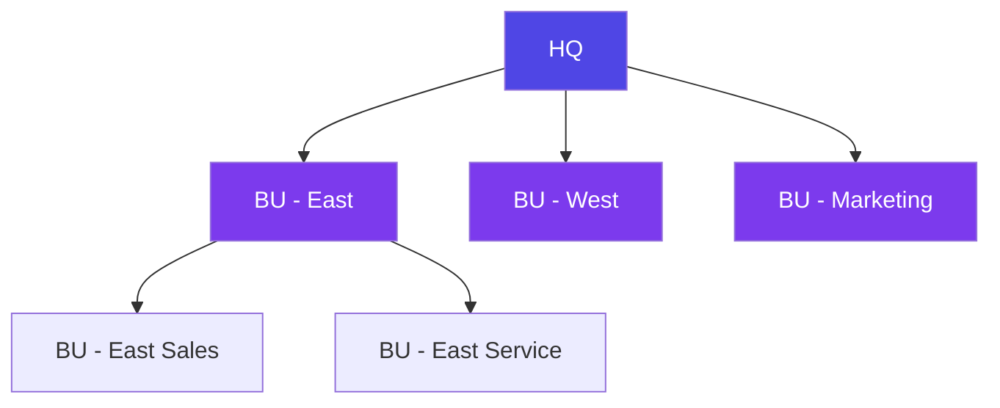
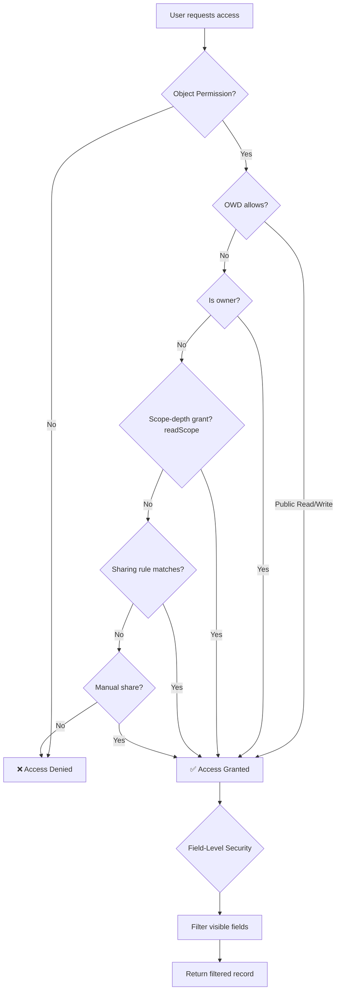

# Security Permissions Matrix

This page provides a comprehensive visual reference for ObjectStack's security model — from object-level permissions to field-level security, sharing rules, and business-unit depth.

<Callout type="info">
**Security Model:** ObjectStack uses a layered security model inspired by Salesforce. Permissions are evaluated in order: Object Permission → Organization-Wide Defaults → Record Ownership / Scope Depth → Sharing (rules + manual shares) → Row-Level Security → Field-Level Security. Unlike Salesforce, there is no automatic hierarchy layer — the business-unit tree widens access only where a sharing rule's `unit_and_subordinates` recipient or a scope-depth grant explicitly invokes it (positions are flat, ADR-0090 D3).
</Callout>

---

## 1. Permission Types

ObjectStack's `ObjectPermission` schema defines these boolean flags for object access (CRUD + lifecycle + VAMA super-user grants):

| Permission | Flag | Description | Grants |
|:---|:---|:---|:---|
| **Read** | `allowRead` | View records owned by the user or shared with them | View own records |
| **Create** | `allowCreate` | Create new records | Insert records |
| **Edit** | `allowEdit` | Modify records owned by the user or shared with them | Edit own records |
| **Delete** | `allowDelete` | Remove records owned by the user or shared with them | Delete own records |
| **Transfer** | `allowTransfer` | Change record ownership | Reassign owner |
| **Restore** | `allowRestore` | Undelete from trash | Recover soft-deleted records |
| **Purge** | `allowPurge` | Permanently (hard) delete | GDPR / compliance erase |
| **View All** | `viewAllRecords` | View all records regardless of ownership or sharing | Read all records (bypass sharing) |
| **Modify All** | `modifyAllRecords` | Edit/delete all records regardless of ownership | Full object access (bypass sharing) |

<Callout type="tip">
**Super-user bypass:** When `modifyAllRecords` is set it satisfies write checks (`allowEdit`/`allowDelete`, and the lifecycle class `allowTransfer`/`allowRestore`/`allowPurge`) on any record; `viewAllRecords` (or `modifyAllRecords`) satisfies `allowRead` on any record — both bypass ownership and sharing. See `packages/plugins/plugin-security/src/permission-evaluator.ts`.

The bypass is **posture-gated for row-level security** (ADR-0066 D2 ①): RLS
policies are short-circuited only on objects whose posture permits it —
`access: { default: 'private' }`, `tenancy.enabled: false`
(platform-global), or better-auth-managed. On an ordinary tenant business
object, authored and baseline RLS still applies (e.g. `member_default`'s
owner-scoped write policies keep `org_member` holders owner-scoped on
`update`/`delete` even when another set grants `modifyAllRecords`), and the
Layer 0 tenant wall always ANDs on top. See
[Sharing & OWD](/docs/permissions/sharing-rules#how-viewallrecords--modifyallrecords-interact-with-the-owd)
and `plugin-security/src/security-plugin.ts` (`computeLayeredRlsFilter`).
</Callout>

<Callout type="warn">
**Lifecycle operations are pending:** the `transfer` / `restore` / `purge` operations do not exist in ObjectQL yet (roadmap M2). Their RBAC gate is already mapped in the permission evaluator — the moment the operations ship they are denied unless the matching flag (or `modifyAllRecords`) is granted — but authoring these flags today grants nothing (#1883).
</Callout>

---

## 2. Object × Permission-Set Matrix

Permission sets are the only capability container (there is no Profile concept — ADR-0090 D2); a user's grants are the union of every set reached via positions, direct grants, the `everyone` anchor, and the additive baseline. This matrix shows which object permissions each set receives. Use it as a template for your own configuration.

### Example: CRM Application

| Object | System Admin | Sales Manager | Sales Rep | Marketing | Read Only |
|:---|:---|:---|:---|:---|:---|
| `account` | `modifyAllRecords` | `viewAllRecords` | `allowRead` `allowCreate` `allowEdit` | `allowRead` | `allowRead` |
| `contact` | `modifyAllRecords` | `viewAllRecords` | `allowRead` `allowCreate` `allowEdit` | `allowRead` `allowCreate` | `allowRead` |
| `opportunity` | `modifyAllRecords` | `modifyAllRecords` | `allowRead` `allowCreate` `allowEdit` | `allowRead` | `allowRead` |
| `task` | `modifyAllRecords` | `viewAllRecords` | `allowRead` `allowCreate` `allowEdit` `allowDelete` | `allowRead` `allowCreate` | `allowRead` |
| `report` | `modifyAllRecords` | `allowRead` `allowCreate` | `allowRead` | `allowRead` `allowCreate` | `allowRead` |
| `user` | `modifyAllRecords` | `allowRead` | `allowRead` | `allowRead` | `allowRead` |
| `audit_log` | `viewAllRecords` | — | — | — | — |

### Configuration Example

```typescript
import { defineStack } from '@objectstack/spec';

export default defineStack({
  permissions: [
    {
      name: 'sales_rep_access',
      label: 'Sales Representative',
      objects: {
        account:     { allowRead: true, allowCreate: true, allowEdit: true, allowDelete: false },
        contact:     { allowRead: true, allowCreate: true, allowEdit: true, allowDelete: false },
        opportunity: { allowRead: true, allowCreate: true, allowEdit: true, allowDelete: false },
        task:        { allowRead: true, allowCreate: true, allowEdit: true, allowDelete: true },
      },
    },
    {
      name: 'sales_manager_access',
      label: 'Sales Manager',
      objects: {
        account:     { allowRead: true, allowCreate: true, allowEdit: true, allowDelete: true, viewAllRecords: true },
        contact:     { allowRead: true, allowCreate: true, allowEdit: true, allowDelete: true, viewAllRecords: true },
        opportunity: { allowRead: true, allowCreate: true, allowEdit: true, allowDelete: true, modifyAllRecords: true },
        task:        { allowRead: true, allowCreate: true, allowEdit: true, allowDelete: true, viewAllRecords: true },
      },
    },
  ],
});
```

---

## 3. Field-Level Security (FLS)

Field-level security controls visibility and editability of individual fields per permission set.

| Field | System Admin | Sales Manager | Sales Rep | Marketing | Read Only |
|:---|:---|:---|:---|:---|:---|
| `account.name` | Visible, Editable | Visible, Editable | Visible, Editable | Visible | Visible |
| `account.revenue` | Visible, Editable | Visible, Editable | Visible | Hidden | Hidden |
| `contact.email` | Visible, Editable | Visible, Editable | Visible, Editable | Visible | Visible |
| `contact.ssn` | Visible, Editable | Hidden | Hidden | Hidden | Hidden |
| `opportunity.amount` | Visible, Editable | Visible, Editable | Visible, Editable | Visible | Visible |
| `opportunity.margin` | Visible, Editable | Visible | Hidden | Hidden | Hidden |

### FLS States

| State | `readable` | `editable` | API Behavior |
|:---|:---|:---|:---|
| **Visible, Editable** | `true` | `true` | Field is included in read and accepted in write |
| **Visible, Read-Only** | `true` | `false` | Field is included in read; a write attempt to it is rejected with a `PermissionDeniedError` (403) |
| **Hidden** | `false` | `false` | Field is stripped from read; a write attempt to it is rejected with a `PermissionDeniedError` (403) |

### Configuration Example

```typescript
{
  name: 'sales_rep_access',
  objects: { /* ... */ },
  // Field-level security — keys are `<object>.<field>`
  fields: {
    'account.revenue':    { readable: true,  editable: false },
    'contact.ssn':        { readable: false, editable: false },
    'opportunity.margin': { readable: false, editable: false },
  },
}
```

---

## 4. Sharing Rule Types

Sharing rules extend access beyond ownership and the depth axis. The declarative `SharingRule` schema is a discriminated union with two `type` values — `owner` and `criteria`. Manual and territory sharing are separate mechanisms (see notes below the table).

| Mechanism | `type` | Description | Example |
|:---|:---|:---|:---|
| **Owner-Based** | `owner` | Share records owned by a specific group/position with another recipient — **[experimental — not enforced]**: owner rules are skipped at seed time and materialize no shares yet | All accounts owned by "West Region" team are shared with "Sales Directors" |
| **Criteria-Based** | `criteria` | Share records matching a CEL predicate over field values | All opportunities where `record.amount > 100000` are shared with "VP Sales" |

<Callout type="warn">
**Enforcement status:** only **criteria** rules are enforced today. Declared `owner`-type rules, and rules with `group` / `guest` recipients, are skipped at seed time with a warning (ADR-0049 — never silently advertised as live). See [Sharing Rules](/docs/permissions/sharing-rules#owner-based-sharing-rules).
</Callout>

<Callout type="info">
**Beyond declarative rules:** Two other sharing mechanisms exist but are **not** `SharingRule` types. **Manual sharing** is a runtime grant — `sys_record_share` rows created with `source: 'manual'` (see `packages/plugins/plugin-sharing/src/sharing-service.ts`). **Territories** are a separate matrix model (`TerritorySchema` in `packages/spec/src/security/territory.zod.ts`) with their own account/opportunity/case access levels, parallel to the business-unit model. Owner/criteria rules are re-evaluated on insert/update via internal sharing rule hooks.
</Callout>

### Configuration Example

```typescript
{
  sharingRules: [
    {
      name: 'high_value_opps_to_vp',
      object: 'opportunity',
      type: 'criteria',
      // condition is a CEL predicate over the record
      condition: 'record.amount > 100000',
      sharedWith: { type: 'position', value: 'vp_sales' },
      accessLevel: 'read',
    },
    {
      name: 'west_accounts_to_directors',
      object: 'account',
      type: 'owner',
      // records owned by this group/position are the source set
      ownedBy: { type: 'position', value: 'west_region_rep' },
      sharedWith: { type: 'position', value: 'sales_director' },
      accessLevel: 'edit',
    },
  ],
}
```

---

## 5. Organization-Wide Defaults (OWD)

OWD sets the baseline access level for each object across the entire organization. The baseline is declared per object via the `sharingModel` field on the object definition (`packages/spec/src/data/object.zod.ts`).

| Default | `sharingModel` | Read Access | Write Access | Use When |
|:---|:---|:---|:---|:---|
| **Public Read/Write** | `read_write` | All users | All users | Low-sensitivity data (e.g., tasks, wiki pages) |
| **Public Read Only** | `read` | All users | Owner + shared | Moderate sensitivity (e.g., accounts, contacts) |
| **Private** | `private` | Owner + shared | Owner + shared | High sensitivity (e.g., opportunities, HR records) |
| **Full Access** | `full` | All users | All users | Legacy alias — enforced identically to `public_read_write` |

<Callout type="info">
Since ADR-0056 (D1), `object.sharingModel` accepts the **canonical OWD vocabulary** — `private`, `public_read`, `public_read_write`, and `controlled_by_parent` — *in addition to* the legacy `read` / `read_write` / `full` spellings shown above (both are valid; the canonical values are preferred for new objects). `controlled_by_parent` is for child objects in a master-detail relationship, where access is **derived from the parent record** (a line is visible/editable only if its master is). These models are enforced by `plugin-sharing` + `plugin-security` and dogfood-proven over the real HTTP stack.
</Callout>

### Configuration Example

```typescript
// OWD is declared on each object, not as a central map.
defineStack({
  objects: {
    account:     { sharingModel: 'read' /* ...fields */ },
    contact:     { sharingModel: 'read' },
    opportunity: { sharingModel: 'private' },
    task:        { sharingModel: 'read_write' },
    hr_record:   { sharingModel: 'private' },
  },
});
```

<Callout type="info">
**Opening Up Access:** OWD restricts the baseline. Sharing rules, scope-depth grants, and manual sharing can only **open up** access — never restrict it further than the OWD.
</Callout>

---

## 6. Business-Unit Hierarchy & Positions

Positions (岗位) are **flat** distribution groups — they have no parent links
and form no tree (ADR-0090 D3). The one hierarchy is the **business-unit
tree**, and it grants **nothing automatically**: sitting above another unit
does not by itself expose its records. Upward visibility is always an
explicit, per-grant opt-in.



**How the tree is consumed** — three explicit mechanisms:

- **Scope depth** — grant a permission set `readScope: 'unit'` /
  `'unit_and_below'`; the owner-match widens to the caller's unit (or its
  subtree). A position assignment's `business_unit_id` anchor decides *which*
  unit that means for multi-unit users (ADR-0090 Addendum).
- **Sharing-rule recipients** — share with
  `{ type: 'unit_and_subordinates', value: 'east' }` to reach everyone in the
  East subtree, or `{ type: 'position', value: 'sales_manager' }` to reach a
  job function across units.
- **Delegated administration** — an `adminScope` bounds a subsidiary admin to
  a BU subtree (ADR-0090 D12).

A Sales Rep sees only their own records (plus shares) under a `private` OWD —
that part needs no configuration.

### Configuration Example

```typescript
defineStack({
  positions: [
    // Flat job functions — no parent links.
    { name: 'vp_sales', label: 'VP Sales' },
    { name: 'sales_director', label: 'Sales Director' },
    { name: 'sales_rep', label: 'Sales Representative' },
  ],
  // The tree lives on business units (seeded as sys_business_unit rows).
});
```

---

## Security Evaluation Order

When a user attempts to access a record, permissions are evaluated in this order:



| Step | Layer | What It Checks |
|:---|:---|:---|
| 1 | **Object Permission** | Does any resolved permission set grant this operation on the object? |
| 2 | **OWD** | Is the object public? If so, grant access immediately |
| 3 | **Record Ownership** | Does the user own this record? |
| 4 | **Scope Depth** | Does a `readScope` / `writeScope` grant (`own_and_reports` / `unit` / `unit_and_below` / `org`) widen the owner-match to cover the record's owner? |
| 5 | **Sharing Rules** | Did a criteria sharing rule materialize a share for this user on this record? |
| 6 | **Manual Sharing** | Was this record explicitly shared with the user (`sys_record_share`, `source: 'manual'`)? |
| 7 | **Field-Level Security** | Which fields is the user allowed to see/edit? |

<Callout type="tip">
**Performance:** For reads, steps 2–6 are compiled into a query filter (owner-match ∪ materialized shares, AND-ed with RLS) at query time, not evaluated record-by-record. By-id writes are verified with a pre-image check: the target row is re-read through the write-scope filter before the mutation. This keeps security checks efficient even on tables with millions of rows.
</Callout>

## See also

- [Access-Matrix Snapshot Gate](/docs/permissions/access-matrix) — the CI gate that fails the build when this matrix drifts
- [Explain Engine](/docs/permissions/explain) — the per-decision runtime zoom lens
- [Delegated Administration](/docs/permissions/delegated-administration)
