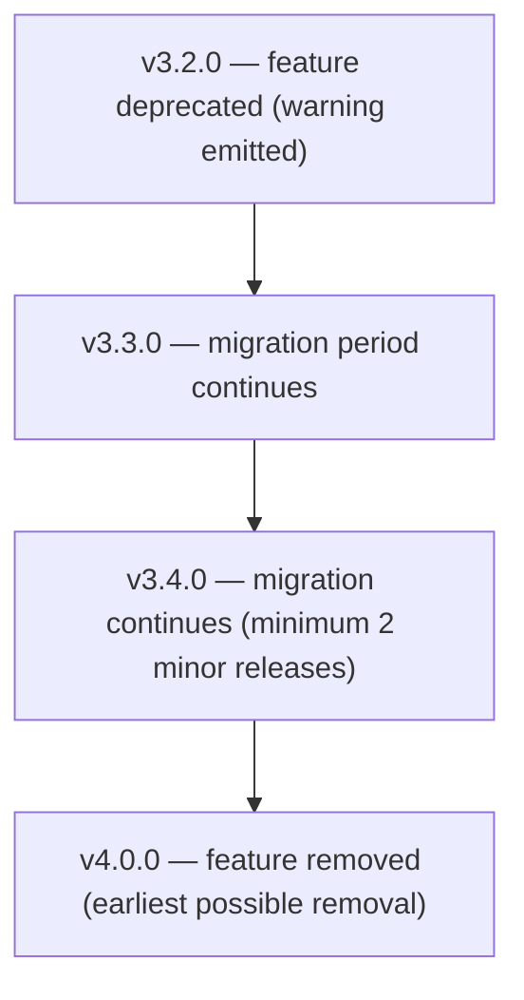

ObjectStack follows strict backward compatibility guarantees to ensure predictable upgrades and long-term stability for production deployments.

<Callout type="info">
**Applies to:** `@objectstack/spec` and all packages in the ObjectStack ecosystem.
</Callout>

---

## Versioning Strategy

ObjectStack follows [Semantic Versioning 2.0.0](https://semver.org/) (`MAJOR.MINOR.PATCH`):

| Version Component | When Incremented | Guarantee |
|:---|:---|:---|
| **MAJOR** (X.0.0) | Incompatible API changes | May contain breaking changes |
| **MINOR** (0.X.0) | New features, backward-compatible | Existing code continues to work |
| **PATCH** (0.0.X) | Bug fixes, backward-compatible | No behavior changes, only fixes |

### SemVer Guarantees

- **Zod schemas** are part of the public API surface. Adding optional properties is a MINOR change; removing or renaming properties is a MAJOR change.
- **TypeScript types** inferred from Zod (`z.infer<typeof Schema>`) follow the same guarantees as their source schemas.
- **Helper functions** (e.g., `defineStack`, `defineStudioPlugin`) maintain their call signatures within a MAJOR version.
- **Input formats** — `defineStack()` accepts both array and map (Record) format for all named metadata collections. Both formats are guaranteed stable within a MAJOR version.
- **Enum values** are append-only within a MAJOR version. Existing values are never removed or renamed in MINOR/PATCH releases.
- **Default values** in schemas are not changed in MINOR/PATCH releases unless fixing a documented bug.

{/* os:check */}
```typescript
// These imports are guaranteed stable within a MAJOR version
import { FieldSchema, ObjectSchema } from '@objectstack/spec/data';
import { defineStack } from '@objectstack/spec';
import { defineStudioPlugin } from '@objectstack/spec/studio';
```

---

## Deprecation Timeline

When a feature, schema property, or API is deprecated, ObjectStack follows a structured wind-down process:

### Phase 1: Deprecation Notice (MINOR release)

- Feature is marked `@deprecated` in JSDoc comments
- Zod schema property gets a `.describe('DEPRECATED: ...')` annotation
- Runtime warning is emitted on first use (once per session)
- Migration path is documented in the CHANGELOG

### Phase 2: Migration Period (minimum 2 MINOR releases)

- Deprecated feature continues to function without behavior changes
- Documentation is updated with migration guides
- Code examples are updated to use the replacement
- CLI tooling may provide automated migration commands

### Phase 3: Removal (next MAJOR release)

- Deprecated feature is removed from the schema
- TypeScript types no longer include the property
- Runtime code no longer supports the feature

### Timeline Summary



<Callout type="warn">
**Minimum guarantee:** Deprecated features survive for at least **2 MINOR releases** before they can be removed in the next MAJOR version.
</Callout>

---

## Breaking Change Policy

### What Constitutes a Breaking Change

| Change Type | Breaking? | Version Impact |
|:---|:---|:---|
| Removing a schema property | **Yes** | MAJOR |
| Renaming a schema property | **Yes** | MAJOR |
| Changing a property from optional to required | **Yes** | MAJOR |
| Narrowing a type (e.g., `string` → `enum`) | **Yes** | MAJOR |
| Removing an enum value | **Yes** | MAJOR |
| Changing default values | **Yes** | MAJOR |
| Adding a new optional property | No | MINOR |
| Adding a new enum value | No | MINOR |
| Widening a type (e.g., `enum` → `string`) | No | MINOR |
| Adding a new schema/export | No | MINOR |
| Fixing validation to match documented behavior | No | PATCH |
| Fixing typos in descriptions | No | PATCH |

### Breaking Change Process

1. **RFC (Request for Comments)** — Breaking changes are proposed as GitHub issues with the `breaking-change` label.
2. **Review Period** — Minimum 30-day community review period.
3. **Deprecation** — The old behavior is deprecated in a MINOR release (see timeline above).
4. **Migration Guide** — A detailed migration guide is published before the MAJOR release.
5. **Release** — Breaking change ships in the next MAJOR version.

---

## Migration Support

### Linting Your Project

The CLI's `lint` command checks your metadata for style and convention issues and surfaces them. Adding `--fix` prints the suggested fix for each issue (dry-run; it does not modify files):

```bash
# Check metadata for style and convention issues
os lint

# Show what could be auto-fixed (dry-run)
os lint --fix

# Scan your source for deprecated ObjectStack patterns
os doctor --scan-deprecations

# Compare two configs and detect breaking changes between versions
os diff <before> <after> --breaking-only
```

<Callout type="info">
There is no `lint --deprecations` flag — deprecation scanning lives on `os doctor --scan-deprecations`. An automated `codemod` command is referenced in the migration guides but is not yet available; until then, combine `os doctor --scan-deprecations`, `os diff`, and the CHANGELOG migration notes (below) to upgrade across MAJOR versions.
</Callout>

### Migration Guides

Each MAJOR release includes:

- **CHANGELOG.md** — Complete list of changes with migration notes
- **RELEASE_NOTES.md** — High-level summary and upgrade instructions
- **Schema Diff** — Use `os diff <before> <after>` to produce a machine-readable (`--json`) diff of breaking changes between two configs

### Support Windows

| Version | Status | Support Level |
|:---|:---|:---|
| Current MAJOR (N) | **Active** | Full feature development, bug fixes, security patches |
| Previous MAJOR (N-1) | **Maintenance** | Critical bug fixes and security patches only |
| Older versions (N-2+) | **End of Life** | No support; upgrade recommended |

---

## Spec Package Guarantees

The `@objectstack/spec` package provides additional stability guarantees:

### Schema Stability

- All Zod schemas are validated by comprehensive test suites
- Schema changes require both Zod and JSON Schema output validation
- Property additions must include `.describe()` annotations and `.optional()` or `.default()` markers

### Export Stability

- All public exports are listed in the package's `index.ts` barrel files
- Removing an export is always a MAJOR change
- Internal modules (prefixed with `_` or in `internal/` directories) are not covered by SemVer guarantees

### Runtime Behavior

- `Schema.parse()` results are guaranteed consistent within a MAJOR version
- Default values applied by `.default()` are stable within a MAJOR version
- Validation error messages may change in MINOR/PATCH releases (do not rely on exact error text)

---

## Launch Window: MINOR Releases Can Contain Breaking Changes

<Callout type="warn">
**This exception overrides the MAJOR/MINOR mapping above — read it before you plan an upgrade.** Every published `@objectstack/*` package versions in **lockstep**, and while the launch window is open a breaking change ships as a **MINOR** release rather than burning a MAJOR. The current release, **17.2.0**, is a MINOR and it contains a documented breaking change.
</Callout>

### Which surfaces this covers

**All of them.** This is not scoped to an experimental corner or a pre-release channel: all **69** packages published from this repository belong to a single Changesets `fixed` group, so they share one version number and one policy. No published surface is exempt.

The convention is enforced rather than informal — `scripts/check-changeset-no-major.mjs` fails any pull request that introduces a `major` bump, because under lockstep a single `major` on one package would promote the entire stack.

### What this means for an upgrade

- **Do not read a MINOR bump as safe to take unattended.** Read the [release notes](/docs/releases) for the version you are moving to: they lead with breaking changes and carry the migration steps.
- **Pin exact versions** instead of caret ranges if you cannot review each MINOR before it lands.
- **Diff your own metadata** across the upgrade with `os diff <before> <after> --breaking-only`.

MAJOR releases do still happen — 17.0.0 was cut precisely because its breaking density was too high to carry `^16.x` consumers across on a caret range — but an individual breaking change does not, on its own, force one.

### When it stops applying

The versioning tables and deprecation timeline above describe the policy in its settled form; they take full effect when the launch window closes and a breaking change once again requires a MAJOR. Until then, **this section is the operative rule wherever the two disagree.**

---

## Reporting Compatibility Issues

If you encounter an unintended breaking change:

1. **Check the CHANGELOG** — Verify the change was not documented as intentional.
2. **Open an issue** — File a GitHub issue with the `compatibility` label.
3. **Include a reproduction** — Provide a minimal code sample showing the breakage.
4. **Reference the version** — Specify the exact versions where behavior changed.
