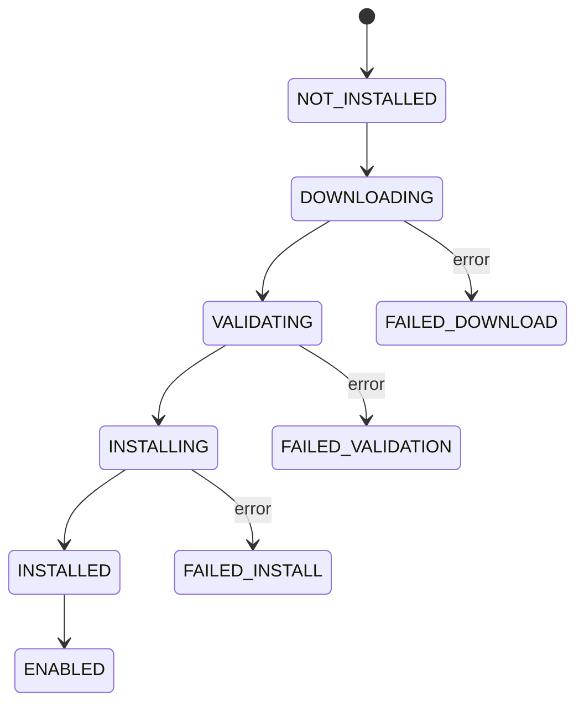

import { Zap, Power, Package, RefreshCw, ArrowLeft, CheckCircle, XCircle, AlertTriangle } from 'lucide-react';

# System Lifecycle

<Callout type="warn">
**Protocol spec.** The boot sequence, schema-evolution model, and graceful
shutdown described below reflect the current `@objectstack/core` and CLI
behaviour. The plugin upgrade flow (`objectstack upgrade @vendor/pkg
--strategy blue-green`, multi-instance rolling upgrades, automatic backup &
rollback) describes the **target** lifecycle for hosted ObjectOS — today it is
partially implemented in the control plane and exposed only on hosted plans.
Treat those command snippets as design intent.
</Callout>

ObjectOS manages the complete **lifecycle** of the platform runtime—from initial boot to plugin installation, upgrades, and rollbacks. Every operation is **declarative**, **idempotent**, and **auditable**.

## Boot Sequence

The ObjectOS boot process follows a **strict order** to ensure dependencies are satisfied before services start.

### Boot Phases

```
┌─────────────────────────────────────────────────────────────────┐
│ Phase 1: INITIALIZE                                             │
│  └─ Load environment variables                                  │
│  └─ Validate runtime requirements (Node.js version, memory)     │
│  └─ Initialize logging infrastructure                           │
└─────────────────────────────────────────────────────────────────┘
                          ↓
┌─────────────────────────────────────────────────────────────────┐
│ Phase 2: CONFIGURE                                              │
│  └─ Load configuration files (objectstack.config.yml)           │
│  └─ Merge config sources (env → file → defaults)                │
│  └─ Validate configuration schema                               │
└─────────────────────────────────────────────────────────────────┘
                          ↓
┌─────────────────────────────────────────────────────────────────┐
│ Phase 3: CONNECT                                                │
│  └─ Establish database connections (PostgreSQL, Redis)          │
│  └─ Run health checks                                           │
│  └─ Initialize connection pools                                 │
└─────────────────────────────────────────────────────────────────┘
                          ↓
┌─────────────────────────────────────────────────────────────────┐
│ Phase 4: LOAD PLUGINS                                           │
│  └─ Discover installed plugins                                  │
│  └─ Resolve dependency graph                                    │
│  └─ Load plugins in topological order                           │
│  └─ Execute onBoot() hooks                                      │
└─────────────────────────────────────────────────────────────────┘
                          ↓
┌─────────────────────────────────────────────────────────────────┐
│ Phase 5: REGISTER METADATA                                      │
│  └─ Register ObjectQL schemas (objects, fields)                 │
│  └─ Register ObjectUI layouts (views, dashboards)               │
│  └─ Register permissions and validation rules                   │
└─────────────────────────────────────────────────────────────────┘
                          ↓
┌─────────────────────────────────────────────────────────────────┐
│ Phase 6: START SERVICES                                         │
│  └─ Start event bus                                             │
│  └─ Start job scheduler                                         │
│  └─ Start audit logger                                          │
│  └─ Start HTTP/GraphQL servers                                  │
└─────────────────────────────────────────────────────────────────┘
                          ↓
┌─────────────────────────────────────────────────────────────────┐
│ Phase 7: READY                                                  │
│  └─ Mark instance as healthy                                    │
│  └─ Begin accepting requests                                    │
│  └─ Log boot time metrics                                       │
└─────────────────────────────────────────────────────────────────┘
```

### Boot Configuration

Boot behaviour is controlled by the host runtime (kernel options + env vars),
not by metadata. The relevant knobs:

| Concern | Where it lives |
| :--- | :--- |
| Plugin startup timeout | `new ObjectKernel({ defaultStartupTimeout: 60_000 })` |
| Fail-fast on plugin error | `new ObjectKernel({ rollbackOnFailure: true })` |
| Disable strict requirement checks (tests) | `new ObjectKernel({ skipSystemValidation: true })` |
| Which services start | Each service is registered with `kernel.use(serviceFactory(...))`; not started → not running |
| Schema sync on boot | Driver-specific (`SqlDriver` calls `syncSchema()` on `init()`) |

A typical bootstrap looks like this — no `defineConfig`, no metadata-side boot
options:

```typescript
import { ObjectKernel } from '@objectstack/core';
import { AppPlugin } from '@objectstack/runtime';
import { SqlDriver } from '@objectstack/driver-sql';
import stack from './objectstack.config';

const kernel = new ObjectKernel({
  defaultStartupTimeout: 60_000,
  gracefulShutdown: true,
  shutdownTimeout: 30_000,
});

kernel.use(new SqlDriver({ /* ... */ }));
kernel.use(new AppPlugin(stack));
await kernel.bootstrap();
```

### Boot Logs (Example)

```
[2024-01-15T10:23:01.234Z] INFO  ObjectOS starting...
[2024-01-15T10:23:01.250Z] INFO  Phase 1: Initialize
[2024-01-15T10:23:01.251Z] INFO    ✓ Node.js v20.10.0
[2024-01-15T10:23:01.252Z] INFO    ✓ Memory: 2048 MB available
[2024-01-15T10:23:01.300Z] INFO  Phase 2: Configure
[2024-01-15T10:23:01.301Z] INFO    ✓ Loaded objectstack.config.yml
[2024-01-15T10:23:01.302Z] INFO    ✓ Merged 3 config sources
[2024-01-15T10:23:01.400Z] INFO  Phase 3: Connect
[2024-01-15T10:23:01.450Z] INFO    ✓ PostgreSQL connected (10 pool size)
[2024-01-15T10:23:01.460Z] INFO    ✓ Redis connected
[2024-01-15T10:23:01.500Z] INFO  Phase 4: Load Plugins
[2024-01-15T10:23:01.501Z] INFO    → @objectstack/core@2.0.0
[2024-01-15T10:23:01.550Z] INFO    → @mycompany/crm@1.5.0
[2024-01-15T10:23:01.600Z] INFO    → @vendor/salesforce@3.2.1
[2024-01-15T10:23:01.650Z] INFO    ✓ 3 plugins loaded
[2024-01-15T10:23:01.700Z] INFO  Phase 5: Register Metadata
[2024-01-15T10:23:01.701Z] INFO    ✓ 15 objects registered
[2024-01-15T10:23:01.702Z] INFO    ✓ 42 views registered
[2024-01-15T10:23:01.800Z] INFO  Phase 6: Start Services
[2024-01-15T10:23:01.850Z] INFO    ✓ Event bus started
[2024-01-15T10:23:01.900Z] INFO    ✓ Job scheduler started (5 jobs loaded)
[2024-01-15T10:23:01.950Z] INFO    ✓ HTTP server listening on :3000
[2024-01-15T10:23:02.000Z] INFO  Phase 7: Ready
[2024-01-15T10:23:02.001Z] INFO  ObjectOS ready in 766ms
```

### Error Handling During Boot

**Scenario:** Plugin fails to load

```
[2024-01-15T10:23:01.500Z] ERROR Phase 4: Load Plugins
[2024-01-15T10:23:01.501Z] ERROR   ✗ @vendor/broken-plugin@1.0.0
[2024-01-15T10:23:01.502Z] ERROR   Dependency @objectstack/core@^3.0.0 not satisfied
[2024-01-15T10:23:01.503Z] ERROR   (Installed version: 2.0.0)
[2024-01-15T10:23:01.504Z] FATAL Boot failed. Exiting.
```

**Resolution Strategy:**
1. **failOnPluginError: true** (default): Boot fails, process exits with code 1
2. **failOnPluginError: false**: Boot continues, failed plugin is disabled and logged

## Plugin Installation

Installing a plugin is a **multi-step transaction**. If any step fails, the entire installation rolls back.

### Installation Flow

```typescript
// Command: objectstack plugin install @vendor/salesforce@3.2.1

async function installPlugin(packageName: string, version: string) {
  const transaction = await db.beginTransaction();
  
  try {
    // Step 1: Download and validate
    const manifest = await registry.download(packageName, version);
    await validateManifest(manifest);
    
    // Step 2: Dependency resolution
    await resolveDependencies(manifest.dependencies);
    
    // Step 3: Backup current state
    const backup = await createBackup();
    
    // Step 4: Run pre-install hook
    await manifest.lifecycle.preInstall?.({ context, transaction });
    
    // Step 5: Apply schema changes (ObjectQL)
    for (const object of manifest.objects) {
      await ObjectQL.createOrUpdateObject(object, { transaction });
    }
    
    // Step 6: Register UI metadata (ObjectUI)
    for (const view of manifest.views) {
      await ObjectUI.registerView(view, { transaction });
    }
    
    // Step 7: Apply configuration defaults
    await ConfigStore.merge(manifest.defaultConfig, { transaction });
    
    // Step 8: Run post-install hook
    await manifest.lifecycle.postInstall?.({ context, transaction });
    
    // Step 9: Mark plugin as installed
    await PluginRegistry.markInstalled(packageName, version, { transaction });
    
    // Step 10: Commit transaction
    await transaction.commit();
    
    logger.info(`✓ Installed ${packageName}@${version}`);
    
  } catch (error) {
    // Rollback on any error
    await transaction.rollback();
    logger.error(`✗ Installation failed: ${error.message}`);
    throw error;
  }
}
```

### Installation States

A plugin progresses through these states:



### Dependency Resolution

**Example Dependency Graph:**

```yaml
# @mycompany/sales-cloud depends on:
dependencies:
  '@objectstack/core': '^2.0.0'
  '@mycompany/crm-base': '^1.0.0'
  '@vendor/email': '>=2.5.0 <3.0.0'
```

**Resolution Algorithm:**

```typescript
async function resolveDependencies(
  deps: Record<string, string>
): Promise<void> {
  for (const [pkg, versionRange] of Object.entries(deps)) {
    const installed = await PluginRegistry.getInstalled(pkg);
    
    if (!installed) {
      throw new Error(
        `Dependency ${pkg} is not installed. ` +
        `Install it first: objectstack plugin install ${pkg}`
      );
    }
    
    if (!semver.satisfies(installed.version, versionRange)) {
      throw new Error(
        `Dependency ${pkg}@${installed.version} does not satisfy ` +
        `required version ${versionRange}`
      );
    }
  }
}
```

### Plugin Lifecycle Hooks

Plugins can define hooks that run at specific lifecycle events:

```typescript
// plugin.manifest.ts
export default definePlugin({
  name: '@vendor/salesforce',
  version: '3.2.1',
  
  lifecycle: {
    // Runs before installation begins
    preInstall: async ({ context, transaction }) => {
      // Validate environment
      if (!context.config.get('salesforce.apiKey')) {
        throw new Error('Salesforce API key not configured');
      }
    },
    
    // Runs after installation completes
    postInstall: async ({ context, transaction }) => {
      // Initialize default data
      await context.db.insert('salesforce_settings', {
        syncInterval: 3600, // 1 hour
        enabled: true,
      }, { transaction });
      
      // Schedule sync job
      await context.scheduler.create({
        name: 'salesforce-sync',
        schedule: '0 * * * *', // Every hour
        handler: 'salesforce.sync',
      }, { transaction });
    },
    
    // Runs when plugin is enabled
    onEnable: async ({ context }) => {
      logger.info('Salesforce sync enabled');
      await context.eventBus.publish('salesforce.enabled');
    },
    
    // Runs when plugin is disabled
    onDisable: async ({ context }) => {
      logger.info('Salesforce sync disabled');
      await context.scheduler.pause('salesforce-sync');
    },
    
    // Runs before uninstallation
    preUninstall: async ({ context, transaction }) => {
      // Clean up jobs
      await context.scheduler.delete('salesforce-sync', { transaction });
    },
    
    // Runs after uninstallation
    postUninstall: async ({ context, transaction }) => {
      // Optional: Remove plugin data
      await context.db.delete('salesforce_settings', {}, { transaction });
    },
  },
});
```

### Installation CLI

```bash
# Install latest version
objectstack plugin install @vendor/salesforce

# Install specific version
objectstack plugin install @vendor/salesforce@3.2.1

# Install from local directory (development)
objectstack plugin install ./plugins/my-plugin

# Install with options
objectstack plugin install @vendor/salesforce \
  --enable \                    # Auto-enable after install
  --config salesforce.apiKey=abc123  # Set config during install
  
# Dry run (validate without installing)
objectstack plugin install @vendor/salesforce --dry-run

# Force reinstall (remove + install)
objectstack plugin install @vendor/salesforce --force
```

### Installation Output

```
Installing @vendor/salesforce@3.2.1...

[1/8] Downloading package...         ✓ 1.2 MB in 0.5s
[2/8] Validating manifest...         ✓ 
[3/8] Checking dependencies...       ✓ 
  → @objectstack/core@2.0.0          ✓ (satisfied)
  → @vendor/http@1.5.0               ✓ (satisfied)
[4/8] Creating backup...             ✓ backup-20240115-102301.tar.gz
[5/8] Applying schema changes...     ✓ 3 objects created
[6/8] Registering UI metadata...     ✓ 7 views registered
[7/8] Running post-install hook...   ✓ 
[8/8] Finalizing installation...     ✓ 

✓ Successfully installed @vendor/salesforce@3.2.1

Next steps:
  1. Configure API credentials:
     objectstack config set salesforce.apiKey <YOUR_KEY>
     
  2. Enable the plugin:
     objectstack plugin enable @vendor/salesforce
     
  3. Test connection:
     objectstack plugin test @vendor/salesforce
```

## Upgrades

ObjectOS supports **zero-downtime upgrades** with automatic rollback on failure.

### Upgrade Strategies

#### 1. In-Place Upgrade (Default)

Upgrade the current instance without creating a new one.

```bash
objectstack upgrade @vendor/salesforce --to 3.3.0
```

**Process:**
1. Download new version
2. Create backup of current state
3. Stop services gracefully (wait for in-flight requests)
4. Apply schema migrations
5. Update plugin files
6. Restart services
7. Validate health checks
8. If validation fails → automatic rollback

**Downtime:** 5-15 seconds (during service restart)

#### 2. Blue-Green Deployment

Run two versions simultaneously, switch traffic after validation.

```bash
objectstack upgrade @vendor/salesforce --to 3.3.0 --strategy blue-green
```

**Process:**
1. Provision "green" instance with new version
2. Apply schema migrations to green database
3. Run smoke tests on green instance
4. If tests pass → switch load balancer to green
5. If tests fail → destroy green, keep blue
6. After validation period → destroy blue

**Downtime:** 0 seconds

#### 3. Rolling Upgrade (Multi-Instance)

Upgrade instances one at a time in a cluster.

```bash
objectstack upgrade @vendor/salesforce --to 3.3.0 --strategy rolling
```

**Process:**
1. Take instance 1 out of load balancer
2. Upgrade instance 1
3. Add instance 1 back to load balancer
4. Repeat for instances 2, 3, ...N

**Downtime:** 0 seconds (requires N ≥ 2 instances)

### Schema Evolution

ObjectStack treats schema as **metadata, not migrations**. The canonical source
of truth is your object definitions; the driver's `syncSchema()` reconciles the
physical database to match. Generated migration files exist as an *escape hatch*
for explicit DDL when automatic sync isn't enough (e.g. data backfill,
non-trivial column renames).

#### Declarative schema (the default)

```typescript
// src/objects/salesforce_account.object.ts
import { ObjectSchema, Field } from '@objectstack/spec/data';

export default ObjectSchema.create({
  name: 'salesforce_account',
  label: 'Salesforce Account',
  fields: {
    salesforce_id: Field.text({ required: true, unique: true }),
    account_name: Field.text(),
    last_sync: Field.datetime(),
  },
});
```

On boot, the driver's `syncSchema(object, schema)` creates / alters the table to
match. Add a field → edit the file → restart (or hot-reload in dev). No
imperative `createObject` / `addField` calls.

#### Generated migration files (escape hatch)

For environments where you want explicit, reviewable DDL — e.g. production
deployments behind change control — generate a migration file from your current
config:

```bash
os generate migration               # → migrations/<timestamp>_migration.ts
os generate migration --format sql  # → migrations/<timestamp>_migration.sql
os generate migration --dry-run     # Preview without writing
```

The generated TypeScript file uses plain Knex-style `up(db)` / `down(db)`
functions — no custom migration DSL:

```typescript
// migrations/20260101000000_migration.ts — auto-generated
export async function up(db: any): Promise<void> {
  await db.schema.createTable('salesforce_account', (t: any) => {
    t.string('id').primary();
    t.string('salesforce_id').notNullable().unique();
    t.string('account_name');
    t.datetime('last_sync');
  });
}

export async function down(db: any): Promise<void> {
  await db.schema.dropTable('salesforce_account');
}
```

Run migrations through your existing Knex / driver tooling — ObjectOS does not
ship its own migration runner. The intent of `os generate migration` is to give
you a hand-off file you can commit, review, and execute via the database tools
your team already uses.

#### Schema safety

The same rules apply whether you rely on `syncSchema()` or hand-written
migrations:

- ✅ Adding optional fields is safe — old code ignores them.
- ❌ Adding required fields without a default breaks running clients.
- ✅ Adding required fields **with** `defaultValue` keeps old code happy.
- ⚠️ Renaming or dropping columns always needs a planned migration window.

### Upgrade Rollback

If upgrade fails, ObjectOS **automatically rolls back** to previous version.

#### Rollback Scenarios

**1. Schema Migration Fails:**
```
[2024-01-15T10:30:00.000Z] INFO  Starting upgrade: 3.2.1 → 3.3.0
[2024-01-15T10:30:01.000Z] INFO  [1/3] Running migration 005_add_column...
[2024-01-15T10:30:01.500Z] ERROR Migration failed: column "account_name" already exists
[2024-01-15T10:30:01.501Z] WARN  Rolling back migration 005...
[2024-01-15T10:30:02.000Z] INFO  ✓ Rollback complete
[2024-01-15T10:30:02.001Z] INFO  Restoring previous version from backup...
[2024-01-15T10:30:03.000Z] INFO  ✓ Restored to version 3.2.1
```

**2. Health Check Fails:**
```
[2024-01-15T10:30:00.000Z] INFO  Upgrade complete, validating...
[2024-01-15T10:30:01.000Z] INFO  Running health checks...
[2024-01-15T10:30:02.000Z] ERROR Health check failed: /api/health returned 500
[2024-01-15T10:30:02.001Z] WARN  Automatic rollback initiated
[2024-01-15T10:30:05.000Z] INFO  ✓ Rolled back to version 3.2.1
```

#### Manual Rollback

To switch an environment back to a previous build, **install the prior package
version** into it (via the Cloud control plane / Marketplace, or
`os package publish <older-artifact> --env <env-id> --install`). This is the cloud
equivalent of "switch back to yesterday's build"; it does not run DDL or undo
schema migrations.

> The legacy revision-activate `os rollback` CLI was removed (#2237); environment
> version management now goes through package install.

For schema rollback, run the `down()` of your generated migration through
whatever Knex / driver tooling your team uses to apply the `up()`.

### Upgrade Configuration

The behaviour around backups, rollback, and health checks during an
`objectstack upgrade` is controlled by the host runtime / hosting platform —
not by a top-level `defineStack` key today. Hosted ObjectStack and self-hosted
ObjectOS expose this through environment-specific configuration:

| Concern | Hosted control plane | Self-hosted |
| :--- | :--- | :--- |
| Pre-upgrade backups | enabled by default, retention configurable per project | run your own snapshotter (e.g. `pg_dump`, LiteFS snapshot) |
| Health-check timeout after upgrade | dashboard setting | `OS_HEALTH_TIMEOUT_MS` env var |
| Automatic rollback on failed health check | dashboard setting | `OS_AUTO_ROLLBACK=true` env var |
| Maintenance-mode banner | dashboard setting | `OS_MAINTENANCE_MESSAGE` env var consumed by `plugin-hono-server` |

This intentionally lives outside the metadata layer: it's an operational
policy, not a property of the application.

## Health Checks

ObjectOS includes **built-in health monitoring** to validate system state.

### Health Check Endpoints

```
GET /health/live
  → 200 if process is alive
  → 503 if process is dead/hung

GET /health/ready
  → 200 if ready to accept requests
  → 503 if still booting or unhealthy

GET /health/status
  → Detailed health report (JSON)
```

### Health Status Response

```json
{
  "status": "healthy",
  "uptime": 3600,
  "version": "2.0.0",
  "timestamp": "2024-01-15T11:00:00.000Z",
  "checks": {
    "database": {
      "status": "healthy",
      "latency_ms": 5,
      "connections": {
        "active": 8,
        "idle": 2,
        "max": 10
      }
    },
    "redis": {
      "status": "healthy",
      "latency_ms": 2
    },
    "plugins": {
      "status": "healthy",
      "loaded": 3,
      "enabled": 3,
      "failed": 0
    },
    "jobs": {
      "status": "healthy",
      "pending": 5,
      "running": 2,
      "failed": 0
    }
  }
}
```

### Custom Health Checks

Plugins can register custom health checks:

```typescript
// Plugin registers health check
export default definePlugin({
  name: '@vendor/salesforce',
  
  healthChecks: {
    salesforce_connection: async ({ context }) => {
      try {
        // Test Salesforce API
        const response = await salesforce.query('SELECT Id FROM Account LIMIT 1');
        
        return {
          status: 'healthy',
          latency_ms: response.duration,
          records_synced_last_hour: await getSyncCount(),
        };
      } catch (error) {
        return {
          status: 'unhealthy',
          error: error.message,
        };
      }
    },
  },
});
```

## Shutdown Sequence

Graceful shutdown ensures in-flight requests complete before process exits.

### Shutdown Phases

```
SIGTERM received
  ↓
[1] Stop accepting new requests
  ↓
[2] Finish in-flight requests (timeout: 30s)
  ↓
[3] Stop background jobs
  ↓
[4] Close database connections
  ↓
[5] Flush audit logs
  ↓
[6] Exit process
```

### Shutdown Configuration

Shutdown is configured at kernel construction, not via metadata:

```typescript
import { ObjectKernel } from '@objectstack/core';

const kernel = new ObjectKernel({
  // Enable graceful shutdown on SIGTERM / SIGINT
  gracefulShutdown: true,
  // Wait this long for in-flight work to drain before force-stopping
  shutdownTimeout: 30_000,
});
```

The host process is responsible for signal handling. ObjectStack ships the
listeners only when `gracefulShutdown: true`; otherwise it stays out of the
process-management business so adapters (Express, Fastify, Hono, Vercel, …)
can install their own.

## Best Practices

### 1. Always Use Transactions for Installations
Every installation step should be atomic. If step 5/8 fails, steps 1-4 must rollback.

```typescript
// ✓ GOOD: Use transaction
const tx = await db.beginTransaction();
try {
  await step1(tx);
  await step2(tx);
  await tx.commit();
} catch (error) {
  await tx.rollback();
}

// ✗ BAD: No transaction
await step1();
await step2(); // If this fails, step1 is not reverted!
```

### 2. Version Migrations, Don't Modify Them
Once a migration file is applied in production, **never modify it**. Generate a new one instead.

```typescript
// ✗ BAD: Modifying an existing migration file
// migrations/20260101000000_migration.ts (ALREADY APPLIED)
// Editing it here changes history that databases have already seen.

// ✓ GOOD: Generate a new migration after updating the object metadata
//   1. Edit src/objects/account.object.ts — add the new field
//   2. Run:  os generate migration
//   3. Commit  migrations/20260201000000_migration.ts
```

### 3. Test Upgrades in Staging First
Always validate upgrades in a staging environment that mirrors production.

```bash
# Staging
objectstack upgrade --dry-run  # Preview changes
objectstack upgrade            # Apply upgrade
objectstack test               # Run integration tests

# If tests pass → Production
objectstack upgrade --production
```

### 4. Monitor Health After Upgrades
Don't assume success. Monitor health checks for 5-10 minutes after upgrade.

```bash
# Automated monitoring
objectstack upgrade @vendor/salesforce --monitor --duration 300
# Watches /health/status for 5 minutes, auto-rollback if unhealthy
```

### 5. Document Breaking Changes
Plugin authors must document breaking changes in CHANGELOG.md.

```markdown
## v4.0.0 (Breaking Changes)

### Removed
- `salesforce.sync()` method (use `salesforce.syncAccounts()` instead)

### Changed
- `salesforce_account.name` field renamed to `account_name`

### Migration Guide
1. Update code: `sync()` → `syncAccounts()`
2. Edit the relevant object metadata files
3. Run `os generate migration` and review the generated DDL
4. Apply via your usual Knex / driver pipeline
```

## Summary

ObjectOS lifecycle management provides:
- **Deterministic Boot:** 7-phase boot sequence with clear error handling
- **Atomic Installations:** Transactions ensure all-or-nothing plugin installs
- **Zero-Downtime Upgrades:** Blue-green and rolling strategies for production
- **Automatic Rollback:** Failed upgrades auto-revert to previous version
- **Health Monitoring:** Built-in health checks validate system state

**Next:** Learn how to define plugin manifests in [Plugin Specification](/docs/protocol/objectos/plugin-spec).
