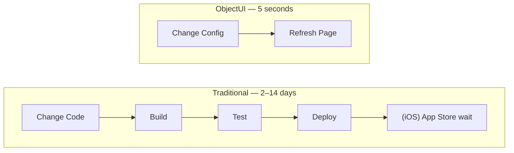

import { Layout, Component, MousePointer, Blocks, Zap, Package, Shield, Globe } from 'lucide-react';

**ObjectUI** is ObjectStack's UI abstraction layer that treats **interfaces as data**. Instead of hardcoding React/Vue components, you define layouts, forms, and dashboards as JSON/YAML configurations that renderers interpret at runtime.

## The Core Problem

Traditional frontend development chains you to specific frameworks and platforms:

- **UI Changes Require Deployments:** Change a form layout? Rebuild, test, redeploy, wait for app store approval
- **Platform Fragmentation:** Build the same form 3 times (Web React, iOS SwiftUI, Android Jetpack Compose)
- **Business User Lock-out:** Analysts can't configure dashboards—they must file tickets and wait for developer sprints
- **Validation Duplication:** Same validation rules written 3 times (Frontend, Backend, Database)
- **Framework Lock-in:** Switching from React to Vue requires months of rewrites

**Result:** 6-week lead time to add a single field to a form. Business agility destroyed by technical constraints.

## The ObjectUI Solution

<Cards>
  <Card
    icon={<Zap />}
    title="Deploy UI in Seconds"
    description="Update forms, dashboards, and reports without rebuilding apps. Change JSON metadata, refresh page—done."
  />
  <Card
    icon={<Globe />}
    title="Write Once, Run Everywhere"
    description="One JSON definition renders natively on Web (React/Vue), iOS (SwiftUI), Android (Compose), Desktop (Tauri)."
  />
  <Card
    icon={<Package />}
    title="Empower Business Users"
    description="Non-technical users configure dashboards and reports themselves. IT enables, doesn't gatekeep."
  />
  <Card
    icon={<Shield />}
    title="Consistent UX Guarantee"
    description="Same form layout on every platform. Validation enforced everywhere automatically. Zero drift."
  />
</Cards>

## Architecture Overview

```
┌─────────────────────────────────────────────────────────────┐
│                     Application Layer                        │
│  Business Users configure dashboards, forms, actions         │
└─────────────────────────────────────────────────────────────┘
                            ↓
┌─────────────────────────────────────────────────────────────┐
│                   ObjectUI Protocol (JSON)                   │
│  Layout DSL • Widget Contract • Action Definitions           │
└─────────────────────────────────────────────────────────────┘
                            ↓
        ┌───────────────────┴────────────────────┐
        ↓                   ↓                     ↓
  ┌──────────┐      ┌──────────┐         ┌──────────┐
  │   Web    │      │  Mobile  │         │ Desktop  │
  │ Renderer │      │ Renderer │         │ Renderer │
  │  React   │      │  Swift   │         │  Tauri   │
  └──────────┘      └──────────┘         └──────────┘
```

**Key Insight:** The protocol is the contract. Any renderer that implements ObjectUI can paint the same interface.

## Core Components

<Cards>
  <Card
    icon={<Layout />}
    title="Layout DSL"
    href="/docs/protocol/objectui/layout-dsl"
    description="Declarative page structure with responsive grid system"
  />
  <Card
    icon={<Component />}
    title="Widget Contract"
    href="/docs/protocol/objectui/widget-contract"
    description="Standard props and events for UI components"
  />
  <Card
    icon={<MousePointer />}
    title="Action Protocol"
    href="/docs/protocol/objectui/actions"
    description="Buttons, triggers, and navigation definitions"
  />
  <Card
    icon={<Blocks />}
    title="UI as Data Concept"
    href="/docs/protocol/objectui/concept"
    description="Philosophy and benefits of metadata-driven UIs"
  />
</Cards>

## Quick Example

### Traditional Approach (React)

```tsx
// CustomerForm.tsx (300+ lines of code)
import { useState, useEffect } from 'react';
import { TextField, Select, Button } from '@mui/material';

function CustomerForm({ customerId }) {
  const [data, setData] = useState({});
  const [loading, setLoading] = useState(true);
  
  useEffect(() => {
    fetch(`/api/customers/${customerId}`)
      .then(res => res.json())
      .then(data => { setData(data); setLoading(false); });
  }, [customerId]);
  
  const handleSubmit = async () => {
    if (!data.name || data.name.length < 3) {
      alert('Name must be at least 3 characters');
      return;
    }
    await fetch(`/api/customers/${customerId}`, {
      method: 'PUT',
      body: JSON.stringify(data)
    });
  };
  
  return (
    <form onSubmit={handleSubmit}>
      <TextField
        label="Customer Name"
        value={data.name || ''}
        onChange={e => setData({...data, name: e.target.value})}
        required
        minLength={3}
      />
      <Select
        label="Status"
        value={data.status || 'active'}
        onChange={e => setData({...data, status: e.target.value})}
      >
        <option value="active">Active</option>
        <option value="inactive">Inactive</option>
      </Select>
      <Button type="submit">Save</Button>
    </form>
  );
}
```

**Problems:**
- 300+ lines for a 2-field form
- Validation logic duplicated (frontend + backend)
- Change field order? Edit code, rebuild, redeploy
- Mobile app? Rewrite entire form in Swift

### ObjectUI Approach

```yaml
# customer.formview.yml (15 lines)
name: customer_edit
object: customer
mode: edit
layout:
  sections:
    - label: Basic Information
      columns: 2
      fields:
        - name
        - status
actions:
  - type: standard_save
    label: Save
```

**Benefits:**
- 15 lines vs 300 lines (95% reduction)
- Validation inherited from `customer.object.yml` (no duplication)
- Change field order? Edit YAML, refresh page (5 seconds)
- Mobile app? Same YAML file renders natively (zero code)

**Result:** What took 2 days now takes 2 minutes.

## Server-Driven UI Flow

```
┌──────────┐                                    ┌──────────┐
│  Client  │                                    │  Server  │
└────┬─────┘                                    └────┬─────┘
     │                                               │
     │  1. Request Layout                            │
     │  GET /api/v1/meta/view/customer               │
     │──────────────────────────────────────────────>│
     │                                               │
     │                                     2. Resolve Layout
     │                              (Merge: Base + Admin Config + User Prefs)
     │                                               │
     │  3. Return Layout JSON                        │
     │  { type: 'form', fields: [...] }              │
     │<──────────────────────────────────────────────│
     │                                               │
4. Render Layout                                     │
(Traverse JSON, instantiate components)              │
     │                                               │
     │  5. User Interaction (Click Save)             │
     │                                               │
     │  6. Submit Data                               │
     │  POST /api/v1/data/customer                   │
     │──────────────────────────────────────────────>│
     │                                               │
     │                                   7. Validate & Save
     │                              (Run validation rules from schema)
     │                                               │
     │  8. Return Success                            │
     │<──────────────────────────────────────────────│
     │                                               │
9. Update UI                                         │
(Show success toast, refresh list)                   │
```

## View Types

### FormView: Record Editing

```yaml
FormView.create({
  object: 'project',
  layout: {
    type: 'tabbed',  # or 'simple' | 'wizard' | 'split' | 'drawer' | 'modal'
    tabs: [
      {
        label: 'Details',
        sections: [
          { label: 'Basic Info', columns: 2, fields: ['name', 'status'] },
          { label: 'Dates', columns: 2, fields: ['start_date', 'end_date'] }
        ]
      },
      {
        label: 'Team',
        sections: [
          { label: 'Members', fields: ['manager', 'team_lead'] }
        ]
      }
    ]
  }
});
```

**Renders as:**
- **Web:** Material-UI tabs with collapsible sections
- **Mobile:** SwiftUI NavigationView with grouped lists
- **Desktop:** Native tabs with keyboard shortcuts

### ListView: Data Tables

```yaml
ListView.create({
  object: 'project',
  type: 'grid',  # or 'kanban' | 'gallery' | 'calendar' | 'timeline' | 'gantt' | 'map' | 'chart'
  columns: [
    { field: 'name', width: 200, sortable: true },
    { field: 'status', width: 120, filter: true },
    { field: 'due_date', width: 150, sortable: true }
  ],
  filters: {
    default: [{ field: 'status', operator: 'in', value: ['active', 'pending'] }]
  },
  actions: [
    { type: 'standard_new', label: 'New Project' },
    { type: 'standard_edit', label: 'Edit' }
  ]
});
```

**Features:**
- Sorting, filtering, pagination (all server-side)
- Bulk actions (select multiple rows)
- Inline editing (double-click cell)
- Export to CSV/Excel

### Dashboard: Analytics Composition

```yaml
Dashboard.create({
  name: 'sales_overview',
  label: 'Sales Overview',
  layout: {
    rows: [
      {
        widgets: [
          { type: 'metric', title: 'Revenue', value: '$1.2M', span: 3 },
          { type: 'metric', title: 'Deals', value: '47', span: 3 },
          { type: 'metric', title: 'Win Rate', value: '68%', span: 3 },
          { type: 'metric', title: 'Avg Deal', value: '$25K', span: 3 }
        ]
      },
      {
        widgets: [
          { type: 'chart', chartType: 'line', title: 'Revenue Trend', span: 8 },
          { type: 'chart', chartType: 'pie', title: 'By Stage', span: 4 }
        ]
      },
      {
        widgets: [
          { type: 'list', object: 'opportunity', view: 'closing_soon', span: 12 }
        ]
      }
    ]
  }
});
```

**Widget Types:**
- **Metric:** KPI cards with trend indicators
- **Chart:** Bar, line, pie, donut, area, scatter
- **List:** Embedded list views
- **Custom:** Register your own widget components

## Design Principles

### 1. Declarative Over Imperative

```typescript
// ❌ Imperative (React)
function TaskList() {
  const [tasks, setTasks] = useState([]);
  const [loading, setLoading] = useState(true);
  
  useEffect(() => {
    fetch('/api/tasks').then(res => res.json()).then(data => {
      setTasks(data);
      setLoading(false);
    });
  }, []);
  
  return loading ? <Spinner /> : <Table rows={tasks} />;
}

// ✅ Declarative (ObjectUI)
ListView.create({
  object: 'task',
  columns: [{ field: 'title' }, { field: 'status' }]
});
```

**Why:** Declarative definitions are:
- **Easier to understand:** No lifecycle logic, just "what" not "how"
- **Easier to maintain:** Change a field? Edit one line
- **Easier to test:** Validate JSON schema instead of testing React hooks

### 2. Configuration Over Code

UI changes should **never** require rebuilding:



**Why:** Business requirements change daily. Code deployment cycles are weekly at best.

### 3. Responsive by Default

All layouts use a 12-column grid that adapts automatically:

```yaml
sections:
  - label: Contact Info
    columns: 2  # Desktop: 2 columns, Tablet: 1 column, Mobile: 1 column
    fields:
      - email
      - phone
```

**Breakpoints (auto-applied):**
- **Desktop:** `columns: 2` → 2 columns
- **Tablet:** `columns: 2` → 1 column
- **Mobile:** `columns: 2` → 1 column (stacked)

### 4. Type-Safe by Default

ObjectUI definitions are Zod schemas:

```typescript
import { FormViewSchema } from '@objectstack/spec/ui';

// Runtime validation
const config = FormViewSchema.parse(userConfig);

// TypeScript inference
type FormView = z.infer<typeof FormViewSchema>;
```

**Benefits:**
- Catch errors at **configuration time**, not runtime
- IDE autocomplete for all properties
- Auto-generated documentation

## Integration with ObjectQL

ObjectUI is tightly integrated with [ObjectQL](/docs/protocol/objectql):

```yaml
# 1. Define Object (ObjectQL)
# customer.object.yml
name: customer
fields:
  name:
    type: text
    required: true
    maxLength: 100
  email:
    type: email
    unique: true
  status:
    type: select
    options:
      - { value: active, label: Active }
      - { value: inactive, label: Inactive }
    default: active

# 2. Define Form (ObjectUI)
# customer.formview.yml
name: customer_edit
object: customer  # ← References ObjectQL schema
layout:
  sections:
    - fields: [name, email, status]  # ← Fields auto-validated
```

**What ObjectUI Inherits from ObjectQL:**
- **Field Types:** `text` → Text input, `select` → Dropdown
- **Validation Rules:** `required`, `maxLength`, `unique`
- **Default Values:** Pre-populate forms
- **Relationships:** `lookup` field → Searchable modal
- **Permissions:** Hide fields user can't see

**Result:** Zero duplication. Define once in ObjectQL, UI auto-configures.

## Real-World Use Cases

### Multi-Tenant SaaS Customization

**Challenge:** You sell a CRM to 500 customers. Each wants custom branding (logo, colors) and slightly different form layouts.

**ObjectUI Solution:**
```typescript
// Tenant A gets blue theme with 3-column layout
tenantA.formview.yml:
  layout: { columns: 3 }
  theme: { primary: '#0066CC' }

// Tenant B gets green theme with 2-column layout
tenantB.formview.yml:
  layout: { columns: 2 }
  theme: { primary: '#00AA00' }
```

**Value:** 
- Same codebase serves all 500 customers
- Launch new tenant in 10 minutes (not 2 weeks)
- $2M/year saved on custom development

### Regulatory Compliance Agility

**Challenge:** Fintech operates in 50 countries. EU requires GDPR consent checkbox, India requires Aadhaar number, USA requires SSN.

**ObjectUI Solution:**
```yaml
# EU variant
formview.eu.yml:
  fields: [name, email, gdpr_consent]

# India variant
formview.in.yml:
  fields: [name, email, aadhaar]

# USA variant
formview.us.yml:
  fields: [name, email, ssn]
```

**Value:**
- New regulation? Update YAML, deploy instantly
- Avoided $500K regulatory fine
- Market entry time: 1 week (was 3 months)

### Offline-First Mobile Apps

**Challenge:** Field service technicians work in areas with no connectivity. App must work offline and sync when online.

**ObjectUI Solution:**
```yaml
# Same definition used by web and mobile
customer.formview.yml:
  object: customer
  fields: [name, email, phone]

# Mobile renderer caches layout + data
mobile_renderer:
  offline_cache: true
  sync_strategy: periodic
```

**Value:**
- UI consistency eliminates confusion
- $100K/year saved on support tickets

## What's Next?

<Cards>
  <Card
    icon={<Blocks />}
    title="UI as Data Concept"
    href="/docs/protocol/objectui/concept"
    description="Deep dive into Server-Driven UI philosophy and benefits"
  />
  <Card
    icon={<Layout />}
    title="Layout DSL"
    href="/docs/protocol/objectui/layout-dsl"
    description="Master the page, view, and section composition syntax"
  />
  <Card
    icon={<Component />}
    title="Widget Contract"
    href="/docs/protocol/objectui/widget-contract"
    description="Standard props and events for all UI components"
  />
  <Card
    icon={<MousePointer />}
    title="Action Protocol"
    href="/docs/protocol/objectui/actions"
    description="Define buttons, triggers, and navigation flows"
  />
</Cards>

## Additional Resources

### For Implementers

Building a renderer for ObjectUI?

- [Component Reference](/docs/references/ui/component) - Widget contract and standard props
- [Widget Reference](/docs/references/ui/widget) - Dashboard widget schema
- [Widget Contract](/docs/protocol/objectui/widget-contract) - Standard props and events

### For Users

Using ObjectUI to build applications?

- [Layout DSL](/docs/protocol/objectui/layout-dsl) - Page, view, and section composition
- [View Reference](/docs/references/ui/view) - FormView and ListView configuration
- [Dashboard Reference](/docs/references/ui/dashboard) - Analytics dashboards
- [Action Protocol](/docs/protocol/objectui/actions) - Buttons, triggers, and navigation

### Related Protocols

- **[ObjectQL (Data Protocol)](/docs/protocol/objectql)** - Define objects and queries
- **[ObjectOS (System Protocol)](/docs/protocol/objectos)** - Runtime configuration
- **[UI Reference](/docs/references/ui)** - Complete API reference
