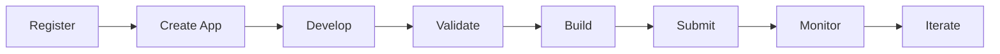

{/* ⚠️  AUTO-GENERATED — DO NOT EDIT. Run build-docs.ts to regenerate. Hand-written docs live in the module folders under content/docs/. */}

# Developer Portal Protocol

Defines schemas for the developer-facing side of the marketplace ecosystem.

Covers the complete developer journey:



## Architecture Alignment

- **Salesforce Partner Portal**: ISV registration, AppExchange publishing, Trialforce

- **Shopify Partner Dashboard**: App management, analytics, billing

- **VS Code Marketplace Management**: Extension publishing, statistics, tokens

## Identity Integration (better-auth)

Authentication, organization management, and API keys are handled by the

Identity module (`@objectstack/spec` Identity namespace), which follows the

better-auth specification. This module only defines marketplace-specific

extensions on top of the shared identity layer:

- **User & Session** → `Identity.UserSchema`, `Identity.SessionSchema`

- **Organization & Members** → `Identity.OrganizationSchema`, `Identity.MemberSchema`

- **API Keys** → `Identity.ApiKeySchema` (with marketplace scopes)

## Key Concepts

- **Publisher Profile**: Links an Identity Organization to a marketplace publisher

- **App Listing Management**: CRUD for marketplace listings (draft → published)

- **Version Channels**: alpha / beta / rc / stable release channels

- **Publishing Analytics**: Install trends, revenue, ratings over time

<Callout type="info">
**Source:** `packages/spec/src/cloud/developer-portal.zod.ts`
</Callout>

## TypeScript Usage

```typescript
import { AnalyticsTimeRange, CreateListingRequest, ListingActionRequest, PublisherProfile, PublishingAnalyticsRequest, PublishingAnalyticsResponse, ReleaseChannel, TimeSeriesPoint, UpdateListingRequest, VersionRelease } from '@objectstack/spec/cloud';
import type { AnalyticsTimeRange, CreateListingRequest, ListingActionRequest, PublisherProfile, PublishingAnalyticsRequest, PublishingAnalyticsResponse, ReleaseChannel, TimeSeriesPoint, UpdateListingRequest, VersionRelease } from '@objectstack/spec/cloud';

// Validate data
const result = AnalyticsTimeRange.parse(data);
```

---

## AnalyticsTimeRange

### Allowed Values

* `last_7d`
* `last_30d`
* `last_90d`
* `last_365d`
* `all_time`


---

## CreateListingRequest

### Properties

| Property | Type | Required | Description |
| :--- | :--- | :--- | :--- |
| **packageId** | `string` | ✅ | Package identifier |
| **name** | `string` | ✅ | App display name |
| **tagline** | `string` | optional |  |
| **description** | `string` | optional |  |
| **category** | `string` | ✅ | Marketplace category |
| **tags** | `string[]` | optional |  |
| **iconUrl** | `string` | optional |  |
| **screenshots** | `Object[]` | optional |  |
| **documentationUrl** | `string` | optional |  |
| **supportUrl** | `string` | optional |  |
| **repositoryUrl** | `string` | optional |  |
| **pricing** | `Enum<'free' \| 'freemium' \| 'paid' \| 'subscription' \| 'usage-based' \| 'contact-sales'>` | ✅ |  |
| **priceInCents** | `integer` | optional |  |


---

## ListingActionRequest

### Properties

| Property | Type | Required | Description |
| :--- | :--- | :--- | :--- |
| **listingId** | `string` | ✅ | Listing ID |
| **action** | `Enum<'submit' \| 'unlist' \| 'deprecate' \| 'reactivate'>` | ✅ | Action to perform on listing |
| **reason** | `string` | optional |  |


---

## PublisherProfile

### Properties

| Property | Type | Required | Description |
| :--- | :--- | :--- | :--- |
| **organizationId** | `string` | ✅ | Identity Organization ID |
| **publisherId** | `string` | ✅ | Marketplace publisher ID |
| **verification** | `Enum<'unverified' \| 'pending' \| 'verified' \| 'trusted' \| 'partner'>` | ✅ | Publisher verification status |
| **agreementVersion** | `string` | optional | Accepted developer agreement version |
| **website** | `string` | optional | Publisher website |
| **supportEmail** | `string` | optional | Publisher support email |
| **registeredAt** | `string` | ✅ |  |


---

## PublishingAnalyticsRequest

### Properties

| Property | Type | Required | Description |
| :--- | :--- | :--- | :--- |
| **listingId** | `string` | ✅ | Listing to get analytics for |
| **timeRange** | `Enum<'last_7d' \| 'last_30d' \| 'last_90d' \| 'last_365d' \| 'all_time'>` | ✅ |  |
| **metrics** | `Enum<'installs' \| 'uninstalls' \| 'active_installs' \| 'ratings' \| 'revenue' \| 'page_views'>[]` | optional | Metrics to include (default: all) |


---

## PublishingAnalyticsResponse

### Properties

| Property | Type | Required | Description |
| :--- | :--- | :--- | :--- |
| **listingId** | `string` | ✅ |  |
| **timeRange** | `Enum<'last_7d' \| 'last_30d' \| 'last_90d' \| 'last_365d' \| 'all_time'>` | ✅ |  |
| **summary** | `Object` | ✅ |  |
| **timeSeries** | `Record<string, Object[]>` | optional | Time series keyed by metric name |
| **ratingDistribution** | `Object` | optional |  |


---

## ReleaseChannel

### Allowed Values

* `alpha`
* `beta`
* `rc`
* `stable`


---

## TimeSeriesPoint

### Properties

| Property | Type | Required | Description |
| :--- | :--- | :--- | :--- |
| **date** | `string` | ✅ |  |
| **value** | `number` | ✅ |  |


---

## UpdateListingRequest

### Properties

| Property | Type | Required | Description |
| :--- | :--- | :--- | :--- |
| **listingId** | `string` | ✅ | Listing ID to update |
| **name** | `string` | optional |  |
| **tagline** | `string` | optional |  |
| **description** | `string` | optional |  |
| **category** | `string` | optional |  |
| **tags** | `string[]` | optional |  |
| **iconUrl** | `string` | optional |  |
| **screenshots** | `Object[]` | optional |  |
| **documentationUrl** | `string` | optional |  |
| **supportUrl** | `string` | optional |  |
| **repositoryUrl** | `string` | optional |  |
| **pricing** | `Enum<'free' \| 'freemium' \| 'paid' \| 'subscription' \| 'usage-based' \| 'contact-sales'>` | optional |  |
| **priceInCents** | `integer` | optional |  |


---

## VersionRelease

### Properties

| Property | Type | Required | Description |
| :--- | :--- | :--- | :--- |
| **version** | `string` | ✅ | Semver version (e.g., 2.1.0-beta.1) |
| **channel** | `Enum<'alpha' \| 'beta' \| 'rc' \| 'stable'>` | ✅ |  |
| **releaseNotes** | `string` | optional | Release notes (Markdown) |
| **changelog** | `Object[]` | optional | Structured changelog entries |
| **minPlatformVersion** | `string` | optional |  |
| **artifactUrl** | `string` | optional | Built package artifact URL |
| **artifactChecksum** | `string` | optional | SHA-256 checksum |
| **deprecated** | `boolean` | ✅ |  |
| **deprecationMessage** | `string` | optional |  |
| **releasedAt** | `string` | optional |  |


---

