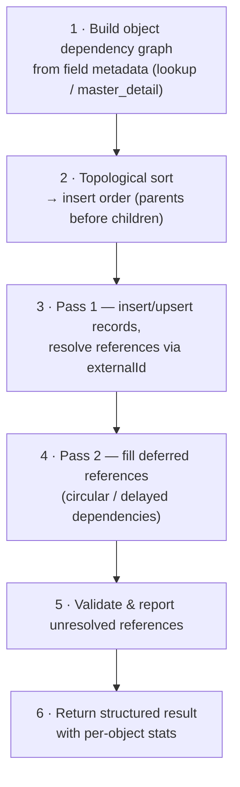

{/* ⚠️  AUTO-GENERATED — DO NOT EDIT. Run build-docs.ts to regenerate. Hand-written docs live in the module folders under content/docs/. */}

# Seed Loader Protocol

Defines the schemas for metadata-driven seed data loading with automatic

relationship resolution, dependency ordering, and multi-pass insertion.

## Architecture Alignment

- **Salesforce Data Loader**: External ID-based upsert with relationship resolution

- **ServiceNow**: Sys ID and display value mapping during import

- **Airtable**: Linked record resolution via display names

## Loading Flow



<Callout type="info">
**Source:** `packages/spec/src/data/seed-loader.zod.ts`
</Callout>

## TypeScript Usage

```typescript
import { ObjectDependencyGraph, ObjectDependencyNode, ReferenceResolution, ReferenceResolutionError, SeedIdentity, SeedLoadResult, SeedLoaderConfig, SeedLoaderRequest, SeedLoaderResult } from '@objectstack/spec/data';
import type { ObjectDependencyGraph, ObjectDependencyNode, ReferenceResolution, ReferenceResolutionError, SeedIdentity, SeedLoadResult, SeedLoaderConfig, SeedLoaderRequest, SeedLoaderResult } from '@objectstack/spec/data';

// Validate data
const result = ObjectDependencyGraph.parse(data);
```

---

## ObjectDependencyGraph

Complete object dependency graph for seed data loading

### Properties

| Property | Type | Required | Description |
| :--- | :--- | :--- | :--- |
| **nodes** | `Object[]` | ✅ | All objects in the dependency graph |
| **insertOrder** | `string[]` | ✅ | Topologically sorted insert order |
| **circularDependencies** | `string[][]` | ✅ | Circular dependency chains (e.g., [["a", "b", "a"]]) |


---

## ObjectDependencyNode

Object node in the seed data dependency graph

### Properties

| Property | Type | Required | Description |
| :--- | :--- | :--- | :--- |
| **object** | `string` | ✅ | Object name (snake_case) |
| **dependsOn** | `string[]` | ✅ | Objects this object depends on |
| **references** | `Object[]` | ✅ | Field-level reference details |


---

## ReferenceResolution

Describes how a field reference is resolved during seed loading

### Properties

| Property | Type | Required | Description |
| :--- | :--- | :--- | :--- |
| **field** | `string` | ✅ | Source field name containing the reference value |
| **targetObject** | `string` | ✅ | Target object name (snake_case) |
| **targetField** | `string` | ✅ | Field on target object used for matching |
| **fieldType** | `Enum<'lookup' \| 'master_detail' \| 'user'>` | ✅ | Relationship field type |


---

## ReferenceResolutionError

Actionable error for a failed reference resolution

### Properties

| Property | Type | Required | Description |
| :--- | :--- | :--- | :--- |
| **sourceObject** | `string` | ✅ | Object with the broken reference |
| **field** | `string` | ✅ | Field name with unresolved reference |
| **targetObject** | `string` | ✅ | Target object searched for the reference |
| **targetField** | `string` | ✅ | ExternalId field used for matching |
| **attemptedValue** | `any` | ✅ | Value that failed to resolve |
| **recordIndex** | `integer` | ✅ | Index of the record in the dataset |
| **message** | `string` | ✅ | Human-readable error description |


---

## SeedIdentity

Identity context for resolving os.user / os.org in seed CEL values

### Properties

| Property | Type | Required | Description |
| :--- | :--- | :--- | :--- |
| **user** | `Object` | optional | Subject bound to os.user in seed CEL expressions |
| **org** | `Object` | optional | Organization bound to os.org in seed CEL expressions |


---

## SeedLoadResult

Result of loading a single dataset

### Properties

| Property | Type | Required | Description |
| :--- | :--- | :--- | :--- |
| **object** | `string` | ✅ | Object that was loaded |
| **mode** | `Enum<'insert' \| 'update' \| 'upsert' \| 'replace' \| 'ignore'>` | ✅ | Import mode used |
| **inserted** | `integer` | ✅ | Records inserted |
| **updated** | `integer` | ✅ | Records updated |
| **skipped** | `integer` | ✅ | Records skipped |
| **errored** | `integer` | ✅ | Records with errors |
| **total** | `integer` | ✅ | Total records in dataset |
| **referencesResolved** | `integer` | ✅ | References resolved via externalId |
| **referencesDeferred** | `integer` | ✅ | References deferred to second pass |
| **errors** | `Object[]` | ✅ | Reference resolution errors |


---

## SeedLoaderConfig

Seed data loader configuration

### Properties

| Property | Type | Required | Description |
| :--- | :--- | :--- | :--- |
| **dryRun** | `boolean` | ✅ | Validate references without writing data |
| **haltOnError** | `boolean` | ✅ | Stop on first reference resolution error |
| **multiPass** | `boolean` | ✅ | Enable multi-pass loading for circular dependencies |
| **defaultMode** | `Enum<'insert' \| 'update' \| 'upsert' \| 'replace' \| 'ignore'>` | ✅ | Default conflict resolution strategy |
| **batchSize** | `integer` | ✅ | Maximum records per batch insert/upsert |
| **transaction** | `boolean` | ✅ | Wrap entire load in a transaction (all-or-nothing) |
| **env** | `Enum<'prod' \| 'dev' \| 'test'>` | optional | Only load datasets matching this environment |
| **organizationId** | `string` | optional | Target organization id for per-tenant seed replay |
| **identity** | `Object` | optional | Identity bound to os.user / os.org when resolving CEL seed values |


---

## SeedLoaderRequest

Seed loader request with datasets and configuration

### Properties

| Property | Type | Required | Description |
| :--- | :--- | :--- | :--- |
| **seeds** | `Object[]` | ✅ | Seeds to load |
| **config** | `Object` | ✅ | Loader configuration |


---

## SeedLoaderResult

Complete seed loader result

### Properties

| Property | Type | Required | Description |
| :--- | :--- | :--- | :--- |
| **success** | `boolean` | ✅ | Overall success status |
| **dryRun** | `boolean` | ✅ | Whether this was a dry-run |
| **dependencyGraph** | `Object` | ✅ | Object dependency graph |
| **results** | `Object[]` | ✅ | Per-object load results |
| **errors** | `Object[]` | ✅ | All reference resolution errors |
| **summary** | `Object` | ✅ | Summary statistics |


---

