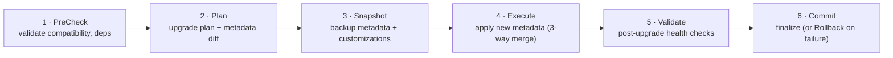

{/* ⚠️  AUTO-GENERATED — DO NOT EDIT. Run build-docs.ts to regenerate. Hand-written docs live in the module folders under content/docs/. */}

# Package Upgrade Protocol

Defines the complete lifecycle for upgrading installed packages,

including pre-upgrade analysis, snapshot/backup, execution, validation,

and rollback capabilities.

## Architecture Alignment

- **Salesforce**: Managed Package upgrade with push upgrades and subscriber control

- **ServiceNow**: Update Sets with preview, commit, and back-out support

- **Helm**: Helm upgrade with rollback to previous release

- **Kubernetes**: Rolling update with readiness probes and automatic rollback

## Upgrade Flow



<Callout type="info">
**Source:** `packages/spec/src/kernel/package-upgrade.zod.ts`
</Callout>

## TypeScript Usage

```typescript
import { MetadataChangeType, MetadataDiffItem, RollbackPackageRequest, RollbackPackageResponse, UpgradeImpactLevel, UpgradePackageResponse, UpgradePhase, UpgradePlan } from '@objectstack/spec/kernel';
import type { MetadataChangeType, MetadataDiffItem, RollbackPackageRequest, RollbackPackageResponse, UpgradeImpactLevel, UpgradePackageResponse, UpgradePhase, UpgradePlan } from '@objectstack/spec/kernel';

// Validate data
const result = MetadataChangeType.parse(data);
```

---

## MetadataChangeType

Type of metadata change between package versions

### Allowed Values

* `added`
* `modified`
* `removed`
* `renamed`


---

## MetadataDiffItem

Single metadata change between package versions

### Properties

| Property | Type | Required | Description |
| :--- | :--- | :--- | :--- |
| **type** | `string` | ✅ | Metadata type |
| **name** | `string` | ✅ | Metadata name |
| **changeType** | `Enum<'added' \| 'modified' \| 'removed' \| 'renamed'>` | ✅ | Category of metadata modification (added, modified, removed, or renamed) |
| **hasConflict** | `boolean` | ✅ | Whether this change may conflict with customizations |
| **summary** | `string` | optional | Human-readable change summary |
| **previousName** | `string` | optional | Previous name if renamed |


---

## RollbackPackageRequest

Rollback package request

### Properties

| Property | Type | Required | Description |
| :--- | :--- | :--- | :--- |
| **packageId** | `string` | ✅ | Package ID to rollback |
| **snapshotId** | `string` | ✅ | Snapshot ID to restore from |
| **rollbackCustomizations** | `boolean` | ✅ | Whether to restore pre-upgrade customizations |


---

## RollbackPackageResponse

Rollback package response

### Properties

| Property | Type | Required | Description |
| :--- | :--- | :--- | :--- |
| **success** | `boolean` | ✅ | Whether the rollback succeeded |
| **restoredVersion** | `string` | optional | Version restored to |
| **message** | `string` | optional | Rollback status message |


---

## UpgradeImpactLevel

Severity of upgrade impact

### Allowed Values

* `none`
* `low`
* `medium`
* `high`
* `critical`


---

## UpgradePackageResponse

Upgrade package response

### Properties

| Property | Type | Required | Description |
| :--- | :--- | :--- | :--- |
| **success** | `boolean` | ✅ | Whether the upgrade succeeded |
| **phase** | `Enum<'pending' \| 'analyzing' \| 'snapshot' \| 'executing' \| 'migrating' \| 'validating' \| 'completed' \| 'failed' \| 'rolling-back' \| 'rolled-back'>` | ✅ | Current upgrade phase |
| **plan** | `Object` | optional | Upgrade plan |
| **snapshotId** | `string` | optional | Snapshot ID for rollback |
| **conflicts** | `Object[]` | optional | Unresolved merge conflicts |
| **errorMessage** | `string` | optional | Error message if upgrade failed |
| **message** | `string` | optional | Human-readable status message |


---

## UpgradePhase

Current phase of the upgrade process

### Allowed Values

* `pending`
* `analyzing`
* `snapshot`
* `executing`
* `migrating`
* `validating`
* `completed`
* `failed`
* `rolling-back`
* `rolled-back`


---

## UpgradePlan

Upgrade analysis plan generated before execution

### Properties

| Property | Type | Required | Description |
| :--- | :--- | :--- | :--- |
| **packageId** | `string` | ✅ | Package identifier |
| **fromVersion** | `string` | ✅ | Currently installed version |
| **toVersion** | `string` | ✅ | Target upgrade version |
| **impactLevel** | `Enum<'none' \| 'low' \| 'medium' \| 'high' \| 'critical'>` | ✅ | Severity assessment from none (seamless) to critical (breaking changes) |
| **changes** | `Object[]` | ✅ | All metadata changes |
| **affectedCustomizations** | `integer` | ✅ | Count of customizations that may be affected |
| **requiresMigration** | `boolean` | ✅ | Whether data migration scripts are needed |
| **migrationScripts** | `string[]` | optional | Paths to migration scripts |
| **dependencyUpgrades** | `Object[]` | optional | Dependent packages that also need upgrading |
| **estimatedDuration** | `integer` | optional | Estimated upgrade duration in seconds |
| **summary** | `string` | optional | Human-readable upgrade summary |


---

